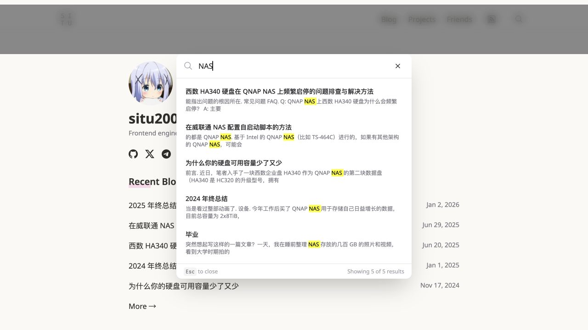
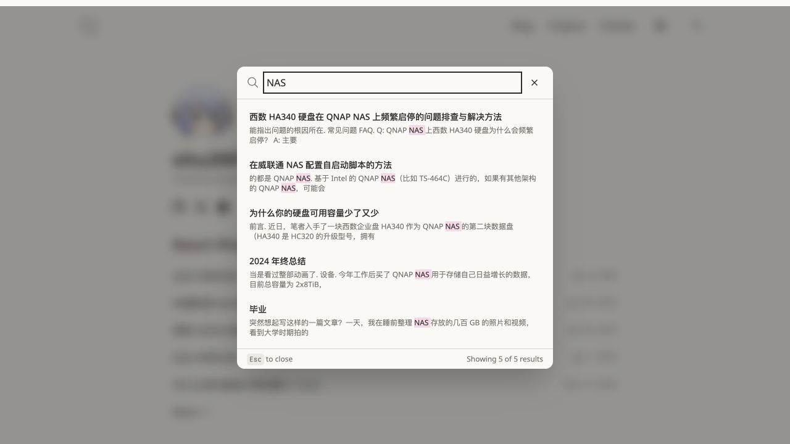
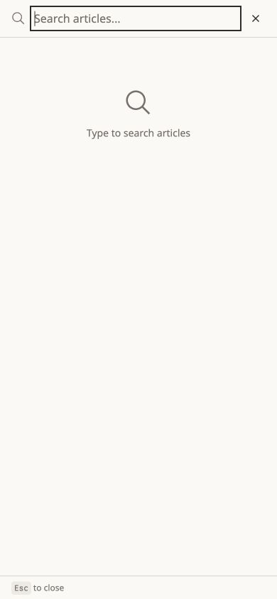
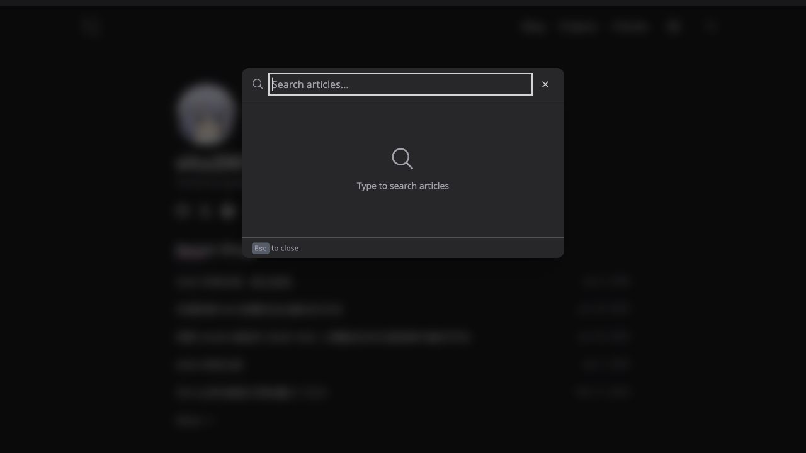

# Design consistency verification

Compared against main at `7706a076` using local production builds on 2026-10-03. No production deployment was performed.

## Search comparison

Before: a white panel and yellow matches; the sticky navigation paints above the overlay. With the empty dialog open, Tab twice from the input moves focus outside the dialog.

After: paper surface, shared text/border roles, and pink matches. The Base UI portal covers the page; Tab wraps to the input, Shift+Tab wraps to Close, and the underlying site is hidden from the accessibility tree. Escape and backdrop dismissal return focus to the search trigger.

## Other checks

- Button and Cmd+K opening, real `NAS` results, 10 → 20 result pagination, and result-link navigation passed. Search also reopened successfully on the destination article.
- At 390×844, search starts at y=0, measures 390×844, and has no horizontal overflow. The result region scrolls independently.
- Home, archive, friends, projects, article, and colors pages had no horizontal overflow at 390px or desktop width.
- Article typography remains 17px / 32.3px line height with a 646px desktop measure.
- Light and dark palette rendering was inspected. Dark checks used temporary copies of built HTML with the `.dark` class forced and the system-preference script removed; they do not test live OS preference switching. These copies are build-only fixtures, absent from tracked source.
- Production-preview console checks found no warnings/errors during search and result navigation.
- TypeScript check passed; `pnpm test --run` passed all 8 tests across 5 files; `pnpm build` built and indexed 84 pages; `git diff --check` passed.

Not checked on physical mobile hardware: virtual keyboard resizing and iOS Safari chrome. Reduced-motion behavior is implemented through CSS; it was not emulated in these browser checks. Index-failure copy consumes the existing session state; network failure was not injected during browser validation.

## Follow-up consistency audit (2026-10-04)

- Added explicit Tailwind utilities for the shared motion variables. Production CSS includes both utilities and the `after:duration-emphasis` variant. Browser computed styles confirm 200ms feedback and 300ms emphasis, including project-title pseudo-elements.
- Article dates and category links both compute to the shared muted color at 14px, matching archive metadata. Insights placeholder text uses the same role. Conditional social-link underlines inherit text color and the shared emphasis duration.
- Insights articles now consume the existing reading stylesheet: 17px serif text, 32.3px line height, and a 646px desktop measure. At 390px, content measures 358px with start alignment and no horizontal overflow.
- Removed the unused legacy Tailwind config and commented Insights list. Global CSS remains the active token/configuration source. A source scan found no remaining standalone gray/zinc/blue/black UI palettes outside the centralized theme; experimental swatches and syntax highlighting retain their own intentional colors.
- Installed tools invoked directly: `vitest run` passed all 8 tests; `tsc --noEmit` passed; `astro build` built and indexed 84 pages. Production build still reports an MDX directive warning and large-chunk warning.
- Dark-theme mappings were unchanged by this follow-up; live OS switching and physical mobile hardware remain outside the recorded checks.
