又一年过去了，尝试用十大关键词总结自己的 2023 年：解封、实习、秋招、开发、生产力、旅行、游戏、阅读、观影、电子设备、生病。


## 解封

> 旧的结束是新的开始。

这里提一下疫情解封，如果 2023 年疫情管控仍未解除，我的情况将完全不同。

## 实习

为了体验公司工作流程与为秋招积攒经验，我在寒假结束后去了北京，在滴滴实习了三个月。同年 5 月，回到深圳，在 TME 实习了四个月后回校。

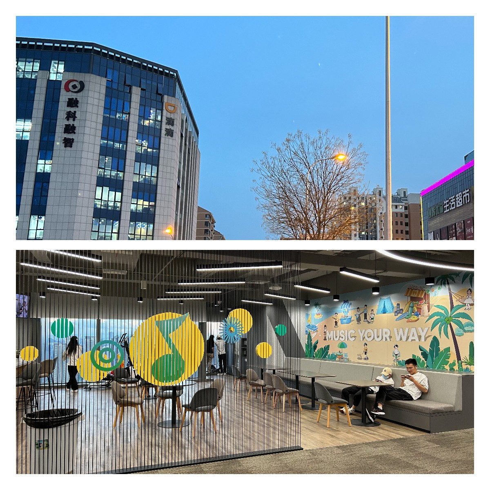

实习期间涉及到的技术

- 跨端应用开发
- React 移动端 H5 页面开发
- 部门 JS 基础库维护、开发
- 客户端 JSBridge, JS binding 维护、开发、适配
- Cocos 小游戏适配

实习期间开发涉及到的软件产品

- 滴滴车主
- 滴滴司机部落
- QQ 音乐
- 全民 K 歌
- 懒人听书

实习做的事情还算充实。并且，在实习后期，还处于一种只要是客户端都会去做的情况（前端、Android、iOS），下面是某一周的 wakatime 统计。

| Languages       | Time          |
| --------------- | ------------- |
| **JavaScript**  | 9 hrs 40 mins |
| **TypeScript**  | 5 hrs 37 mins |
| **Clojure**     | 3 hrs 23 mins |
| **Kotlin**      | 1hr 36 mins   |
| **Java**        | 1 hr 15 mins  |
| **Objective-C** | 50 mins       |
| **Ezhil**       | 31 mins       |
| **GDScript**    | 29 mins       |
| **Other**       | 28 mins       |

## 秋招

因为实习具有不确定性，即实习是否能留下。于是在 8 月，我开始了秋招。拿了若干家公司的 offer，基本是 SP or SSP（岗位：前端开发）

- 字节
- 大疆
- 美团
- 小红书
- 快手

不过最后实习还是转正了，结合做的事情和若干其他因素综合考虑后，第一份工作还是选择留在了实习的公司。很抱歉，希望以后能以社招身份能加入他们。

值得一提的是，双非本科在今年找工作还是挺难的，希望大家在找工作的时候，能沉得住气。

## 开发

与上年相比，今年主要是给公司写业务代码。个人项目的开发时间大幅降低，并且时间集中在实习离职后的 10 月 - 12 月。

- 用 Astro 重写个人博客
- 用 Rust 开发毕设项目（与 DNS 有关）
- 用 React Native 开发了一个 GPS 测速工具，在坐高铁、公交车的时候用来查看和记录速度

暂时是自用项目，希望下一年能写出让大家受益的项目。

## 生产力

### GTD & 知识管理

在阅读《番茄工作法图解：简单易行的时间管理方法》和《软技能 2：代码之外的生存指南》后，我开始实践上面提及的方法，以尝试提高自己的生产力。

从 5 月开始，我使用滴答清单跟踪与管理自己的任务。

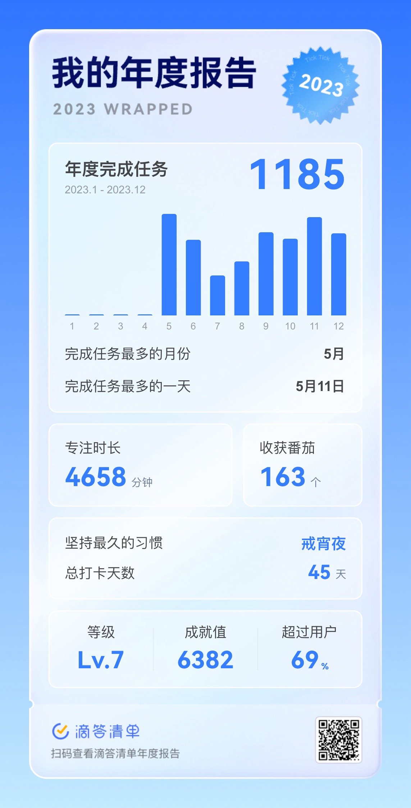

总结出了一套自己的知识管理方法：

1. 输入：主动收集数据
2. 整理：整理收集到的数据，将他们连接成网
3. 输出：写博客文章、教会别人等

步骤如下图所示。其中用到的软件有滴答清单、Reeder、Apple 备忘录、Logseq 和 Obsidian 等。

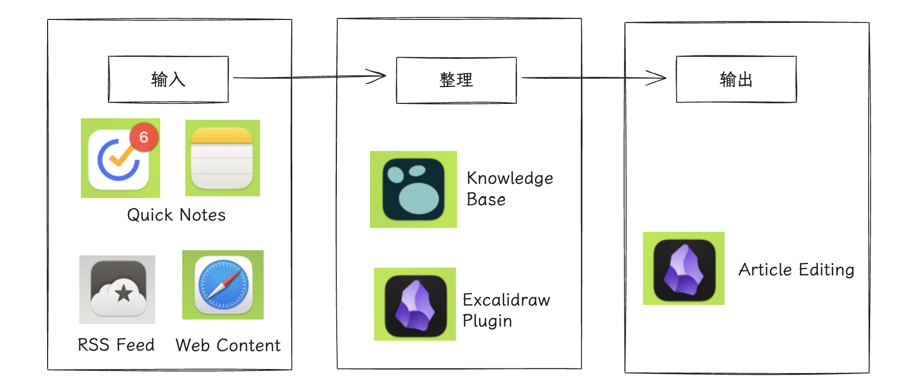

在我看来，GTD 和知识管理的好处，就如同下面这段伪代码和图一样：将知识塞入冰箱，并在不久的将来获取它们，快速获得知识，并期望能得出新观点。

```javascript
// Now, store your knowledge.
const data = readFromYourBrain();
globalThis.knowledgeBase.link(data);
// In the near future, extract them from the knowledge base.
globalThis.addEventListener("inspired-with-sth", findInKnowledgeBase);
```

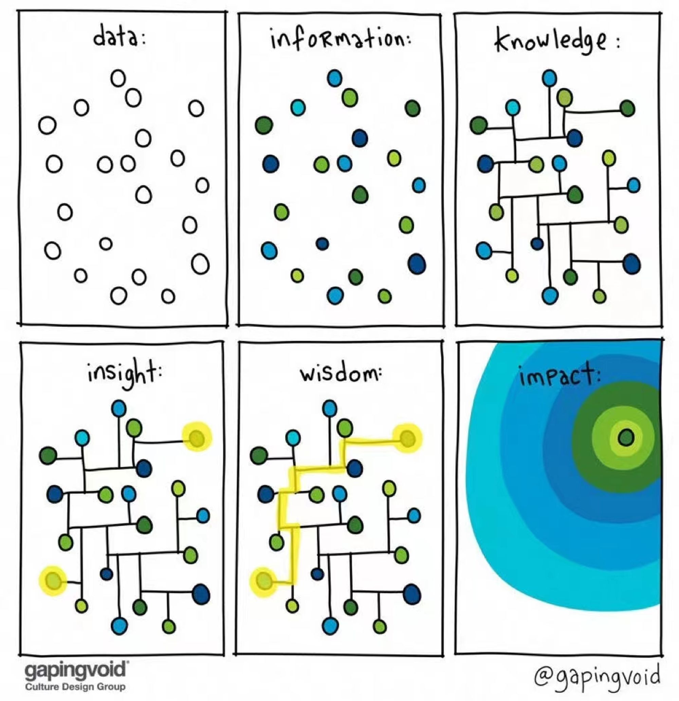

这是近年来我在 Logseq 里整理的 pages

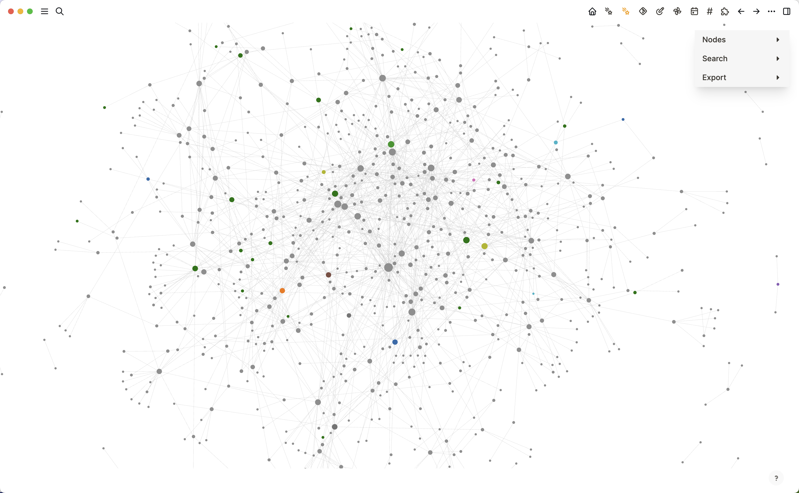

### 善用生成式 AI

例如 GPT，它能提高我们的学习、工作效率。它的意义并不是完全取代程序员，而是让程序员变为更好的程序员。

举个例子，我在工作中经常使用 GPT 进行数据处理（此处特指数据结构的转换），可以大量减少重复劳动的耗时。比如，我要渲染我的发烧记录，而这些数据被记录在 Apple 备忘录的表格里。

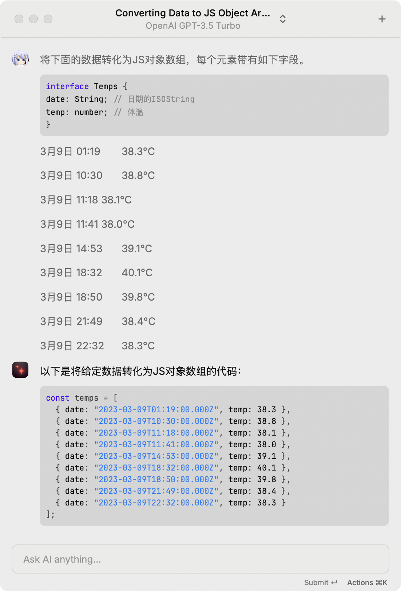

## 旅行

### 香港

舍友 and 朋友见我在深圳实习，就让我带他们去香港玩玩。

一次是乘坐各种交通工具（顺时针方向依次为山顶缆车、天星小轮、叮叮车、轻铁、东铁线头等舱）+ 游海洋公园（值得一提的是，这是 10 年内第三次去海洋公园了）

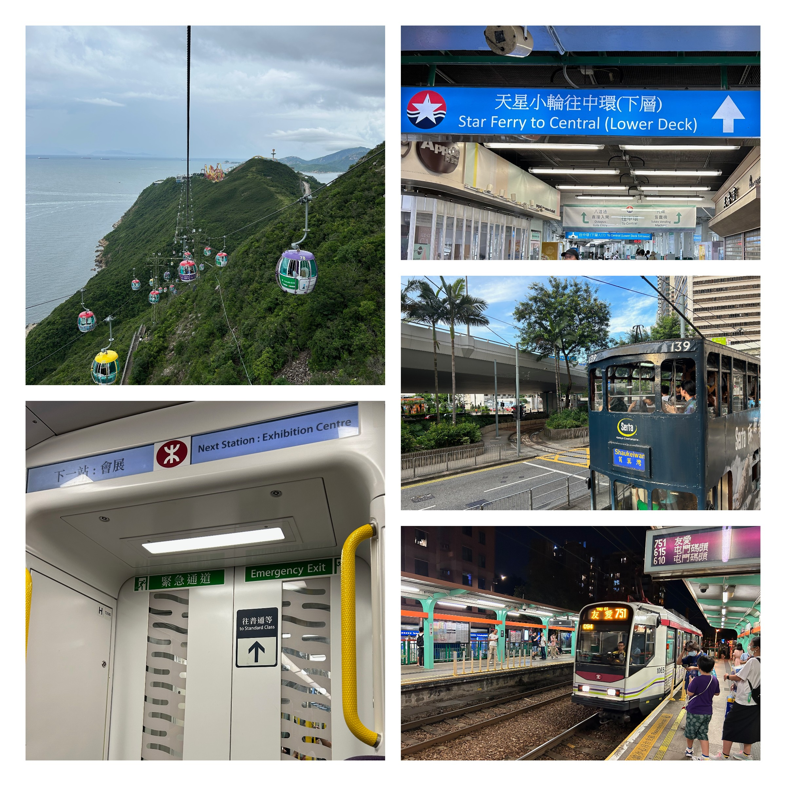

而另一次是去电影院看柯南剧场版

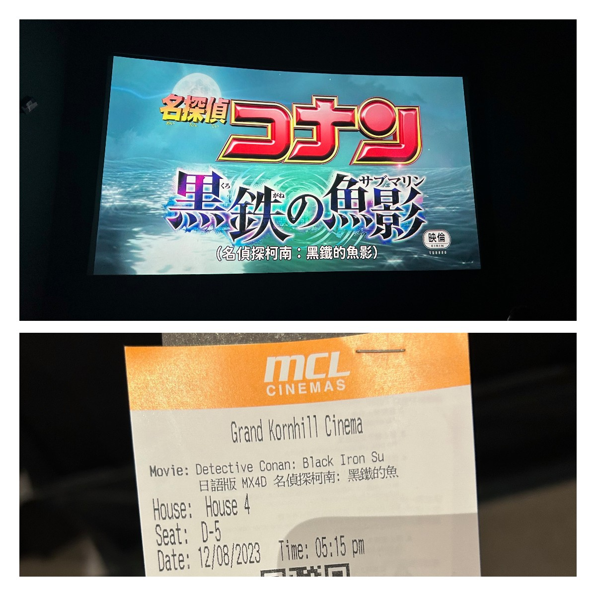

### 沪杭

这次就是应一起合作开发过网友的邀约，去杭州玩了。为了使行程有效化，我往计划里加入了三日上海游，沪杭计划加起来就是六日游。

但很可惜撞上了 12 月中旬的寒潮...被冻得瑟瑟发抖，西湖游到一半直接跑去电影院取暖。

下面放出六日路线图供大伙出游参考。

杭州三日游

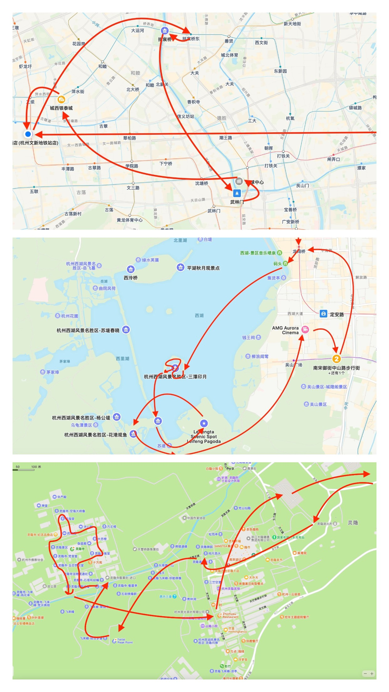

上海三日游

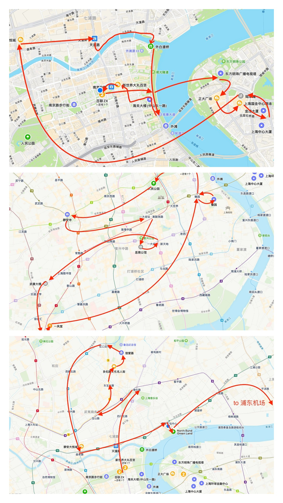

## 游戏

2023 年，我在工作或学习之余会玩游戏。并保持着这样的一个节奏：日间坐着就玩 Minecraft，睡前躺着就玩 Switch 游戏。

| 游戏                   | 游戏时长   |
| ---------------------- | ---------- |
| Minecraft              | 200 hours+ |
| Persona 5 Royal（P5R） | 85 hours+  |
| Minecraft Dungeons     | 35 hours+  |

Minecraft 玩的是多人联机模式（宿舍建的 Minecraft MTR 服，在游戏里主要是修地铁）。有一说一，我很喜欢这种亲手搭建系统的过程，看着简单的系统在时间的流逝下，逐渐复杂起来，是一种享受。

线网图变化：

从年初

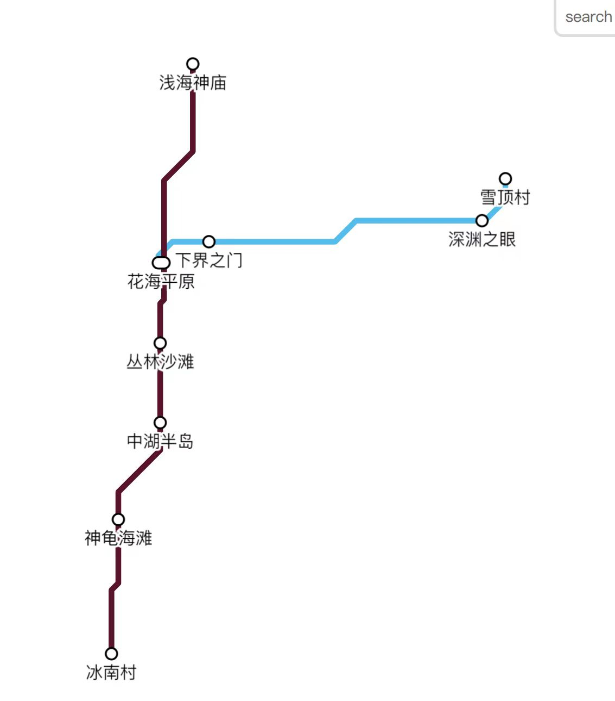

到年末

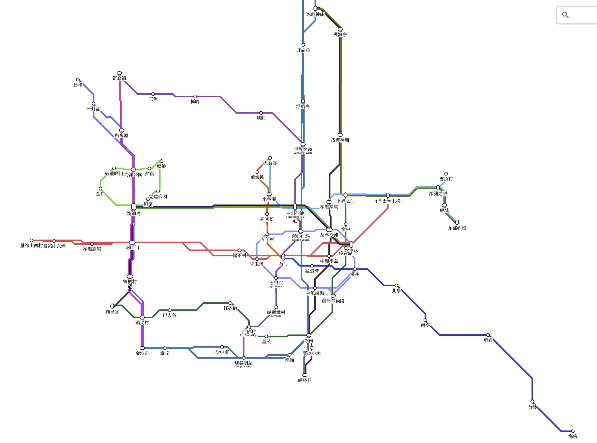

游戏车站变化（石门）：

从单线站

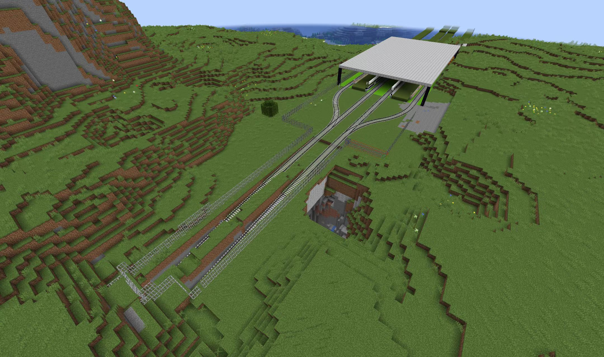

到四线换乘站


与此同时，Switch 的游戏时间如下


游戏 P5R 除了回合制外，在剧情方面也做得很不错。为防止剧透，这里附上新游戏开始时的 UI，它完美地总结了游戏的剧情。


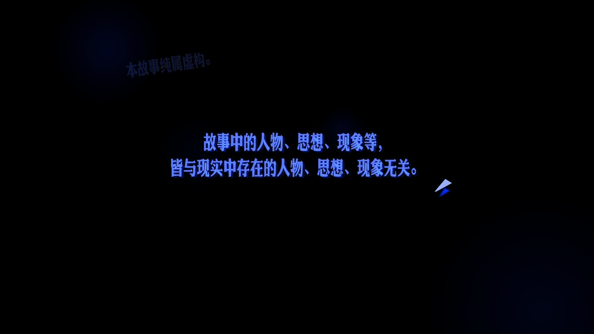


对于 Minecraft Dungeons，我很喜欢游戏提供的打斗感，在周末休息的时候，会搓上几把。

## 阅读

十月实习离职，回到学校上课。通勤路上，用微信读书读了不少书。书籍是人类进步的阶梯，通过阅读，我悟到了很多前人的智慧。希望明年还能坚持阅读。

- 《网络是怎样连接的》
- 《程序员的底层思维》
- 《程序员的 README》
- 《软技能 2：代码之外的生存指南》
- 《番茄工作法图解：简单易行的时间管理方法》
- 《老后破产：名为“长寿”的噩梦》
- 《最璀璨的银河：刘慈欣经典作品集》

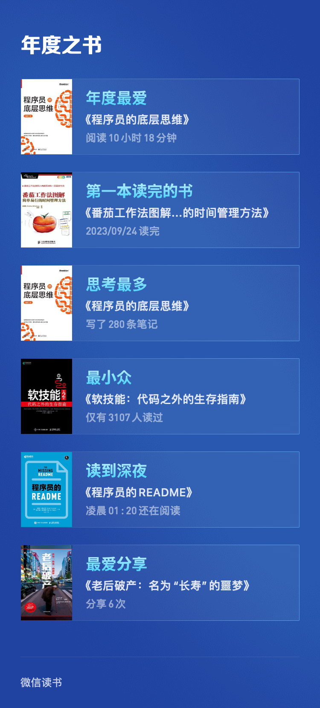

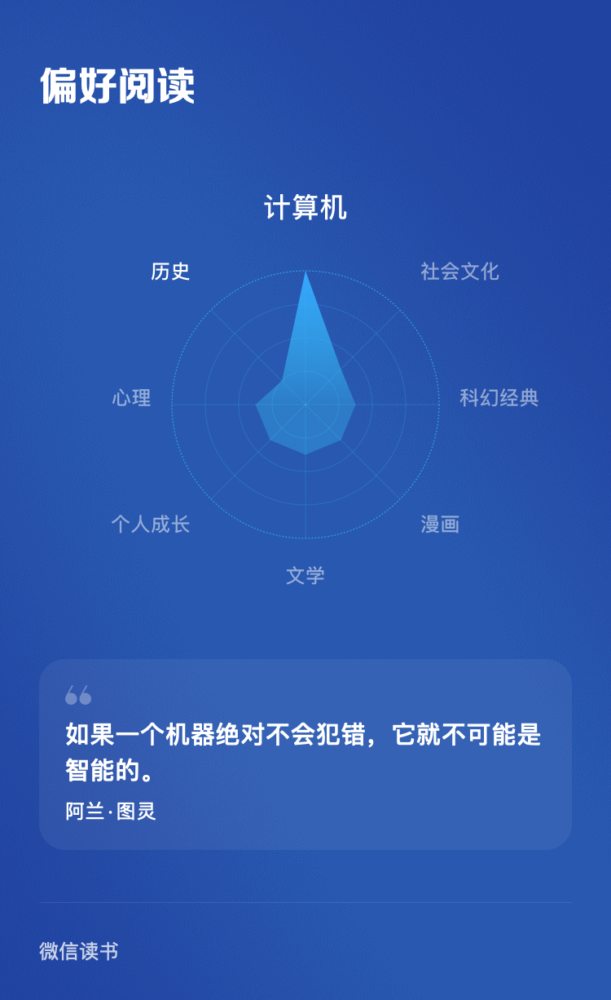

## 观影

看了些 2013, 2014 年的老番，很喜欢当年动画的风格和叙事。

- 《樱花任务》
- 《白箱》
- 《来自风平浪静的明天》

偶尔还会在下班 or 放假的时候，去电影院看电影放松心情。

- 《流浪地球 2》
- 《铃芽之旅》
- 《超级马力欧兄弟大电影》
- 《灌篮高手》
- 《名侦探柯南：黑铁的鱼影》
- 《坚如磐石》

## 电子设备

实习存了点钱，购入了一些电子设备

| 设备                         | 用途               |
| ---------------------------- | ------------------ |
| Nintendo Switch OLED         | 游戏掌机           |
| Apple Watch Series 8         | 健康监测           |
| Xiaomi Mini PC               | 丐版 Homelab       |
| ViewSonic VG2481-4K          | 外接显示器         |
| Sony WH-1000XM5              | 头戴降噪           |
| Anker 100W GaN Power Adapter | 出行只带一个充电头 |

## 生病

上年年底疫情解封后，身边的人接二连三得病。而我进入了新冠“决赛圈”，暂时没有感染上新冠病毒。

但不幸的是，从 2023 年开始，我开始因为不同的病而发烧，近乎一个季度烧一次，令人感慨。希望 2024 年不要再生病了。

|      病症      | 月份  | 是否发烧 |
| :------------: | ----- | :------: |
|    甲型流感    | 3 月  |    是    |
|    新冠首阳    | 6 月  |    是    |
| 新冠二阳（疑） | 9 月  |    否    |
|    外耳道炎    | 12 月 |    是    |

甲流体温

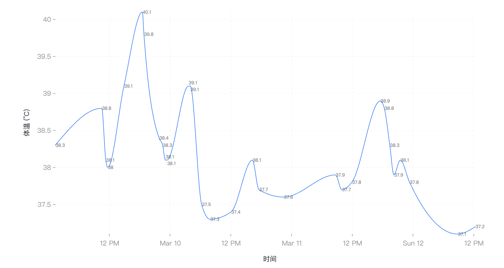

新冠体温

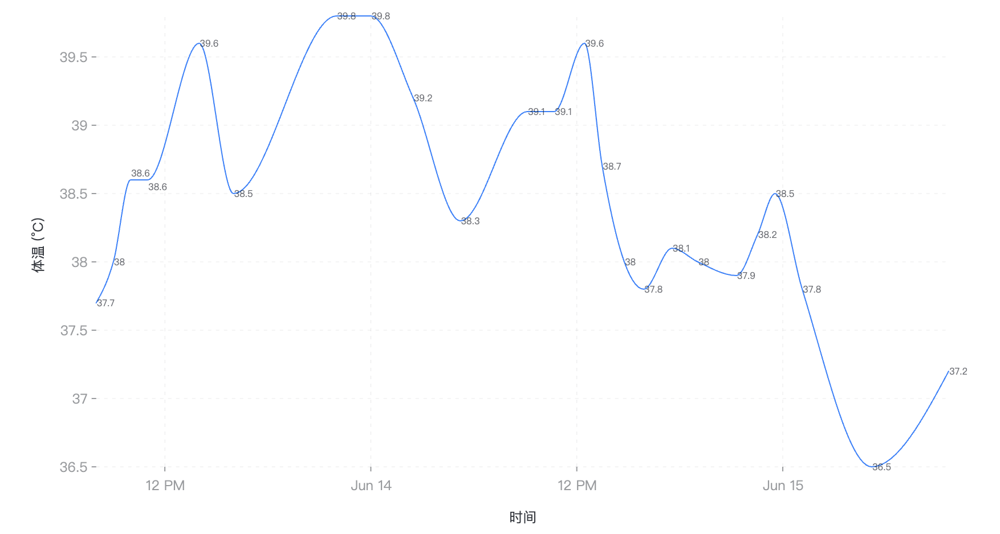
