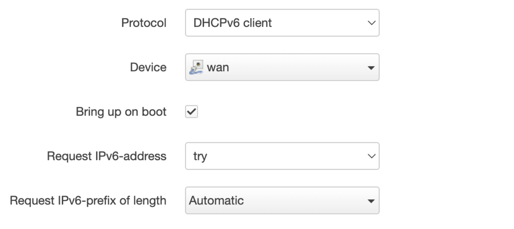
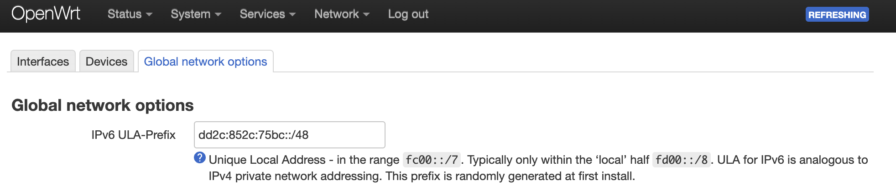
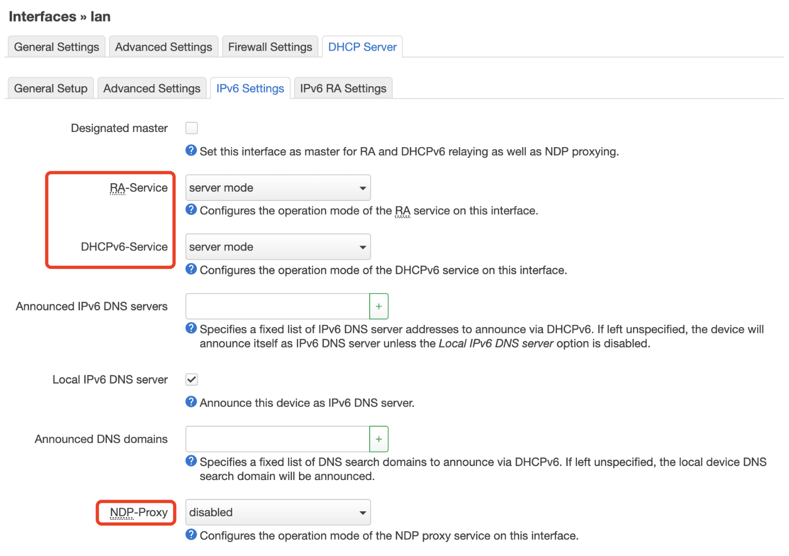
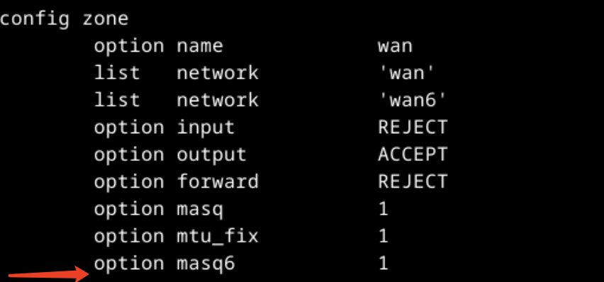
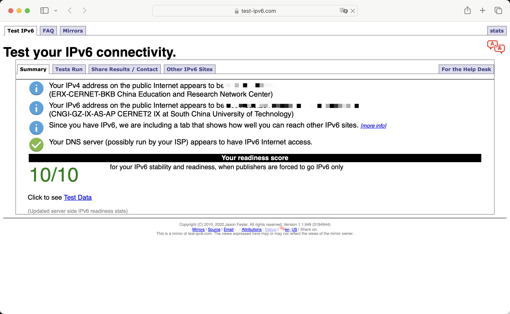

## 背景

> TL;DR: 宿舍的路由器坏了，需要买一个新路由器，并为其配置 IPv6，用作 Tailscale 和 BT 下载用途。

宿舍的小米 mini 路由器在前些天，因为宿舍深夜发生断电，烧坏了。15 年初中购入在家使用，20 年被我带到学校上网，用了 8 年，在 23 年居然因为断电挂了...

宿舍没有路由器了，没办法，只好购入了收藏夹里的红米 AC2100 路由器（果然是迟早要买...），京东物流效率非常高，早上 10 点半下单，傍晚就到货了。

> 不过的取货的时候遇到了一些小插曲——快递被其他同学错拿了，还好联系上对方让他拿回来了。这里吐槽一下京东的快递站，取快递的时候需要知道手机尾号和姓名，但这些信息都是明文印在快递包装上的...想偷的人一下就能把对应的快递给偷掉了。

理论上来说，买回来刷入系统，配置好校园网认证，就能上网了。但，IPv6 访问除外。因为校园网的特点是：

1. 不支持 DHCPv6-PD
2. 设备需要认证才能联网

此时，需要用户手动配置 NAT6，才能让每个设备通过 IPv6 上网。

## 准备工作

路由器到手后，将官方固件降级，然后刷入 breed，再刷入 OpenWrt 即可。下面是一些有用的链接

- [小米 红米 AC2100 一键刷 BREED](https://www.right.com.cn/forum/thread-4066963-1-1.html)
- [OpenWrt MT7621 Downloads](https://downloads.openwrt.org/releases/23.05.2/targets/ramips/mt7621/)

校园网认证还要不要配置锐捷认证插件？不用，学校在大半年前非常良心地加入了 web 认证。截止 2023 年 12 月，宿舍网络认证方式是锐捷/web 二选一。

## 配置 NAT6

> 本次配置的 OpenWrt 系统版本为 23.05，一个很明显的变化是：该版本的防火墙是 nftables 而不是 iptables

大致思路如下：

1. 先让路由器 WAN 接口的 DHCPv6 客户端获得 IPv6 地址
2. 配置 LAN 接口的 DHCP，让路由器下的设备能被分配到 IPv6 地址
3. 配置防火墙等，以启用 NAT6

### 配置 WAN6 接口

配置 WAN6 接口的两个设置：Request IPv6-Address 为 try，Request IPv6-prefix of length 为自动。



配置后，如果能看到有 ipv6 地址，并且 Network--Diagnostics 下的 v6 Traceroute 能跑通即可。

### 配置 ULA 前缀

将 IPv6 的 ULA 前缀改为非 IANA 预留地址，如下图所示，最简单的方式是将开头的 `fd` 改为 `dd`



究其原因，是因为 `fc00::/7` 这段地址被划分为内网地址（参见 [IANA IPv6 Special-Purpose Address Registry](https://www.iana.org/assignments/iana-ipv6-special-registry/iana-ipv6-special-registry.xhtml)），如果设备有这个 IPv6 地址，该设备会优先使用 IPv4。如果被分配到的地址不是预留的内网地址，那么设备就会以为自己拿到的是一个公网 IPv6 地址，从而使用 IPv6。

### 配置 LAN DHCP

LAN 接口设置，更改如下的选项到对应值。



### 配置防火墙

去 `/etc/config/firewall` 下的 `config zone` 加入一行配置即可启用 NAT6

```
option masq6 1
```



### 配置 sysctl

此外，还要在 `/etc/sysctl.conf` 加一行配置，使得路由器的 WAN 接口能接受 ra(router advertisement)

```
net.ipv6.conf.wan.accept_ra = 2
```

## 验证

网站 [https://test-ipv6.com/](https://test-ipv6.com/) 可以测试 IPv6 连接，直接点开即可测试。

配置 NAT6 成功的话，结果应该如下图所示。


