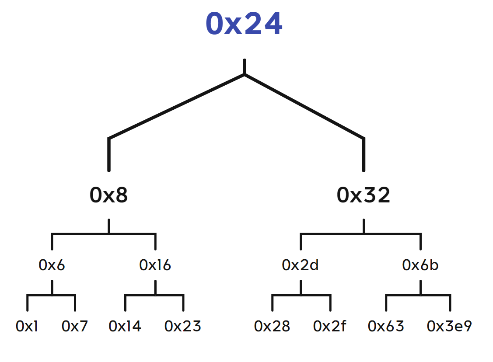

## 开始之前

大名鼎鼎的CS:APP Bomb Lab，即阅读汇编拆炸弹。

实验预计用时：8.5小时（这是我的耗时）

自学实验材料留给我们一个`bomb`和`bomb.c`

首先我们先看看`bomb.c`，缺少头文件，它是不能编译的

```c
/***************************************************************************
 * Dr. Evil's Insidious Bomb, Version 1.1
 * Copyright 2011, Dr. Evil Incorporated. All rights reserved.
 *
 * LICENSE:
 *
 * Dr. Evil Incorporated (the PERPETRATOR) hereby grants you (the
 * VICTIM) explicit permission to use this bomb (the BOMB).  This is a
 * time limited license, which expires on the death of the VICTIM.
 * The PERPETRATOR takes no responsibility for damage, frustration,
 * insanity, bug-eyes, carpal-tunnel syndrome, loss of sleep, or other
 * harm to the VICTIM.  Unless the PERPETRATOR wants to take credit,
 * that is.  The VICTIM may not distribute this bomb source code to
 * any enemies of the PERPETRATOR.  No VICTIM may debug,
 * reverse-engineer, run "strings" on, decompile, decrypt, or use any
 * other technique to gain knowledge of and defuse the BOMB.  BOMB
 * proof clothing may not be worn when handling this program.  The
 * PERPETRATOR will not apologize for the PERPETRATOR's poor sense of
 * humor.  This license is null and void where the BOMB is prohibited
 * by law.
 ***************************************************************************/

#include <stdio.h>
#include <stdlib.h>
#include "support.h"
#include "phases.h"

/* 
 * Note to self: Remember to erase this file so my victims will have no
 * idea what is going on, and so they will all blow up in a
 * spectaculary fiendish explosion. -- Dr. Evil 
 */

FILE *infile;

int main(int argc, char *argv[])
{
    char *input;

    /* Note to self: remember to port this bomb to Windows and put a 
     * fantastic GUI on it. */

    /* When run with no arguments, the bomb reads its input lines 
     * from standard input. */
    if (argc == 1) {  
       infile = stdin;
    } 

    /* When run with one argument <file>, the bomb reads from <file> 
     * until EOF, and then switches to standard input. Thus, as you 
     * defuse each phase, you can add its defusing string to <file> and
     * avoid having to retype it. */
    else if (argc == 2) {
       if (!(infile = fopen(argv[1], "r"))) {
           printf("%s: Error: Couldn't open %s\n", argv[0], argv[1]);
           exit(8);
       }
    }

    /* You can't call the bomb with more than 1 command line argument. */
    else {
       printf("Usage: %s [<input_file>]\n", argv[0]);
       exit(8);
    }

    /* Do all sorts of secret stuff that makes the bomb harder to defuse. */
    initialize_bomb();

    printf("Welcome to my fiendish little bomb. You have 6 phases with\n");
    printf("which to blow yourself up. Have a nice day!\n");

    /* Hmm...  Six phases must be more secure than one phase! */
    input = read_line();             /* Get input                   */
    phase_1(input);                  /* Run the phase               */
    phase_defused();                 /* Drat!  They figured it out!
          * Let me know how they did it. */
    printf("Phase 1 defused. How about the next one?\n");

    /* The second phase is harder.  No one will ever figure out
     * how to defuse this... */
    input = read_line();
    phase_2(input);
    phase_defused();
    printf("That's number 2.  Keep going!\n");

    /* I guess this is too easy so far.  Some more complex code will
     * confuse people. */
    input = read_line();
    phase_3(input);
    phase_defused();
    printf("Halfway there!\n");

    /* Oh yeah?  Well, how good is your math?  Try on this saucy problem! */
    input = read_line();
    phase_4(input);
    phase_defused();
    printf("So you got that one.  Try this one.\n");
    
    /* Round and 'round in memory we go, where we stop, the bomb blows! */
    input = read_line();
    phase_5(input);
    phase_defused();
    printf("Good work!  On to the next...\n");

    /* This phase will never be used, since no one will get past the
     * earlier ones.  But just in case, make this one extra hard. */
    input = read_line();
    phase_6(input);
    phase_defused();

    /* Wow, they got it!  But isn't something... missing?  Perhaps
     * something they overlooked?  Mua ha ha ha ha! */
    
    return 0;
}
```

这段代码看起来，就是让你一行一行输入答案，正确的话就继续，错误的话就爆炸。

可以看出我们可以把答案分开不同行，放在一个文件里头，运行炸弹的时候传进去就行了，也可以一个个输进命令行。

其次我们需要反汇编一下，获取反汇编后的汇编代码，这里用`objdump`即可

```shell
objdump -d bomb > bomb.asm
```

我们还需要准备好`gdb`，运行的时候做调试工具

小tips：打断点在在比较指令后，用`info registers eflags`就能看到Condition codes了。~~可以提前知道炸弹会不会炸，要是出事了`kill`掉就行了~~

万事俱备，那我们开始吧

## Phase 1

该阶段不难，读出大概意思就能解

```text
0000000000400ee0 <phase_1>:
  400ee0: 48 83 ec 08           sub    $0x8,%rsp
  400ee4: be 00 24 40 00        mov    $0x402400,%esi
  400ee9: e8 4a 04 00 00        callq  401338 <strings_not_equal>
  400eee: 85 c0                 test   %eax,%eax
  400ef0: 74 05                 je     400ef7 <phase_1+0x17>
  400ef2: e8 43 05 00 00        callq  40143a <explode_bomb>
  400ef7: 48 83 c4 08           add    $0x8,%rsp
  400efb: c3                    retq   
```

先是准备好了两个参数，然后调用`strings_not_euqal` 函数，然后对比返回值，如果0就不爆炸，不是0就会爆炸。如果是正常人的话，想想就会是，输入的字符串不相等就会爆炸，相等就不爆。

看到汇编里头操作寄存器的语句，容易知道是传入两个字符串——用户输入的与预置的，进行比较。

而再观察一番，发现预置的那个字符串在`0x402400`上。我们便可以用如下命令来读取该地址上的值。

```text
(gdb) x /s 0x402400
0x402400:       "Border relations with Canada have never been better."
```

所以答案是`Border relations with Canada have never been better.`

## Phase 2

```text
0000000000400efc <phase_2>:
  400efc: 55                    push   %rbp
  400efd: 53                    push   %rbx
  400efe: 48 83 ec 28           sub    $0x28,%rsp
  400f02: 48 89 e6              mov    %rsp,%rsi
  400f05: e8 52 05 00 00        callq  40145c <read_six_numbers>
  400f0a: 83 3c 24 01           cmpl   $0x1,(%rsp)
  400f0e: 74 20                 je     400f30 <phase_2+0x34>
  400f10: e8 25 05 00 00        callq  40143a <explode_bomb>
  400f15: eb 19                 jmp    400f30 <phase_2+0x34>
  400f17: 8b 43 fc              mov    -0x4(%rbx),%eax
  400f1a: 01 c0                 add    %eax,%eax
  400f1c: 39 03                 cmp    %eax,(%rbx)
  400f1e: 74 05                 je     400f25 <phase_2+0x29>
  400f20: e8 15 05 00 00        callq  40143a <explode_bomb>
  400f25: 48 83 c3 04           add    $0x4,%rbx
  400f29: 48 39 eb              cmp    %rbp,%rbx
  400f2c: 75 e9                 jne    400f17 <phase_2+0x1b>
  400f2e: eb 0c                 jmp    400f3c <phase_2+0x40>
  400f30: 48 8d 5c 24 04        lea    0x4(%rsp),%rbx
  400f35: 48 8d 6c 24 18        lea    0x18(%rsp),%rbp
  400f3a: eb db                 jmp    400f17 <phase_2+0x1b>
  400f3c: 48 83 c4 28           add    $0x28,%rsp
  400f40: 5b                    pop    %rbx
  400f41: 5d                    pop    %rbp
  400f42: c3                    retq  
```

这里可以看到一个函数`read_six_numbers`，顾名思义，这个函数是用来从input里头读取六个数字。我们来分析下这个函数到底做了啥。

```text
000000000040145c <read_six_numbers>:
  40145c: 48 83 ec 18           sub    $0x18,%rsp
  401460: 48 89 f2              mov    %rsi,%rdx
  401463: 48 8d 4e 04           lea    0x4(%rsi),%rcx
  401467: 48 8d 46 14           lea    0x14(%rsi),%rax
  40146b: 48 89 44 24 08        mov    %rax,0x8(%rsp)
  401470: 48 8d 46 10           lea    0x10(%rsi),%rax
  401474: 48 89 04 24           mov    %rax,(%rsp)
  401478: 4c 8d 4e 0c           lea    0xc(%rsi),%r9
  40147c: 4c 8d 46 08           lea    0x8(%rsi),%r8
  401480: be c3 25 40 00        mov    $0x4025c3,%esi
  401485: b8 00 00 00 00        mov    $0x0,%eax
  40148a: e8 61 f7 ff ff        callq  400bf0 <__isoc99_sscanf@plt>
  40148f: 83 f8 05              cmp    $0x5,%eax
  401492: 7f 05                 jg     401499 <read_six_numbers+0x3d>
  401494: e8 a1 ff ff ff        callq  40143a <explode_bomb>
  401499: 48 83 c4 18           add    $0x18,%rsp
  40149d: c3                    retq   
```

我们去**CppReference**查一下C语言的API

```c
int sscanf( const char *restrict buffer, const char *restrict format, ... ); // (since C99)
```

输入的格式化字符串应该在第二个参数，而上面的汇编代码可以看出，这个字符串在地址`0x4025c3`上，我们用gdb来看看

```text
(gdb) x/s 0x4025c3
0x4025c3:       "%d %d %d %d %d %d"
```

emm果然是六个数字啊，那我们就要看看，第三到第八个参数是啥了。

首先在调用函数前，`phase_2`将栈顶指针给复制到了`%rsi`。

```text
400f02: 48 89 e6              mov    %rsp,%rsi
```

然后在读取六个数字的函数调用sscanf之前，准备了一坨参数，可以看到偏移量都是4，妥妥的int整数

```text
  # %rsi is %rsp
  401463: 48 8d 4e 04           lea    0x4(%rsi),%rcx
  401467: 48 8d 46 14           lea    0x14(%rsi),%rax
  40146b: 48 89 44 24 08        mov    %rax,0x8(%rsp)
  401470: 48 8d 46 10           lea    0x10(%rsi),%rax
  401474: 48 89 04 24           mov    %rax,(%rsp)
  401478: 4c 8d 4e 0c           lea    0xc(%rsi),%r9
  40147c: 4c 8d 46 08           lea    0x8(%rsi),%r8
```

对着寄存器表查了一波，`%rsi`为第一个变量的地址，`%rcx`为第二个变量的地址，`%r8`是第三个的...

那我可以猜测了——这六个数是依次从栈顶排下去的

可以直接实验一下，在爆炸前打个断点，输入`1 2 3 4 5 6`，然后看看此时栈的情况。

```text
(gdb) x/8wx $rsp
0x7fffffffe350: 0x00000001      0x00000002      0x00000003      0x00000004
0x7fffffffe360: 0x00000005      0x00000006      0x00401431      0x00000000
```

果然如此，那我们继续看看汇编

```text
  400f0a: 83 3c 24 01           cmpl   $0x1,(%rsp)
  400f0e: 74 20                 je     400f30 <phase_2+0x34>
  400f10: e8 25 05 00 00        callq  40143a <explode_bomb>
```

可以看出，先是看看栈顶是否为1，是就继续，否则爆炸。

然后执行下面这些语句，先把第二个元素的地址放入`%rbx`，然后`%rbp`为`%rsp + 0x18`，刚好是6个int整数的长度

```text
  400f30: 48 8d 5c 24 04        lea    0x4(%rsp),%rbx
  400f35: 48 8d 6c 24 18        lea    0x18(%rsp),%rbp
  400f3a: eb db                 jmp    400f17 <phase_2+0x1b>
```

然后跳转到这，开始循环，可以看到，前面的这几条语句是初始化循环。

```text
  400f17: 8b 43 fc              mov    -0x4(%rbx),%eax
  400f1a: 01 c0                 add    %eax,%eax
  400f1c: 39 03                 cmp    %eax,(%rbx)
  400f1e: 74 05                 je     400f25 <phase_2+0x29>
  400f20: e8 15 05 00 00        callq  40143a <explode_bomb>
  400f25: 48 83 c3 04           add    $0x4,%rbx
  400f29: 48 39 eb              cmp    %rbp,%rbx
  400f2c: 75 e9                 jne    400f17 <phase_2+0x1b>
  400f2e: eb 0c                 jmp    400f3c <phase_2+0x40>
```

上面这段汇编的意思是：

把第一个元素放入`%eax`，然后将其翻倍，然后与第二个元素进行比较，如果不相等，就引爆炸弹。然后`%rbx`就继续向上跑，指向第三个元素，继续与第二个元素比较，如果第三个元素是第二个的两倍就继续，否则就爆炸，......，直到`%rbx`与`$rbp`相等为止。

所以后一个元素要是前一个元素的两倍，并且第一个元素要是1。

答案便呼之欲出：`1 2 4 8 16 32`

## Phase 3

```text
0000000000400f43 <phase_3>:
  400f43: 48 83 ec 18           sub    $0x18,%rsp
  400f47: 48 8d 4c 24 0c        lea    0xc(%rsp),%rcx
  400f4c: 48 8d 54 24 08        lea    0x8(%rsp),%rdx
  400f51: be cf 25 40 00        mov    $0x4025cf,%esi
  400f56: b8 00 00 00 00        mov    $0x0,%eax
  400f5b: e8 90 fc ff ff        callq  400bf0 <__isoc99_sscanf@plt>
  400f60: 83 f8 01              cmp    $0x1,%eax
  400f63: 7f 05                 jg     400f6a <phase_3+0x27>
  400f65: e8 d0 04 00 00        callq  40143a <explode_bomb>
  400f6a: 83 7c 24 08 07        cmpl   $0x7,0x8(%rsp)
  400f6f: 77 3c                 ja     400fad <phase_3+0x6a>
  400f71: 8b 44 24 08           mov    0x8(%rsp),%eax
  400f75: ff 24 c5 70 24 40 00  jmpq   *0x402470(,%rax,8)
  400f7c: b8 cf 00 00 00        mov    $0xcf,%eax
  400f81: eb 3b                 jmp    400fbe <phase_3+0x7b>
  400f83: b8 c3 02 00 00        mov    $0x2c3,%eax
  400f88: eb 34                 jmp    400fbe <phase_3+0x7b>
  400f8a: b8 00 01 00 00        mov    $0x100,%eax
  400f8f: eb 2d                 jmp    400fbe <phase_3+0x7b>
  400f91: b8 85 01 00 00        mov    $0x185,%eax
  400f96: eb 26                 jmp    400fbe <phase_3+0x7b>
  400f98: b8 ce 00 00 00        mov    $0xce,%eax
  400f9d: eb 1f                 jmp    400fbe <phase_3+0x7b>
  400f9f: b8 aa 02 00 00        mov    $0x2aa,%eax
  400fa4: eb 18                 jmp    400fbe <phase_3+0x7b>
  400fa6: b8 47 01 00 00        mov    $0x147,%eax
  400fab: eb 11                 jmp    400fbe <phase_3+0x7b>
  400fad: e8 88 04 00 00        callq  40143a <explode_bomb>
  400fb2: b8 00 00 00 00        mov    $0x0,%eax
  400fb7: eb 05                 jmp    400fbe <phase_3+0x7b>
  400fb9: b8 37 01 00 00        mov    $0x137,%eax
  400fbe: 3b 44 24 0c           cmp    0xc(%rsp),%eax
  400fc2: 74 05                 je     400fc9 <phase_3+0x86>
  400fc4: e8 71 04 00 00        callq  40143a <explode_bomb>
  400fc9: 48 83 c4 18           add    $0x18,%rsp
  400fcd: c3                    retq
```

我们把这汇编拆开几部分来分析，首先很容易看出这个

```text
400f5b: e8 90 fc ff ff        callq  400bf0 <__isoc99_sscanf@plt>
```

很明显是做输入了，我们去**CppReference**查一下C语言的API，~~哦不用了刚刚已经查过了~~

再看看开头这一段汇编，这是为`sscanf`函数准备参数的过程。

```text
0000000000400f43 <phase_3>:
  400f43: 48 83 ec 18           sub    $0x18,%rsp
  400f47: 48 8d 4c 24 0c        lea    0xc(%rsp),%rcx
  400f4c: 48 8d 54 24 08        lea    0x8(%rsp),%rdx
  400f51: be cf 25 40 00        mov    $0x4025cf,%esi
  400f56: b8 00 00 00 00        mov    $0x0,%eax
```

参数1在main函数的时候已经存到`%rdi`了。参数2是格式字符串，我们可以通过调试命令`x/s 0x4025cf` 得到`"%d %d"` 。参数3及以后便是变量的地址了，这里参数3 4通过lea计算栈地址，并传入相应的寄存器中。这里我们把这两个参数称之为：第一个数字，第二个数字（

有一说一，~~我之前差点把这个函数当成普通的`scanf`了~~

接着便是比较返回值，如果成功接受的参数数目为2，那么就会跳过爆炸函数的调用。但是如果第一个参数小于1或大于7就会爆炸（注意，比较的指令为`ja`）

```text
400f60: 83 f8 01              cmp    $0x1,%eax
400f63: 7f 05                 jg     400f6a <phase_3+0x27>
400f65: e8 d0 04 00 00        callq  40143a <explode_bomb>
400f6a: 83 7c 24 08 07        cmpl   $0x7,0x8(%rsp)
400f6f: 77 3c                 ja     400fad <phase_3+0x6a>
```

接着，语句`mov  0x8(%rsp),%eax`便是把第一个数字给存到%eax里头。紧接着就出现这条语句

```text
400f71: 8b 44 24 08           mov    0x8(%rsp),%eax
400f75: ff 24 c5 70 24 40 00  jmpq   *0x402470(,%rax,8)
```

而`0x400f75`上的语句看起来就是跳转至该内存区域中存放的地址，那么同理，我们可以用gdb获取到对应地址的值。

```text
(gdb) x/x 0x402470
0x402470:       0x00400f7c
```

`%rax`的值可以是0~7，这意味着我们要对内存进行偏移，所以我们可以使用命令`x/16x [addr]`，得出所有的displacement后的地址

```text
(gdb) x/16x 0x402470
0x402470:       0x00400f7c      0x00000000      0x00400fb9      0x00000000
0x402480:       0x00400f83      0x00000000      0x00400f8a      0x00000000
0x402490:       0x00400f91      0x00000000      0x00400f98      0x00000000
0x4024a0:       0x00400f9f      0x00000000      0x00400fa6      0x00000000
```

结合下面的这部分汇编，我们就可以看出这是一个switch语句，根据刚刚得到的信息，那么我们就可以进行标注。

```text
  # x = 0
  400f7c: b8 cf 00 00 00        mov    $0xcf,%eax
  400f81: eb 3b                 jmp    400fbe <phase_3+0x7b>
  # x = 2
  400f83: b8 c3 02 00 00        mov    $0x2c3,%eax
  400f88: eb 34                 jmp    400fbe <phase_3+0x7b>
  # x = 3
  400f8a: b8 00 01 00 00        mov    $0x100,%eax
  400f8f: eb 2d                 jmp    400fbe <phase_3+0x7b>
  # x = 4
  400f91: b8 85 01 00 00        mov    $0x185,%eax
  400f96: eb 26                 jmp    400fbe <phase_3+0x7b>
  # x = 5
  400f98: b8 ce 00 00 00        mov    $0xce,%eax
  400f9d: eb 1f                 jmp    400fbe <phase_3+0x7b>
  # x = 6
  400f9f: b8 aa 02 00 00        mov    $0x2aa,%eax
  400fa4: eb 18                 jmp    400fbe <phase_3+0x7b>
  # x = 7
  400fa6: b8 47 01 00 00        mov    $0x147,%eax
  400fab: eb 11                 jmp    400fbe <phase_3+0x7b>
  # default
  400fad: e8 88 04 00 00        callq  40143a <explode_bomb>
  400fb2: b8 00 00 00 00        mov    $0x0,%eax
  400fb7: eb 05                 jmp    400fbe <phase_3+0x7b>
  # x = 1
  400fb9: b8 37 01 00 00        mov    $0x137,%eax
  # switch ends
  400fbe: 3b 44 24 0c           cmp    0xc(%rsp),%eax
  400fc2: 74 05                 je     400fc9 <phase_3+0x86>
  400fc4: e8 71 04 00 00        callq  40143a <explode_bomb>
  400fc9: 48 83 c4 18           add    $0x18,%rsp
  400fcd: c3                    retq
```

不过呢，所有case执行过后都把对应的数复制到%eax上，然后跳转到`400fbe` 上，**此时的%eax**便会与输入的第二个数字进行比较，如果相等则成功解除本阶段的炸弹。

所以，我们可以得出其中一个答案为： `1 311`

## Phase 4

```text
000000000040100c <phase_4>:
  40100c: 48 83 ec 18           sub    $0x18,%rsp
  401010: 48 8d 4c 24 0c        lea    0xc(%rsp),%rcx
  401015: 48 8d 54 24 08        lea    0x8(%rsp),%rdx
  40101a: be cf 25 40 00        mov    $0x4025cf,%esi
  40101f: b8 00 00 00 00        mov    $0x0,%eax
  401024: e8 c7 fb ff ff        callq  400bf0 <__isoc99_sscanf@plt>
  401029: 83 f8 02              cmp    $0x2,%eax
  40102c: 75 07                 jne    401035 <phase_4+0x29>
  40102e: 83 7c 24 08 0e        cmpl   $0xe,0x8(%rsp)
  401033: 76 05                 jbe    40103a <phase_4+0x2e>
  401035: e8 00 04 00 00        callq  40143a <explode_bomb>
  40103a: ba 0e 00 00 00        mov    $0xe,%edx
  40103f: be 00 00 00 00        mov    $0x0,%esi
  401044: 8b 7c 24 08           mov    0x8(%rsp),%edi
  401048: e8 81 ff ff ff        callq  400fce <func4>
  40104d: 85 c0                 test   %eax,%eax
  40104f: 75 07                 jne    401058 <phase_4+0x4c>
  401051: 83 7c 24 0c 00        cmpl   $0x0,0xc(%rsp)
  401056: 74 05                 je     40105d <phase_4+0x51>
  401058: e8 dd 03 00 00        callq  40143a <explode_bomb>
  40105d: 48 83 c4 18           add    $0x18,%rsp
  401061: c3                    retq   
```

拆开几部分来看

看起来，前面这部分依旧是读取两个数字，如果没读齐两个数字，或者第一个数字没有小于等于14的话，炸弹就会爆炸。

```text
000000000040100c <phase_4>:
  40100c: 48 83 ec 18           sub    $0x18,%rsp
  401010: 48 8d 4c 24 0c        lea    0xc(%rsp),%rcx
  401015: 48 8d 54 24 08        lea    0x8(%rsp),%rdx
  40101a: be cf 25 40 00        mov    $0x4025cf,%esi
  40101f: b8 00 00 00 00        mov    $0x0,%eax
  401024: e8 c7 fb ff ff        callq  400bf0 <__isoc99_sscanf@plt>
  401029: 83 f8 02              cmp    $0x2,%eax
  40102c: 75 07                 jne    401035 <phase_4+0x29>
  40102e: 83 7c 24 08 0e        cmpl   $0xe,0x8(%rsp)
  401033: 76 05                 jbe    40103a <phase_4+0x2e>
  401035: e8 00 04 00 00        callq  40143a <explode_bomb>
```

后半部分是构造好参数到寄存器里头，然后调用函数`func4`，接着比较返回值，如果返回值不为0就会爆炸。如果第二个数字不为0的话，炸弹也会爆炸。

```text
  40103a: ba 0e 00 00 00        mov    $0xe,%edx
  40103f: be 00 00 00 00        mov    $0x0,%esi
  401044: 8b 7c 24 08           mov    0x8(%rsp),%edi
  401048: e8 81 ff ff ff        callq  400fce <func4>
  40104d: 85 c0                 test   %eax,%eax
  40104f: 75 07                 jne    401058 <phase_4+0x4c>
  401051: 83 7c 24 0c 00        cmpl   $0x0,0xc(%rsp)
  401056: 74 05                 je     40105d <phase_4+0x51>
  401058: e8 dd 03 00 00        callq  40143a <explode_bomb>
  40105d: 48 83 c4 18           add    $0x18,%rsp
  401061: c3                    retq   
```

我们看到函数调用的另外一个函数`func4`

```text
0000000000400fce <func4>:
  400fce: 48 83 ec 08           sub    $0x8,%rsp
  400fd2: 89 d0                 mov    %edx,%eax
  400fd4: 29 f0                 sub    %esi,%eax
  400fd6: 89 c1                 mov    %eax,%ecx
  400fd8: c1 e9 1f              shr    $0x1f,%ecx
  400fdb: 01 c8                 add    %ecx,%eax
  400fdd: d1 f8                 sar    %eax
  400fdf: 8d 0c 30              lea    (%rax,%rsi,1),%ecx
  400fe2: 39 f9                 cmp    %edi,%ecx
  400fe4: 7e 0c                 jle    400ff2 <func4+0x24>
  400fe6: 8d 51 ff              lea    -0x1(%rcx),%edx
  400fe9: e8 e0 ff ff ff        callq  400fce <func4>
  400fee: 01 c0                 add    %eax,%eax
  400ff0: eb 15                 jmp    401007 <func4+0x39>
  400ff2: b8 00 00 00 00        mov    $0x0,%eax
  400ff7: 39 f9                 cmp    %edi,%ecx
  400ff9: 7d 0c                 jge    401007 <func4+0x39>
  400ffb: 8d 71 01              lea    0x1(%rcx),%esi
  400ffe: e8 cb ff ff ff        callq  400fce <func4>
  401003: 8d 44 00 01           lea    0x1(%rax,%rax,1),%eax
  401007: 48 83 c4 08           add    $0x8,%rsp
  40100b: c3                    retq
```

这个函数看起来是先对做了一定的运算，然后进行比较判断，最后再递归调用自身

由于涉及到了递归调用，增加了~~边注释边脑补的~~难度，所以我们可以逆着写出对应的C代码

```c
int f4(int x, int y, int z)
{
    int t = z - y;
    unsigned tmp = t >> 31;
    t += tmp;
    t >>= 1;
    int sum = t + y;
    if (sum - x == 0)
    {
        return 0;
    }
    if (sum - x > 0)
    {
        return 2 * f4(x, y, sum - 1);
    }
    if (sum - x < 0)
    {
        return 2 * f4(x, sum + 1, z) + 1;
    }
}
```

~~最后我们可以用循环，把答案给搞出来~~

```c
int main()
{
    for (int i = 0; i <= 14; i++)
    {
        if (f4(i, 0, 14) == 0)
        {
            printf("%d ", i);
        }
    }
}
```

最后得出 `0 1 3 7` ，然后又因为第二个数必须为`0`，所以答案可以是 `7 0`

## Phase 5

```text
0000000000401062 <phase_5>:
  401062: 53                    push   %rbx
  401063: 48 83 ec 20           sub    $0x20,%rsp
  401067: 48 89 fb              mov    %rdi,%rbx
  40106a: 64 48 8b 04 25 28 00  mov    %fs:0x28,%rax
  401071: 00 00 
  401073: 48 89 44 24 18        mov    %rax,0x18(%rsp)
  401078: 31 c0                 xor    %eax,%eax
  40107a: e8 9c 02 00 00        callq  40131b <string_length>
  40107f: 83 f8 06              cmp    $0x6,%eax
  401082: 74 4e                 je     4010d2 <phase_5+0x70>
  401084: e8 b1 03 00 00        callq  40143a <explode_bomb>
  401089: eb 47                 jmp    4010d2 <phase_5+0x70>
  40108b: 0f b6 0c 03           movzbl (%rbx,%rax,1),%ecx
  40108f: 88 0c 24              mov    %cl,(%rsp)
  401092: 48 8b 14 24           mov    (%rsp),%rdx
  401096: 83 e2 0f              and    $0xf,%edx
  401099: 0f b6 92 b0 24 40 00  movzbl 0x4024b0(%rdx),%edx
  4010a0: 88 54 04 10           mov    %dl,0x10(%rsp,%rax,1)
  4010a4: 48 83 c0 01           add    $0x1,%rax
  4010a8: 48 83 f8 06           cmp    $0x6,%rax
  4010ac: 75 dd                 jne    40108b <phase_5+0x29>
  4010ae: c6 44 24 16 00        movb   $0x0,0x16(%rsp)
  4010b3: be 5e 24 40 00        mov    $0x40245e,%esi
  4010b8: 48 8d 7c 24 10        lea    0x10(%rsp),%rdi
  4010bd: e8 76 02 00 00        callq  401338 <strings_not_equal>
  4010c2: 85 c0                 test   %eax,%eax
  4010c4: 74 13                 je     4010d9 <phase_5+0x77>
  4010c6: e8 6f 03 00 00        callq  40143a <explode_bomb>
  4010cb: 0f 1f 44 00 00        nopl   0x0(%rax,%rax,1)
  4010d0: eb 07                 jmp    4010d9 <phase_5+0x77>
  4010d2: b8 00 00 00 00        mov    $0x0,%eax
  4010d7: eb b2                 jmp    40108b <phase_5+0x29>
  4010d9: 48 8b 44 24 18        mov    0x18(%rsp),%rax
  4010de: 64 48 33 04 25 28 00  xor    %fs:0x28,%rax
  4010e5: 00 00 
  4010e7: 74 05                 je     4010ee <phase_5+0x8c>
  4010e9: e8 42 fa ff ff        callq  400b30 <__stack_chk_fail@plt>
  4010ee: 48 83 c4 20           add    $0x20,%rsp
  4010f2: 5b                    pop    %rbx
  4010f3: c3                    retq   
```

先看看开头

```text
0000000000401062 <phase_5>:
  401062: 53                    push   %rbx
  401063: 48 83 ec 20           sub    $0x20,%rsp
  401067: 48 89 fb              mov    %rdi,%rbx
  40106a: 64 48 8b 04 25 28 00  mov    %fs:0x28,%rax
  401071: 00 00 
  401073: 48 89 44 24 18        mov    %rax,0x18(%rsp)
  401078: 31 c0                 xor    %eax,%eax
  40107a: e8 9c 02 00 00        callq  40131b <string_length>
  40107f: 83 f8 06              cmp    $0x6,%eax
  401082: 74 4e                 je     4010d2 <phase_5+0x70>
  401084: e8 b1 03 00 00        callq  40143a <explode_bomb>
  401089: eb 47                 jmp    4010d2 <phase_5+0x70>
```

开头这段汇编，比对输入的字符串的长度，如果长度不为5，就会爆炸。这里有一个`%fs:0x28`，只是在后面用来检查栈的而已，这里忽略即可。

如果不爆炸的话，就会去到这里

```text
  4010d2: b8 00 00 00 00        mov    $0x0,%eax
  4010d7: eb b2                 jmp    40108b <phase_5+0x29>
```

然而这里继续跳转，跳转到下面这段代码，看起来是循环代码，如果条件没达到就循环执行，如果达到了条件就会执行`4010ac`下一句`4010ae`，这段汇编等下贴

```text
  40108b: 0f b6 0c 03           movzbl (%rbx,%rax,1),%ecx
  40108f: 88 0c 24              mov    %cl,(%rsp)
  401092: 48 8b 14 24           mov    (%rsp),%rdx
  401096: 83 e2 0f              and    $0xf,%edx
  401099: 0f b6 92 b0 24 40 00  movzbl 0x4024b0(%rdx),%edx
  4010a0: 88 54 04 10           mov    %dl,0x10(%rsp,%rax,1)
  4010a4: 48 83 c0 01           add    $0x1,%rax
  4010a8: 48 83 f8 06           cmp    $0x6,%rax
  4010ac: 75 dd                 jne    40108b <phase_5+0x29>
```

那么这段循环代码做了什么呢？我们分析一下，最后写出了如下伪代码

```text
char* input = your input;
for (int i = 0; i < 6; i++) {
  1. retrieve i-th char from input as ch
  2. push ch into stack
  3. mov ch to %rdx
  4. update %rdx with %rdx & 0xf (masking, only retain low 4 bits of ch)
  5. mov the ch on address (0x4024b0 + %rdx) to stack address (%rsp + i) (below stack.top())
}
```

每一次循环，都从`input`里取出第`i`个字符，使其与`0xf`做位运算以只留下低四位的数据，产生的结果作为偏移量`offset`，接着取出`0x4024b0 + offset`处的字符，放到栈里。

那么，`0x4024b0`处肯定是有什么东西的吧？试试就知道了，不试不知道，一试，发现是一个数组。

```text
(gdb) x/s 0x4024b0
0x4024b0 <array.3449>:  "maduiersnfotvbylSo you think you can stop the bomb with ctrl-c, do you?"
```

又刚刚提到了，上面的循环跳出之后，就会执行`4010ac`的下一句`4010ae`

```text
  4010ae: c6 44 24 16 00        movb   $0x0,0x16(%rsp)
  4010b3: be 5e 24 40 00        mov    $0x40245e,%esi
  4010b8: 48 8d 7c 24 10        lea    0x10(%rsp),%rdi
  4010bd: e8 76 02 00 00        callq  401338 <strings_not_equal>
  4010c2: 85 c0                 test   %eax,%eax
  4010c4: 74 13                 je     4010d9 <phase_5+0x77>
  4010c6: e8 6f 03 00 00        callq  40143a <explode_bomb>
  4010cb: 0f 1f 44 00 00        nopl   0x0(%rax,%rax,1)
  4010d0: eb 07                 jmp    4010d9 <phase_5+0x77>
```

那么那一段汇编做了什么工作呢？（注：这里最后一句jmp到结束部分，没有产生什么影响）

看起来是比较两个字符串是否相等，使用函数`string_not_equal`。如果不一样就爆炸，一样就解除该阶段。

同理，我们发现传参的时候，把栈中字符串的指针传进寄存器，准备好了其中一个参数。而另一个参数在准备时，读取了`0x40245e`的值，好，直接用gdb调试看看。

```text
(gdb) x/s 0x40245e
0x40245e:       "flyers"
```

看来我们需要从上面那一大坨字符串中，构造出与flyers一样的字符串。既然刚刚已经说过怎么从这坨字符串中获取字符了。

那我们先把目标字符的index算出来，分别是`9 15 14 5 6 7`

于是，我们只需构造低4位分别为上述index的字符就行了，经过一番的查ASCII表，我们容易得出其中一个答案为`yon567`

## Phase 6

```text
00000000004010f4 <phase_6>:
  4010f4: 41 56                 push   %r14
  4010f6: 41 55                 push   %r13
  4010f8: 41 54                 push   %r12
  4010fa: 55                    push   %rbp
  4010fb: 53                    push   %rbx
  4010fc: 48 83 ec 50           sub    $0x50,%rsp
  401100: 49 89 e5              mov    %rsp,%r13
  401103: 48 89 e6              mov    %rsp,%rsi
  401106: e8 51 03 00 00        callq  40145c <read_six_numbers>
  40110b: 49 89 e6              mov    %rsp,%r14
  40110e: 41 bc 00 00 00 00     mov    $0x0,%r12d
  401114: 4c 89 ed              mov    %r13,%rbp
  401117: 41 8b 45 00           mov    0x0(%r13),%eax
  40111b: 83 e8 01              sub    $0x1,%eax
  40111e: 83 f8 05              cmp    $0x5,%eax
  401121: 76 05                 jbe    401128 <phase_6+0x34>
  401123: e8 12 03 00 00        callq  40143a <explode_bomb>
  401128: 41 83 c4 01           add    $0x1,%r12d
  40112c: 41 83 fc 06           cmp    $0x6,%r12d
  401130: 74 21                 je     401153 <phase_6+0x5f>
  401132: 44 89 e3              mov    %r12d,%ebx
  401135: 48 63 c3              movslq %ebx,%rax
  401138: 8b 04 84              mov    (%rsp,%rax,4),%eax
  40113b: 39 45 00              cmp    %eax,0x0(%rbp)
  40113e: 75 05                 jne    401145 <phase_6+0x51>
  401140: e8 f5 02 00 00        callq  40143a <explode_bomb>
  401145: 83 c3 01              add    $0x1,%ebx
  401148: 83 fb 05              cmp    $0x5,%ebx
  40114b: 7e e8                 jle    401135 <phase_6+0x41>
  40114d: 49 83 c5 04           add    $0x4,%r13
  401151: eb c1                 jmp    401114 <phase_6+0x20>
  401153: 48 8d 74 24 18        lea    0x18(%rsp),%rsi
  401158: 4c 89 f0              mov    %r14,%rax
  40115b: b9 07 00 00 00        mov    $0x7,%ecx
  401160: 89 ca                 mov    %ecx,%edx
  401162: 2b 10                 sub    (%rax),%edx
  401164: 89 10                 mov    %edx,(%rax)
  401166: 48 83 c0 04           add    $0x4,%rax
  40116a: 48 39 f0              cmp    %rsi,%rax
  40116d: 75 f1                 jne    401160 <phase_6+0x6c>
  40116f: be 00 00 00 00        mov    $0x0,%esi
  401174: eb 21                 jmp    401197 <phase_6+0xa3>
  401176: 48 8b 52 08           mov    0x8(%rdx),%rdx
  40117a: 83 c0 01              add    $0x1,%eax
  40117d: 39 c8                 cmp    %ecx,%eax
  40117f: 75 f5                 jne    401176 <phase_6+0x82>
  401181: eb 05                 jmp    401188 <phase_6+0x94>
  401183: ba d0 32 60 00        mov    $0x6032d0,%edx
  401188: 48 89 54 74 20        mov    %rdx,0x20(%rsp,%rsi,2)
  40118d: 48 83 c6 04           add    $0x4,%rsi
  401191: 48 83 fe 18           cmp    $0x18,%rsi
  401195: 74 14                 je     4011ab <phase_6+0xb7>
  401197: 8b 0c 34              mov    (%rsp,%rsi,1),%ecx
  40119a: 83 f9 01              cmp    $0x1,%ecx
  40119d: 7e e4                 jle    401183 <phase_6+0x8f>
  40119f: b8 01 00 00 00        mov    $0x1,%eax
  4011a4: ba d0 32 60 00        mov    $0x6032d0,%edx
  4011a9: eb cb                 jmp    401176 <phase_6+0x82>
  4011ab: 48 8b 5c 24 20        mov    0x20(%rsp),%rbx
  4011b0: 48 8d 44 24 28        lea    0x28(%rsp),%rax
  4011b5: 48 8d 74 24 50        lea    0x50(%rsp),%rsi
  4011ba: 48 89 d9              mov    %rbx,%rcx
  4011bd: 48 8b 10              mov    (%rax),%rdx
  4011c0: 48 89 51 08           mov    %rdx,0x8(%rcx)
  4011c4: 48 83 c0 08           add    $0x8,%rax
  4011c8: 48 39 f0              cmp    %rsi,%rax
  4011cb: 74 05                 je     4011d2 <phase_6+0xde>
  4011cd: 48 89 d1              mov    %rdx,%rcx
  4011d0: eb eb                 jmp    4011bd <phase_6+0xc9>
  4011d2: 48 c7 42 08 00 00 00  movq   $0x0,0x8(%rdx)
  4011d9: 00 
  4011da: bd 05 00 00 00        mov    $0x5,%ebp
  4011df: 48 8b 43 08           mov    0x8(%rbx),%rax
  4011e3: 8b 00                 mov    (%rax),%eax
  4011e5: 39 03                 cmp    %eax,(%rbx)
  4011e7: 7d 05                 jge    4011ee <phase_6+0xfa>
  4011e9: e8 4c 02 00 00        callq  40143a <explode_bomb>
  4011ee: 48 8b 5b 08           mov    0x8(%rbx),%rbx
  4011f2: 83 ed 01              sub    $0x1,%ebp
  4011f5: 75 e8                 jne    4011df <phase_6+0xeb>
  4011f7: 48 83 c4 50           add    $0x50,%rsp
  4011fb: 5b                    pop    %rbx
  4011fc: 5d                    pop    %rbp
  4011fd: 41 5c                 pop    %r12
  4011ff: 41 5d                 pop    %r13
  401201: 41 5e                 pop    %r14
  401203: c3                    retq
```

这个可以说是最难phase了吧？这个前前后后花了我快三个钟...

近100行的汇编...我觉得还是得一部分一部分地分割开来，单独进行分析

首先还是常见的输入六个数字，从前往后扫描，自顶向下地保存到栈里。

```text
  4010fc: 48 83 ec 50           sub    $0x50,%rsp
  401100: 49 89 e5              mov    %rsp,%r13
  401103: 48 89 e6              mov    %rsp,%rsi
  401106: e8 51 03 00 00        callq  40145c <read_six_numbers>
  40110b: 49 89 e6              mov    %rsp,%r14
```

然后便会碰到一个嵌套的循环

```text
  40110e: 41 bc 00 00 00 00     mov    $0x0,%r12d
  401114: 4c 89 ed              mov    %r13,%rbp
  401117: 41 8b 45 00           mov    0x0(%r13),%eax
  40111b: 83 e8 01              sub    $0x1,%eax
  40111e: 83 f8 05              cmp    $0x5,%eax
  401121: 76 05                 jbe    401128 <phase_6+0x34>
  401123: e8 12 03 00 00        callq  40143a <explode_bomb>
  401128: 41 83 c4 01           add    $0x1,%r12d
  40112c: 41 83 fc 06           cmp    $0x6,%r12d
  401130: 74 21                 je     401153 <phase_6+0x5f>
  401132: 44 89 e3              mov    %r12d,%ebx
  401135: 48 63 c3              movslq %ebx,%rax
  401138: 8b 04 84              mov    (%rsp,%rax,4),%eax
  40113b: 39 45 00              cmp    %eax,0x0(%rbp)
  40113e: 75 05                 jne    401145 <phase_6+0x51>
  401140: e8 f5 02 00 00        callq  40143a <explode_bomb>
  401145: 83 c3 01              add    $0x1,%ebx
  401148: 83 fb 05              cmp    $0x5,%ebx
  40114b: 7e e8                 jle    401135 <phase_6+0x41>
  40114d: 49 83 c5 04           add    $0x4,%r13
  401151: eb c1                 jmp    401114 <phase_6+0x20>
```

这个循环用了两个循环进行数字之间的逐一比对

外循环初始化为`i = 0`

```text
  40110e: 41 bc 00 00 00 00     mov    $0x0,%r12d
```

首先先检查了当前第i个数字是否满足大于0且小于等于6，注意第i个数字被保存到了`%rbp`上

```text
  401114: 4c 89 ed              mov    %r13,%rbp
  401117: 41 8b 45 00           mov    0x0(%r13),%eax
  40111b: 83 e8 01              sub    $0x1,%eax
  40111e: 83 f8 05              cmp    $0x5,%eax
  401121: 76 05                 jbe    401128 <phase_6+0x34>
  401123: e8 12 03 00 00        callq  40143a <explode_bomb>

```

然后检查一下i是否超出6，如超出则跳出循环

```text
  401128: 41 83 c4 01           add    $0x1,%r12d
  40112c: 41 83 fc 06           cmp    $0x6,%r12d
  401130: 74 21                 je     401153 <phase_6+0x5f>
```

否则，便使得`j = i + 1`，进入内循环

```text
  401132: 44 89 e3              mov    %r12d,%ebx
  401135: 48 63 c3              movslq %ebx,%rax
  401138: 8b 04 84              mov    (%rsp,%rax,4),%eax
  40113b: 39 45 00              cmp    %eax,0x0(%rbp)
  40113e: 75 05                 jne    401145 <phase_6+0x51>
  401140: e8 f5 02 00 00        callq  40143a <explode_bomb>
  401145: 83 c3 01              add    $0x1,%ebx
  401148: 83 fb 05              cmp    $0x5,%ebx
  40114b: 7e e8                 jle    401135 <phase_6+0x41>
```

从上可以看出，内循环就是，通过displacement寻址，把第j个元素给放入`%eax`，然后与`%rbp`即第i个数字进行比较。如果相等就会爆炸。如果j超过5的话，就会跳出跳出内循环。

最后外循环进行自增和跳转

```text
  40114d: 49 83 c5 04           add    $0x4,%r13 # rbp + 4
  401151: eb c1                 jmp    401114 <phase_6+0x20>
```

整理一下，验证的条件有：

1. 所有数字必须大于0（**使用了`jbe`**进行比较）且小于等于6
2. 每个数字之间不能相等

大致的伪代码如下

```c
int n[6] = {...};
for (int i = 0; i < 6; i++) {
  if (n[i] > 6 && n[i] <= 0) {
    boom();
  }
  for (int j = i + 1; j < 6; j++) {
    if (n[j] == n[i]) {
      boom();
    }
  }
}
// pass
```

这还是第一步...我们继续看看第二步，依旧是个循环

```text
  401153: 48 8d 74 24 18        lea    0x18(%rsp),%rsi
  401158: 4c 89 f0              mov    %r14,%rax
  40115b: b9 07 00 00 00        mov    $0x7,%ecx
  401160: 89 ca                 mov    %ecx,%edx
  401162: 2b 10                 sub    (%rax),%edx
  401164: 89 10                 mov    %edx,(%rax)
  401166: 48 83 c0 04           add    $0x4,%rax
  40116a: 48 39 f0              cmp    %rsi,%rax
  40116d: 75 f1                 jne    401160 <phase_6+0x6c>
```

先是把`0x18(%rsp)`到`%rsi`上（用于在`40116a`处做比较判断循环是否终止），把栈顶指针复制一份给`%r14`，接着把直接数7给了`%ecx`，再临时把7存到`%edx`做后续计算

开始了：把`%edx`的数7给减去`(%rax)`，再把`%edx`复制到`(%rax)`，实现了`x => 7 - x`的映射。

如果我们输入`1 2 3 4 5 6`，那么程序就会处理为`6 5 4 3 2 1`

用JS来表示就相当于

```javascript
const arr = [1, 2, 3, 4, 5, 6].map(x => 7 - x); // [6, 5, 4, 3, 2, 1]
```

好，很有精神，那么我们加大力度！

```text
  40116f: be 00 00 00 00        mov    $0x0,%esi
  401174: eb 21                 jmp    401197 <phase_6+0xa3>
  401176: 48 8b 52 08           mov    0x8(%rdx),%rdx
  40117a: 83 c0 01              add    $0x1,%eax
  40117d: 39 c8                 cmp    %ecx,%eax
  40117f: 75 f5                 jne    401176 <phase_6+0x82>
  401181: eb 05                 jmp    401188 <phase_6+0x94>
  401183: ba d0 32 60 00        mov    $0x6032d0,%edx
  401188: 48 89 54 74 20        mov    %rdx,0x20(%rsp,%rsi,2)
  40118d: 48 83 c6 04           add    $0x4,%rsi
  401191: 48 83 fe 18           cmp    $0x18,%rsi
  401195: 74 14                 je     4011ab <phase_6+0xb7>
  401197: 8b 0c 34              mov    (%rsp,%rsi,1),%ecx
  40119a: 83 f9 01              cmp    $0x1,%ecx
  40119d: 7e e4                 jle    401183 <phase_6+0x8f>
  40119f: b8 01 00 00 00        mov    $0x1,%eax
  4011a4: ba d0 32 60 00        mov    $0x6032d0,%edx
  4011a9: eb cb                 jmp    401176 <phase_6+0x82>
```

上面这几行汇编，大概做了这些事情，我先写点伪代码

```text
1. %esi = i = 0;
2. get i-th number from stack
3. if i <= 1, then *(0x20 + %rsp + 2 * i) = %edx = 0x6032d0
   else if i > 1 AND i <= 6, let j = 1, %edx = 0x6032d0, then
      1. while j < (i-th number from stack)
          1. %edx = *(%edx + 8) // %edx = node->next
          2. j++
      2. *(0x20 + %rsp + 2 * i) = %edx
4. i = i + 4
5. if i != 24, goto step 2
```

通过汇编又可以看出，这里将一个地址送进去了`%edx`，这symbol，看起来就是一个链表节点

```text
(gdb) x/24x 0x6032d0
0x6032d0 <node1>:       0x0000014c      0x00000001      0x006032e0      0x00000000
0x6032e0 <node2>:       0x000000a8      0x00000002      0x006032f0      0x00000000
0x6032f0 <node3>:       0x0000039c      0x00000003      0x00603300      0x00000000
0x603300 <node4>:       0x000002b3      0x00000004      0x00603310      0x00000000
0x603310 <node5>:       0x000001dd      0x00000005      0x00603320      0x00000000
0x603320 <node6>:       0x000001bb      0x00000006      0x00000000      0x00000000
```

根据伪代码，把偏移了8之后的地址给解引用后的值是一个地址，猜测是`node->next`。那么综上所述，这一步是依次读取第i个数字n，将第n个节点的地址复制到栈上

打个断点验证一下，如果我们输入`1 2 3 4 5 6`，那么栈里头的地址就依次是第`6 5 4 3 2 1`个节点的地址

```text
(gdb) x/24x ($rsp+0x20)
0x7fffffffe340: 0x00603320      0x00000000      0x00603310      0x00000000
0x7fffffffe350: 0x00603300      0x00000000      0x006032f0      0x00000000
0x7fffffffe360: 0x006032e0      0x00000000      0x006032d0      0x00000000
0x7fffffffe370: 0xffffe498      0x00007fff      0x00000000      0x00000000
0x7fffffffe380: 0x00400c90      0x00000000      0xffffe490      0x00007fff
0x7fffffffe390: 0x00000000      0x00000000      0x00400ecb      0x00000000
```

YES，验证完毕，的确如此。且注意，每一个地址都占了4字节，后面还填充了4字节的0

接着，我们进入了新的汇编代码中

```text
  4011ab: 48 8b 5c 24 20        mov    0x20(%rsp),%rbx
  4011b0: 48 8d 44 24 28        lea    0x28(%rsp),%rax
  4011b5: 48 8d 74 24 50        lea    0x50(%rsp),%rsi
  4011ba: 48 89 d9              mov    %rbx,%rcx
  4011bd: 48 8b 10              mov    (%rax),%rdx
  4011c0: 48 89 51 08           mov    %rdx,0x8(%rcx)
  4011c4: 48 83 c0 08           add    $0x8,%rax
  4011c8: 48 39 f0              cmp    %rsi,%rax
  4011cb: 74 05                 je     4011d2 <phase_6+0xde>
  4011cd: 48 89 d1              mov    %rdx,%rcx
  4011d0: eb eb                 jmp    4011bd <phase_6+0xc9>
```

开始分析

```text
  4011ab: 48 8b 5c 24 20        mov    0x20(%rsp),%rbx
  4011b0: 48 8d 44 24 28        lea    0x28(%rsp),%rax
  4011b5: 48 8d 74 24 50        lea    0x50(%rsp),%rsi
  4011ba: 48 89 d9              mov    %rbx,%rcx
```

上面这一段是为循环做初始化：`%rsi`为结束时候的地址，`%rbx`为`0x20(%rsp)`上的值，然而`%rax`存放的是`0x28(%rsp)`的地址！

如果来个类型的话，那就是

```c
Node* %rbx;
Node** %rax;
```

循环开始，看看第一次循环都做了什么。

注意：为了避免产生晕针现象，我们把所有的记号变为类型`Node*`，即节点所在的起始地址

记号为：在**这个部分**，栈上第一个节点是`%rbx`即`node1`,第二个节点是`(%rax)`即`node2`

```text
  4011bd: 48 8b 10              mov    (%rax),%rdx
  4011c0: 48 89 51 08           mov    %rdx,0x8(%rcx)
  4011c4: 48 83 c0 08           add    $0x8,%rax
  4011c8: 48 39 f0              cmp    %rsi,%rax
  4011cb: 74 05                 je     4011d2 <phase_6+0xde>
  4011cd: 48 89 d1              mov    %rdx,%rcx
  4011d0: eb eb                 jmp    4011bd <phase_6+0xc9>
```

第一次循环做了这些事情：

1. 将`node2`给了`%rdx`
2. 将`%rdx`拷给`0x8(%rcx)`即`node1->next = node2`（注意括号在`mov`指令下，有解引用的意思）
3. 检查循环条件`%rsi == %rax`,是则跳出循环
4. 否则继续，把`node2`赋给`%rcx`

推广一下

第n次循环做了这些事情：

1. 将`node(n+1)`给了`%rdx`
2. 将`%rdx`拷给`0x8(%rcx)`即`node(n)->next = node(n+1)`（注意括号在`mov`指令下，有解引用的意思）
3. 检查循环条件`%rsi == %rax`,是则跳出循环
4. 否则继续，把`node(n+1)`赋给`%rcx`

继续顺推一下，就会发现，这是很明显的**节点重连**了

好耶，继续前进，我们注意到了这个细节

```text
4011d2: 48 c7 42 08 00 00 00  movq   $0x0,0x8(%rdx)
```

这是给最后一个节点的`node->next`赋上了`NULL`

啊啊啊，终于到最后一步了！！！

```text
  4011da: bd 05 00 00 00        mov    $0x5,%ebp
  4011df: 48 8b 43 08           mov    0x8(%rbx),%rax
  4011e3: 8b 00                 mov    (%rax),%eax
  4011e5: 39 03                 cmp    %eax,(%rbx)
  4011e7: 7d 05                 jge    4011ee <phase_6+0xfa>
  4011e9: e8 4c 02 00 00        callq  40143a <explode_bomb>
  4011ee: 48 8b 5b 08           mov    0x8(%rbx),%rbx
  4011f2: 83 ed 01              sub    $0x1,%ebp
  4011f5: 75 e8                 jne    4011df <phase_6+0xeb>
```

依旧是一个循环，初始化：`%ebp = 5`，然后用到了上文的`%rbx = *(0x20(%rsp))`即首个节点。

先是使`%rax`为`node1->next`，接着访问得到`node1->next->val`获得node2的值，最后对比`node2->val`与`node1->val`的值，如果1的值大于等于2的就继续，否则爆炸

接着把`node1->next`赋值给`%rbx`，`%ebp`自减1，继续循环，当`%ebp == 0`时，就结束循环。

捋一捋这个过程，其实就是相邻两个节点之间的值对比罢了。**要求是**前面的节点必须大于后面的节点

我们把节点们的值都打印出来

```text
(gdb) x/24d 0x6032d0
0x6032d0 <node1>:       332     1       6304480 0
0x6032e0 <node2>:       168     2       6304496 0
0x6032f0 <node3>:       924     3       6304512 0
0x603300 <node4>:       691     4       6304528 0
0x603310 <node5>:       477     5       6304544 0
0x603320 <node6>:       443     6       0       0
```

很容易看出，进入栈中等候重连的节点顺序应该为`3 4 5 6 1 2`，但是注意到前面有一个`x => 7 - x`的映射，我们要构造的答案就要是`4 3 2 1 6 5`了！

芜湖，完美解决

~~吐槽时间到~~

~~好家伙，涉及的步骤是真的多——有六个数字的输入，对这些数字进行映射，链表与结构体，有关链表部分涉及到读取节点的值，甚至还有节点重连~~

## 完结撒花(并没有)

至此，炸弹~~好像~~被我干掉了

```text
situ@ubuntu:~/Desktop/solutions-csapp/labs/bomb$ ./bomb answer.txt 
Welcome to my fiendish little bomb. You have 6 phases with
which to blow yourself up. Have a nice day!
Phase 1 defused. How about the next one?
That's number 2.  Keep going!
Halfway there!
So you got that one.  Try this one.
Good work!  On to the next...
Congratulations! You've defused the bomb!
```

## Secret Phase

但是你以为就这样结束了？还没有呢！作者特地为我们留下了一个`secret_phase`，你看看`bomb.c`里头这神奇的注释

```c
/* Wow, they got it!  But isn't something... missing?  Perhaps
 * something they overlooked?  Mua ha ha ha ha! */
```

~~你以为拆掉炸弹了，但炸弹没被全拆~~

那么我得好好观察一下，这个秘密阶段是如何进入的，最简单的方法就是直接搜索`<secret_phase>`，可以直接找到这函数在哪里被调用。

一番查找之后，发现竟然是在函数`phase_defused`里头，藏得可真巧妙

国际惯例，先把这个函数晒出来

```text
00000000004015c4 <phase_defused>:
  4015c4: 48 83 ec 78           sub    $0x78,%rsp
  4015c8: 64 48 8b 04 25 28 00  mov    %fs:0x28,%rax
  4015cf: 00 00 
  4015d1: 48 89 44 24 68        mov    %rax,0x68(%rsp)
  4015d6: 31 c0                 xor    %eax,%eax
  4015d8: 83 3d 81 21 20 00 06  cmpl   $0x6,0x202181(%rip)        # 603760 <num_input_strings>
  4015df: 75 5e                 jne    40163f <phase_defused+0x7b>
  4015e1: 4c 8d 44 24 10        lea    0x10(%rsp),%r8
  4015e6: 48 8d 4c 24 0c        lea    0xc(%rsp),%rcx
  4015eb: 48 8d 54 24 08        lea    0x8(%rsp),%rdx
  4015f0: be 19 26 40 00        mov    $0x402619,%esi
  4015f5: bf 70 38 60 00        mov    $0x603870,%edi
  4015fa: e8 f1 f5 ff ff        callq  400bf0 <__isoc99_sscanf@plt>
  4015ff: 83 f8 03              cmp    $0x3,%eax
  401602: 75 31                 jne    401635 <phase_defused+0x71>
  401604: be 22 26 40 00        mov    $0x402622,%esi
  401609: 48 8d 7c 24 10        lea    0x10(%rsp),%rdi
  40160e: e8 25 fd ff ff        callq  401338 <strings_not_equal>
  401613: 85 c0                 test   %eax,%eax
  401615: 75 1e                 jne    401635 <phase_defused+0x71>
  401617: bf f8 24 40 00        mov    $0x4024f8,%edi
  40161c: e8 ef f4 ff ff        callq  400b10 <puts@plt>
  401621: bf 20 25 40 00        mov    $0x402520,%edi
  401626: e8 e5 f4 ff ff        callq  400b10 <puts@plt>
  40162b: b8 00 00 00 00        mov    $0x0,%eax
  401630: e8 0d fc ff ff        callq  401242 <secret_phase>
  401635: bf 58 25 40 00        mov    $0x402558,%edi
  40163a: e8 d1 f4 ff ff        callq  400b10 <puts@plt>
  40163f: 48 8b 44 24 68        mov    0x68(%rsp),%rax
  401644: 64 48 33 04 25 28 00  xor    %fs:0x28,%rax
  40164b: 00 00 
  40164d: 74 05                 je     401654 <phase_defused+0x90>
  40164f: e8 dc f4 ff ff        callq  400b30 <__stack_chk_fail@plt>
  401654: 48 83 c4 78           add    $0x78,%rsp
  401658: c3                    retq   
```

从上面这段汇编中，我们可以看出这么几点：首先会检查你输入了多少次字符串，如果是6个的话，他就会执行`4015e1`开始的语句

```text
  4015e1: 4c 8d 44 24 10        lea    0x10(%rsp),%r8
  4015e6: 48 8d 4c 24 0c        lea    0xc(%rsp),%rcx
  4015eb: 48 8d 54 24 08        lea    0x8(%rsp),%rdx
  4015f0: be 19 26 40 00        mov    $0x402619,%esi
  4015f5: bf 70 38 60 00        mov    $0x603870,%edi
  4015fa: e8 f1 f5 ff ff        callq  400bf0 <__isoc99_sscanf@plt>
  4015ff: 83 f8 03              cmp    $0x3,%eax
  401602: 75 31                 jne    401635 <phase_defused+0x71>
```

我们先解析一下一些地址吧，`0x402619`里头存着字符串`%d %d %s`，`0x603870`是sscanf的第一个参数`buffer`，在没有运行的时候，很正常地为`0x0`，也就是说我们要在运行时打断点进行观察。

上面这段汇编表示，我要从`buffer`中读出两个数字和一个字符串，如果没有读够三个的话就会跳过秘密阶段相关的语句。

于是在`4015fa`处打断点，并观察`buffer`上到底有什么东西

```text
(gdb) x/s 0x603870
0x603870 <input_strings+240>:   "7 0"
```

好家伙，这不就是phase4的输入吗！所以我们要把一个额外的字符串追加到这个phase的后面。

那究竟是什么呢？我们继续往下看

```text
  401604: be 22 26 40 00        mov    $0x402622,%esi
  401609: 48 8d 7c 24 10        lea    0x10(%rsp),%rdi
  40160e: e8 25 fd ff ff        callq  401338 <strings_not_equal>
```

诶，这个函数是老朋友了，也就是说我们的输入要与位于`0x402622`上的字符串进行比较，经过gdb的一番操作，可以看出我们要追加的字符串为`DrEvil`（~~果然很邪恶~~）

此时我们就进入了秘密阶段

```text
Curses, you've found the secret phase!
But finding it and solving it are quite different...
```

好，很有精神，我们开始分析`secret_phase`

```text
0000000000401242 <secret_phase>:
  401242: 53                    push   %rbx
  401243: e8 56 02 00 00        callq  40149e <read_line>
  401248: ba 0a 00 00 00        mov    $0xa,%edx
  40124d: be 00 00 00 00        mov    $0x0,%esi
  401252: 48 89 c7              mov    %rax,%rdi
  401255: e8 76 f9 ff ff        callq  400bd0 <strtol@plt>
  40125a: 48 89 c3              mov    %rax,%rbx
  40125d: 8d 40 ff              lea    -0x1(%rax),%eax
  401260: 3d e8 03 00 00        cmp    $0x3e8,%eax
  401265: 76 05                 jbe    40126c <secret_phase+0x2a>
  401267: e8 ce 01 00 00        callq  40143a <explode_bomb>
  40126c: 89 de                 mov    %ebx,%esi
  40126e: bf f0 30 60 00        mov    $0x6030f0,%edi
  401273: e8 8c ff ff ff        callq  401204 <fun7>
  401278: 83 f8 02              cmp    $0x2,%eax
  40127b: 74 05                 je     401282 <secret_phase+0x40>
  40127d: e8 b8 01 00 00        callq  40143a <explode_bomb>
  401282: bf 38 24 40 00        mov    $0x402438,%edi
  401287: e8 84 f8 ff ff        callq  400b10 <puts@plt>
  40128c: e8 33 03 00 00        callq  4015c4 <phase_defused>
  401291: 5b                    pop    %rbx
  401292: c3                    retq
```

可以看出多了一个函数叫做`strtol`，一查API结果如下，其实就是一个将字符串`str`转化为基数为`base`的长整形数而已

```c
long      strtol( const char          *str, char          **str_end, int base );
```

大致流程是读字符串，然后转化为十进制整数，处理并比较一下整数，即这个整数不能大于`1001`。如果满足条件就传入你的整数和一个地址`0x6030f0`并调用`fun7`，并比较`fun7`返回值，如果返回值不等于2就爆炸，否则就成功defuse

接着自然而然，我们就要解析一下`fun7`了

```text
0000000000401204 <fun7>:
  401204: 48 83 ec 08           sub    $0x8,%rsp
  401208: 48 85 ff              test   %rdi,%rdi
  40120b: 74 2b                 je     401238 <fun7+0x34>
  40120d: 8b 17                 mov    (%rdi),%edx
  40120f: 39 f2                 cmp    %esi,%edx
  401211: 7e 0d                 jle    401220 <fun7+0x1c>
  401213: 48 8b 7f 08           mov    0x8(%rdi),%rdi
  401217: e8 e8 ff ff ff        callq  401204 <fun7>
  40121c: 01 c0                 add    %eax,%eax
  40121e: eb 1d                 jmp    40123d <fun7+0x39>
  401220: b8 00 00 00 00        mov    $0x0,%eax
  401225: 39 f2                 cmp    %esi,%edx
  401227: 74 14                 je     40123d <fun7+0x39>
  401229: 48 8b 7f 10           mov    0x10(%rdi),%rdi
  40122d: e8 d2 ff ff ff        callq  401204 <fun7>
  401232: 8d 44 00 01           lea    0x1(%rax,%rax,1),%eax
  401236: eb 05                 jmp    40123d <fun7+0x39>
  401238: b8 ff ff ff ff        mov    $0xffffffff,%eax
  40123d: 48 83 c4 08           add    $0x8,%rsp
  401241: c3                    retq   
```

又出现了递归...还是写伪代码吧

```c
int fun7(void* p, long n) {
  if (p == NULL) return -1;
  if (*p <= n) {
    if (*p == n) return 0;
    else {
      int t = fun7(*(p + 16), n);
      return 2 * t + 1;
    }
  } else {
    int t = fun7(*(p + 8), n);
    return 2 * t;
  }
}
```

`0x6030f0`里头到底有啥呢？又因为出现了解引用后传值递归调用的操作，那我想，会不会是目标地址存着的还是个地址呢？那我们直接查一下看看

```text
(gdb) x/16x 0x6030f0
0x6030f0 <n1>:  0x00000024      0x00000000      0x00603110      0x00000000
0x603100 <n1+16>:       0x00603130      0x00000000      0x00000000      0x00000000
0x603110 <n21>: 0x00000008      0x00000000      0x00603190      0x00000000
0x603120 <n21+16>:      0x00603150      0x00000000      0x00000000      0x00000000
```

诶，这个symbol，这个规律。不就是一个二叉树节点吗！`*(p + 8)`是左儿子的地址，`*(p + 16)`是右儿子的地址

```c
typedef struct {
  int val;
  Node* left;
  Node* right;
} Node;
```

那这个函数就是在遍历这个二叉树了，如果某个节点的值等于传入的数字`n`，递归就终止，返回0。

在返回的过程中，如果是**从右节点返回**就是返回`2 * t + 1`，**从左节点返回**的话就是返回`2 * t`

在结合上面的分析，得出`fun7()`要等于2，才会defuse这个炸弹。所以要使得返回值不为0的话，递归返回的过程中就要有至少一步是从右节点返回的

那我们把所有节点打印出来

```text
(gdb) x/120x 0x6030f0
0x6030f0 <n1>:  0x00000024      0x00000000      0x00603110      0x00000000
0x603100 <n1+16>:       0x00603130      0x00000000      0x00000000      0x00000000
0x603110 <n21>: 0x00000008      0x00000000      0x00603190      0x00000000
0x603120 <n21+16>:      0x00603150      0x00000000      0x00000000      0x00000000
0x603130 <n22>: 0x00000032      0x00000000      0x00603170      0x00000000
0x603140 <n22+16>:      0x006031b0      0x00000000      0x00000000      0x00000000
0x603150 <n32>: 0x00000016      0x00000000      0x00603270      0x00000000
0x603160 <n32+16>:      0x00603230      0x00000000      0x00000000      0x00000000
0x603170 <n33>: 0x0000002d      0x00000000      0x006031d0      0x00000000
0x603180 <n33+16>:      0x00603290      0x00000000      0x00000000      0x00000000
0x603190 <n31>: 0x00000006      0x00000000      0x006031f0      0x00000000
0x6031a0 <n31+16>:      0x00603250      0x00000000      0x00000000      0x00000000
0x6031b0 <n34>: 0x0000006b      0x00000000      0x00603210      0x00000000
0x6031c0 <n34+16>:      0x006032b0      0x00000000      0x00000000      0x00000000
0x6031d0 <n45>: 0x00000028      0x00000000      0x00000000      0x00000000
0x6031e0 <n45+16>:      0x00000000      0x00000000      0x00000000      0x00000000
0x6031f0 <n41>: 0x00000001      0x00000000      0x00000000      0x00000000
0x603200 <n41+16>:      0x00000000      0x00000000      0x00000000      0x00000000
0x603210 <n47>: 0x00000063      0x00000000      0x00000000      0x00000000
0x603220 <n47+16>:      0x00000000      0x00000000      0x00000000      0x00000000
0x603230 <n44>: 0x00000023      0x00000000      0x00000000      0x00000000
0x603240 <n44+16>:      0x00000000      0x00000000      0x00000000      0x00000000
0x603250 <n42>: 0x00000007      0x00000000      0x00000000      0x00000000
0x603260 <n42+16>:      0x00000000      0x00000000      0x00000000      0x00000000
0x603270 <n43>: 0x00000014      0x00000000      0x00000000      0x00000000
0x603280 <n43+16>:      0x00000000      0x00000000      0x00000000      0x00000000
0x603290 <n46>: 0x0000002f      0x00000000      0x00000000      0x00000000
0x6032a0 <n46+16>:      0x00000000      0x00000000      0x00000000      0x00000000
0x6032b0 <n48>: 0x000003e9      0x00000000      0x00000000      0x00000000
0x6032c0 <n48+16>:      0x00000000      0x00000000      0x00000000      0x00000000
```

然后画个图



最后得出两个答案，提交其中一个就行了：`22`或者`20`（即`0x16`或`0x14`）

## 完结撒花(真的)

没错！现在才是真的结束，命令行输出如下结果

```text
situ@ubuntu:~/Desktop/solutions-csapp/labs/bomb$ ./bomb answer.txt
Welcome to my fiendish little bomb. You have 6 phases with
which to blow yourself up. Have a nice day!
Phase 1 defused. How about the next one?
That's number 2.  Keep going!
Halfway there!
So you got that one.  Try this one.
Good work!  On to the next...
Curses, you've found the secret phase!
But finding it and solving it are quite different...
Wow! You've defused the secret stage!
Congratulations! You've defused the bomb!
```

## 总结

课业繁重，于是这炸弹有空就拆拆，用了一周，断断续续，才把这个炸弹给拆除。

其中爆炸了两次，~~一次是我把`phase_6`的大于比较看错成了小于~~，还有一次是断点打歪了QAQ

开始前需要了解一下gdb的用法，好在这本书的官网给了我们两页纸的常用命令。用着用着就熟悉起来了。

然后题目的难度逐级提升，越到后面越困难，不过实质上也就是语句，分支，循环，函数，指针，数组，结构体罢了。

~~其实把这些东西综合起来，难度就指数级增长了~~

一圈下来算是增强了对汇编的了解，对内存与栈的理解以及对多级指针和内存地址的理解吧
