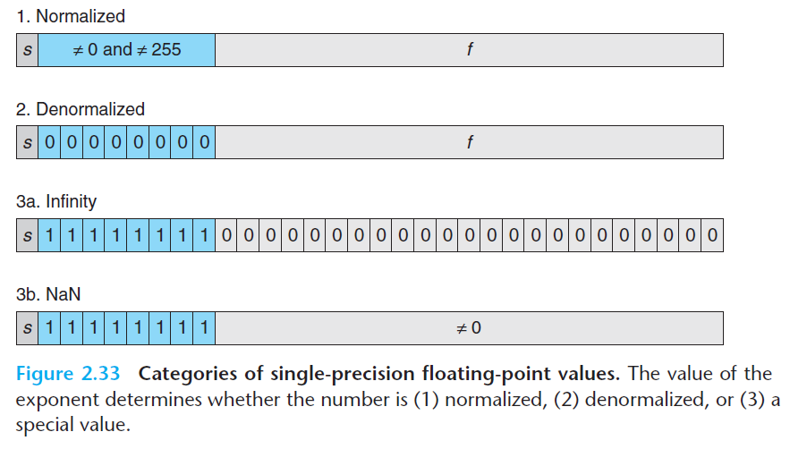

## 动机

这个周末待在了实验室，窝了一天。终于把CS:APP这本书的第一个实验datalab给做完了。

我是把B站上面对应本书第二章的15-213的视频都过一遍之后在慢慢啃书的。

看这章的时候，证明实在有点多，时不时还要用笔纸亲手验一次。就这样花了一周左右的空闲时间，把chapter2过完了，除了家庭作业，每一小节附带的练习题目都做了一次。

心想：~~这些练习题都没什么难度啊，datalab还能难到我？~~

直到我花了**两天**的晚上做完datalab...可怕，这就是CMU大二本科生水平吗？？？

实在太可怕了，得好好写篇wp总结一下

## 写在前面

首先，我做的lab是从[http://csapp.cs.cmu.edu/3e/labs.html](http://csapp.cs.cmu.edu/3e/labs.html)这里下载的，是Self-study Handout版本

然后，环境为Ubuntu 20.04，gcc 9.3.0

根据`README`，测试的时候只需要在lab目录下执行

```shell
make btest && ./btest
```

此外，`README`还说明了各种文件的用途，以及一些小工具的使用

同时，`bits.c`里头也告诉我们关于该实验代码的限制

如需检查代码是否符合实验要求，可执行

```shell
./dlc bits.c
```

下面步入正题

## Integer

整数部分开始

在开始前，先提及几个点

1. int类型的整数为补码数
2. 右移为算术移位
3. 可通过一次或两次逻辑非将数字转化为0或1
4. 考虑溢出

### bitXor

```c
/* 
 * bitXor - x^y using only ~ and & 
 *   Example: bitXor(4, 5) = 1
 *   Legal ops: ~ &
 *   Max ops: 14
 *   Rating: 1
 */
int bitXor(int x, int y) {
    /* First convert XOR to combination of AND and OR, then apply De Morgan's laws. */
    return ~(~x & ~y) & ~(x & y);
}
```

不是很难，首先看到只能用按位与和按位否运算符。如果我们学过离散数学，那么就会很容易想到德摩根律，先用或和与表达出`x^y`吧

$$x\oplus y=(x|y)\And \sim(x\And y)$$

那么把右侧含与运算符的表达式代入至德摩根律

$$(x|y)=(\sim x) \And (\sim y)$$

便可得题目答案

### tmin

```c
/* 
 * tmin - return minimum two's complement integer 
 *   Legal ops: ! ~ & ^ | + << >>
 *   Max ops: 4
 *   Rating: 1
 */
int tmin(void) {
    // Simply perform right shift 31 of bit on 1
    return 1 << 31;
}
```

送分题不解释，只要知道补码数的bit pattern就行了。

补码数的二十转换公式如下

$$B2T_w(x)=-2^{w-1}*x_{w-1}+\sum^{w-2}_{i=0}2^{i}*x_i$$

### isTmax

```c
/*
 * isTmax - returns 1 if x is the maximum, two's complement number,
 *     and 0 otherwise 
 *   Legal ops: ! ~ & ^ | +
 *   Max ops: 10
 *   Rating: 1
 */
int isTmax(int x) {
    // If x = TMax
    // x + 1 => 0x80000000, x + (x + 1) => 0xffffffff, ~(x + (x + 1)) => 0x0
    // Consider 0xffffffff(-1), so we should plus !(x+1)
    // And also think of how to convert result from number logically to 1 or 0
    return !(~(x + (x + 1)) + !(x + 1));
}
```

判断x是否为Tmax，利用满溢的性质：当x为Tmax的时候，对其加1就会变为Tmin，接着两者相加就会变为0

但如果x是-1，那么对其进行上述操作，其结果依旧是0。所以我们要给判断加上一个约束条件`!(x+1)`。最后对这个加法表达式进行取反，便可得出答案

### addOddBits

```c
/* 
 * allOddBits - return 1 if all odd-numbered bits in word set to 1
 *   where bits are numbered from 0 (least significant) to 31 (most significant)
 *   Examples allOddBits(0xFFFFFFFD) = 0, allOddBits(0xAAAAAAAA) = 1
 *   Legal ops: ! ~ & ^ | + << >>
 *   Max ops: 12
 *   Rating: 2
 */
int allOddBits(int x) {
    // Construct a mask, do not forget priority of operator
    int mask = ((0xaa + (0xaa << 8)) << 16) + (0xaa + (0xaa << 8));
    // First perform & on mask and x then ^ on mask and x
    return !(mask ^ (mask & x));
}
```

要检查奇数位是否都为1，我们自然而然会想到构造掩码进行操作。

但是你要注意到README里头说了一句话：`Integer constants 0 through 255 (0xFF), inclusive.`因此我们只能构造一个在这个范围内的掩码`0xaa`，然后对其进行移位操作，构造出最后的掩码。

将掩码与x进行按位与操作，此时只留下了奇数位的数据，但此时我们依旧不能判断出奇数位是不是都为1，所以要加上一步异或运算（判断两数是否相等），用于判断这个情况。

最后使用非运算符取0或1，得出答案

### negate

```c
/* 
 * negate - return -x 
 *   Example: negate(1) = -1.
 *   Legal ops: ! ~ & ^ | + << >>
 *   Max ops: 5
 *   Rating: 2
 */
int negate(int x) {
    // Well-known qu fan zai jia 1 (NOT then add1)
    return ~x + 1;
}
```

前面那个`tmin`算啥送分题，这个才是真正的送分题！（

~~取反加一，上过计组，大陆学生，人尽皆知~~。不过详细的证明过程在书上，可以去看看

### isAsciiDigit

```c
/* 
 * isAsciiDigit - return 1 if 0x30 <= x <= 0x39 (ASCII codes for characters '0' to '9')
 *   Example: isAsciiDigit(0x35) = 1.
 *            isAsciiDigit(0x3a) = 0.
 *            isAsciiDigit(0x05) = 0.
 *   Legal ops: ! ~ & ^ | + << >>
 *   Max ops: 15
 *   Rating: 3
 */
int isAsciiDigit(int x) {
    // if 39 - x >= 0 and x - 30 >= 0, then yes
    int neg_x = ~x + 1;
    int res1 = 0x39 + neg_x;
    int res2 = x + (~(0x30) + 1);
    // How to check wether a result is negative or not? Use sign bit
    return !((res1 >> 31) | (res2 >> 31));
}
```

如何判断一个数是否落在[30, 39]这个范围？我想我们可以给两个数作差。但是题目这里只给了加号，没有减号。但这并不妨碍我们给第二个加数取相反数。

最后判断两者是不是都大于等于0即可。

当时我在这里卡了好一会，一直在想`res1`和`res2`是不是有溢出的可能，如果x是取反还是Tmin的Tmin呢？但好像并没有什么问题（即使有一个很大的x让这两个表达式的结果溢出了，也没法满足两式大于等于0

### conditional

```c
/* 
 * conditional - same as x ? y : z 
 *   Example: conditional(2,4,5) = 4
 *   Legal ops: ! ~ & ^ | + << >>
 *   Max ops: 16
 *   Rating: 3
 */
int conditional(int x, int y, int z) {
    // if x = 0, return z, else y
    // So how to check wether x is 0 or not?
    int condition = !!x; // integer => 0 or 1
    condition = ~condition + 1; // 0 or 1 => 0x00000000 or 0xffffffff
    return (condition & y) | (~condition & z); // use condition as a mask
}
```

用位运算符实现三目元算符，有趣的问题。实际我们可以看到，返回y还是返回z，是由x为不为0决定的。所以我们第一步先把x转换为0或1，接着取反，得到位模式`0x0`或`0xffffffff`，最后拿着这个位模式当掩码去掩一下y和z，最后就会返回想要的结果了。

### isLessOrEqual

```c
/* 
 * isLessOrEqual - if x <= y  then return 1, else return 0 
 *   Example: isLessOrEqual(4,5) = 1.
 *   Legal ops: ! ~ & ^ | + << >>
 *   Max ops: 24
 *   Rating: 3
 */
int isLessOrEqual(int x, int y) {
    int neg_x = ~x + 1;
    // Case1: when y+ and x-
    int y_pos_x_neg = ((x >> 31 & 0x1)) & (!(y >> 31 & 0x1));
    // Case2: If signs of x and y are the same, we should test if result of sub > 0
    int same_sign = !((x >> 31) ^ (y >> 31));
    int sub_comparsion = !((y + neg_x) >> 31);
    int sub_more_than_zero = same_sign & sub_comparsion;
    // Case3: x == y
    int equal = !(x ^ y);
    return equal | sub_more_than_zero | y_pos_x_neg;
}
```

这题要我们只用逻辑运算符实现小于等于运算符。首先想到的肯定是：y和x两者作差的结果大于等于0不就行了吗？

但是考虑到

$$y-x>2^{w-1}-1$$

或者

$$y-x<-2^{w-1}$$

此时就会溢出，而当xy都同号(0的符号位为0)的时候，相减便不会溢出的情况。

再考虑到，其实如果x负y正，结果就可想而知了。因此加入考虑条件中去。最后再加一个x恒等于y的判断即可。

那个时候已经很晚了，属于是爆肝了。大脑转速也下降，只好用非运算符一把梭变为0或1，然后用按位与进行结果的输出（只要满足其中一个条件，就可以认为x<=y

### howManyBits

```c
/* howManyBits - return the minimum number of bits required to represent x in
 *             two's complement
 *  Examples: howManyBits(12) = 5
 *            howManyBits(298) = 10
 *            howManyBits(-5) = 4
 *            howManyBits(0)  = 1
 *            howManyBits(-1) = 1
 *            howManyBits(0x80000000) = 32
 *  Legal ops: ! ~ & ^ | + << >>
 *  Max ops: 90
 *  Rating: 4
 */
int howManyBits(int x) {
    int sign = x >> 31;
    // If x < 0, perform ~ on it
    int target = sign ^ x;
    // printf("x=%.8x sign=%.8x target=%.8x\n", x, sign, target);
    // Either pos or neg, find the position of the highest 1
    int res = 0;
    // How to get the position?
    // Use !! => 0 or 1, then let it right shifts x bit
    // We can divide it equally
    // Note: if variables are not declared first, there will be errors when you run ./dic with this file
    int higher_16_bit, higher_8_bit, higher_4_bit, higher_2_bit, higher_1_bit;
    // If there is any 1 in higher 16 bits, add 16
    higher_16_bit = !!(target >> 16) << 4;
    // printf("target=%x\n", target);
    target >>= higher_16_bit;
    // divide the higher 16 bits into 8 bits
    higher_8_bit = !!(target >> 8) << 3;
    // printf("target=%x\n", target);
    target >>= higher_8_bit;
    // the same
    higher_4_bit = !!(target >> 4) << 2;
    // printf("target=%x\n", target);
    target >>= higher_4_bit;
    higher_2_bit = !!(target >> 2) << 1;
    // printf("target=%x\n", target);
    // target >>= higher_4_bit;
    target >>= higher_2_bit; // WTF!
    higher_1_bit = !!(target >> 1) << 0;
    // printf("target=%x\n", target);
    target >>= higher_1_bit;
    res += (higher_16_bit + higher_8_bit + higher_4_bit + higher_2_bit + higher_1_bit);
    // printf("target=%d\n", target);
    return res + target + 1; // + remaining target and sign bit
}
```

我们首先想，用几个位就能表示出一个指定的数字呢？首先看看题目给的用例`howManyBits(12) = 5`

明明`12=1100`啊，为什么要用5个数字呢？其实再想一步，int是补码数啊！所以最高位应该是一个负权重的位，因此12最少要用5位数进行比较，即`12=01100`

然后数字分为正数负数，那么，此时我们分为两类情况，是正数就要判最高的1在第几位，然后往结果加一，负数的话，由于**sign extension**这个性质，我们只需要从高到低找到第一个0的位置，然后往结果加一即可。

既然是找到最高的0，那何不妨把负数的位模式取反？这下就变成不论正负数，只需找到最高的1所在的位置即可。

下面就要在这些恶心的限制条件下，找出最高的1的位置了。

比如我有一个位模式

$$\vec{x}=01011010$$

该怎么求出最高的1的位置7呢？思考片刻，我们可以想到，二分如何？如果高4位没有则把范围缩小到低4位，接着在这低4位中继续二分，直到找到1的位置为止（很明显的递归，base条件为范围缩小到1位）

但这里只能用逻辑运算符。。。所以该怎么用逻辑运算符进行范围缩小呢？比如高16位没有，我就缩小到低16位，反之则缩小到高16位了。。。

有了，我们可以使用移位乘法，分两个变量，一个用来存储缩小范围后的位模式，一个用来存放此时的位置。最后在往位置上加回此时仅剩下一位的target（如果target为1就要+1来确定位置）再加一（表示需要一个负权重最高位）即得到最终答案。

有趣的是，我不小心typo了，~~把2打成了4，导致我又卡了好一小会（见上方注释~~

至此，整数部分完美结束

## Floating-points

浮点数部分开始

惯例，在开始前，我们要注意下面几点

1. 浮点数的公式
2. 浮点数的位模式表示
3. 整数与浮点数的转化
4. Rounding舍去
5. 浮点数算术运算无溢出
6. 浮点数的几种表示方法（Normalized，DeNormalized，NaN，Infinity，+0，-0）



### floatScale2

```c
/* 
 * floatScale2 - Return bit-level equivalent of expression 2*f for
 *   floating point argument f.
 *   Both the argument and result are passed as unsigned int's, but
 *   they are to be interpreted as the bit-level representation of
 *   single-precision floating point values.
 *   When argument is NaN, return argument
 *   Legal ops: Any integer/unsigned operations incl. ||, &&. also if, while
 *   Max ops: 30
 *   Rating: 4
 */
unsigned floatScale2(unsigned uf) {
    // printf("uf=%.8x\n", uf);
    int sign = (uf >> 31) & 0x1; // 0 or 1
    unsigned exp = (uf >> 23) & 0xff;
    // printf("exp=0x%.8x\n", exp);
    if (exp == 0xff) return uf; // NaN
    if (exp == 0x0) { // If exp = 0(Denoarmalized), just << 1
        // printf("uf=0x%.8x exp=0x%.8x\n", uf, exp);
        // simply *2 then add back sign bit
        return (uf << 1) | (sign << 31);
    }
    exp = exp + 1;
    if (exp >= 0xff) { // +- Infinity
        return (exp << 23) | (uf & 0x8fffffff);
    }
    // use 0x807fffff to remove exp of uf
    return (uf & 0x807fffff) | (exp << 23);
}
```

观察浮点数表示的公式：乘2，实质也就是给exp加一罢了

不过要考虑到特殊情况——乘2之前的NaN，乘2之后的infinity——exp达到`0xff`，就要变为Infinity了

有趣的是，一番笔算之后发现：Denorm乘2之后如果变为norm，依旧只需左移1位然后加回符号位，IEEE标准，实在是高！

最后把原来数字的exp替换成处理后的exp就得到答案了~

### floatFloat2Int

```c
/* 
 * floatFloat2Int - Return bit-level equivalent of expression (int) f
 *   for floating point argument f.
 *   Argument is passed as unsigned int, but
 *   it is to be interpreted as the bit-level representation of a
 *   single-precision floating point value.
 *   Anything out of range (including NaN and infinity) should return
 *   0x80000000u.
 *   Legal ops: Any integer/unsigned operations incl. ||, &&. also if, while
 *   Max ops: 30
 *   Rating: 4
 */
int floatFloat2Int(unsigned uf) {
    int bias = 127;
    int sign = (uf >> 31) & 0x1; // 0 or 1
    int exp = (uf >> 23) & 0xff;
    int frac = uf & 0x7fffff;
    int E = exp - bias;
    // printf("ul=0x%.8x E=%d\n", uf, E);

    // Cases
    // if E > 31 => Out of Range
    if (E > 31) return 0x80000000u;
    // if E < 0 => 0
    if (E < 0) return 0;
    // From here, we should just consider the normalized form
    // right shift the floating point of frac
    // if 23 - E < 0
    int tmp;
    if (E > 23) {
        tmp = frac << (E - 23);
    } else {
        tmp = frac >> (23 - E);
    }
    // printf("tmp=0x%.8x\n", tmp);
    tmp = tmp & (~(0x80000000 >> (23 - E - 1)));
    // add back sign bit
    // tmp = tmp | (sign << 31);
    // add 1 to first
    tmp = tmp | (1 << E);
    // printf("tmp=0x%.8x uf=0x%.8x\n", tmp, uf);
    // ~x + 1 if sign == 1
    if (sign == 1) return ~tmp + 1;
    return tmp;
}
```

这题教我们如何把一个浮点数化成整数，懂浮点数的人都知道，浮点数的值可以用这个公式表示

$$V=(-1)^{s}*M*2^E$$

又因为int最大也只能是31次方的，超了就溢出；

又因为整数不能表示小数，所以不能表示负数次方的，统统返回0，且Denorm的浮点数都是小于1的，所以我们就排除了Denorm转整数的情况。

下面只需要考虑Norm的浮点数了。

看过书的都知道，如果我们有一个十进制数字12345(0x3039)，则有

$$T2B_{32}(12345)=11000000111001$$

科学计数法一波

$$1.1000000111001*2^{13}$$

再把它与浮点数的表示公式对一下，可以看出

$$E=13$$

$$M=1.1000000111001$$

因此可以算出exp和bias了。

此时我们逆着推一遍，问题即可破解

首先把浮动的小数点给移回去（根据E来决定移动位数），注意要判断一下是否超出23，超了就要往后面继续补0（左移对应位数即可），否则就是把小数点移回去（右移）

额，右移的话，万一最高位是1呢？因此又得想办法掩去高位的数据

因此这里使用了一个丑陋的方法来掩去：`~(0x80000000 >> (23 - E - 1))`

接着再把符号位放回去即可。最后返回结果，即为答案

### floatPower2

```c
/* 
 * floatPower2 - Return bit-level equivalent of the expression 2.0^x
 *   (2.0 raised to the power x) for any 32-bit integer x.
 *
 *   The unsigned value that is returned should have the identical bit
 *   representation as the single-precision floating-point number 2.0^x.
 *   If the result is too small to be represented as a denorm, return
 *   0. If too large, return +INF.
 * 
 *   Legal ops: Any integer/unsigned operations incl. ||, &&. Also if, while 
 *   Max ops: 30 
 *   Rating: 4
 */
unsigned floatPower2(int x) {
    int bias = 127;
    // Check out figure 2.36 on the book
    // > largest norm
    if (x > 127) return 0x7f800000;
    // < smallest denorm
    if (x < (-23-126)) return 0;
    // in [smallest norm, largest norm]
    if (x >= -126 && x <= 127) return (bias + x) << 23;
    // when x < -126 && x >= (-23-126), it is Denorm, so bits of exp are irrelevant in this case.
    return 114514; // So we can return any number :)
}
```

...这题不搁着喂你分吃？请直接查看书本上的这幅图


然后由于DeNormalized的E是这样的

$$E=1-Bias$$

因此这已经不关`exp`位什么事了，因此我们随便返回一个数字（

好了，题目完结，真的是太顶了。
