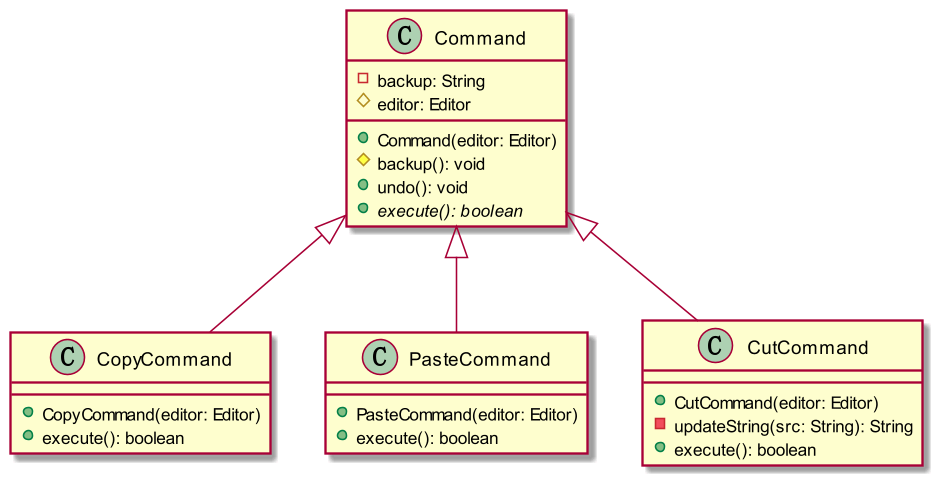

## 一个简单的文本编辑器

这里有一个平凡到不能平凡的要求：用JavaFX做一个简单的文本编辑器，该编辑器具有复制、粘贴、剪贴与撤回功能。我们可以通过菜单选项、底部按钮和快捷键来调用这些功能。如下图所示。


## 立即实现

首先去查JavaFX的文档，可以发现`TextArea`类里有相关的方法可以操作复制粘贴和剪切，这些操作本质都是把文本给读取出来，比如使用`textArea.getText()`来读取出当前的文本。

那么这还不简单？直接给相对应的`Node`注册相对应的事件不就行了？比如给一个拷贝按钮注册事件

```java
copyBtn.setOnMouseClicked(e -> {
    var selectedText = this.textArea.getSelectedText();
    if (!selectedText.isEmpty()) {
        this.clipboard = selectedText;
    }
});
```

同理，给剩下的按键组合和菜单Item也注册一个类似的函数即可完成。

## 优化一下

那么问题来了，我们这样做，似乎是把GUI层和逻辑层的代码给耦合起来了，并且修改逻辑的时候，就要去GUI代码那边翻找代码来一个一个地修改。并且还有改漏的可能。

并且对于撤销功能，似乎也不是很方便：要实现简单的撤销操作的话，我们就要维护一个栈，把每个操作的行为记录下来并添加进该数据结构，撤销的时候把执行该操作时候的把当前指令操作后的上一个文本给恢复到`TextArea`里头即可。可以看出：要想实现撤销操作的话，重点是要把每次操作的编辑器的历史文本给**记录下来**

那么，我们是不是可以把这些逻辑封装成一个类呢？既可以与GUI层代码分离开来，又可以方便实现撤销功能呢？

由于这些每个逻辑都可以独立地看成一个Command，所以......很快啊，这里出现了一个抽象类`Command`


代码如下

```java
public abstract class Command {
    private String backup;
    protected Editor editor;

    public Command(Editor editor) {
        this.editor = editor;
    }

    protected void backup() {
        backup = editor.textArea.getText();
    }

    public void undo() {
        editor.textArea.setText(backup);
    }

    public abstract boolean execute();
}
```

接着就出现了继承于Command的各个子类了，比如说`CopyCommand`，要实现父类的`execute()`方法。

那怎么实现呢？上面提到，要实现复制粘贴和剪切，我们可以调用`TextArea`对象的方法，那么我们要做的就是让这个Command类的实例拥有这个`TextArea`对象的引用。很简单，只需要添加一个field `editor`（如上图），顺便修改一个constructor即可。


接着是剪切和粘贴的类，按葫芦画瓢就可以了。此时便有了这样的继承关系



如果我们要实现撤销的话，我们可以创建一个新类`CommandHistory`来维护执行过的`Command`

```java
public class CommandHistory {
    Stack<Command> history = new Stack<>();

    private void push(Command c) {
        history.push(c);
    }

    private Command pop() {
        return history.pop();
    }

    private boolean isEmpty() {
        return history.isEmpty();
    }

    public void executeCommand(Command command) {
        if (command.execute()) {
            push(command);
        }
    }

    public void undo() {
        if (!isEmpty()) {
            var command = pop();
            if (command != null) {
                command.undo();
            }
        }
    }
}
```

然后我们就可以`CommandHistory` -> `Editor`这样子来进行组合，即每一个`Editor`里头都拥有一个`CommandHistory`


每次Command执行，都会往`CommandHistory`里头存下操作记录，撤销的时候读出历史记录然后恢复到`TextArea`里头就行了

最后，这个简易文本编辑器里头的类之间的大致关系是这样子的。


最后我们执行Command的时候就可以通过`executor.executeCommand(new CopyCommand(this));`来执行。

相对应的注册事件是这样的

```java
copyBtn.setOnMouseClicked(e -> executor.executeCommand(new CopyCommand(this)));
```

## 总结

其实经过上面的一番操作，我们就已经实现了Command设计模式，Command是一个行为型的设计模式。

### Pros

1. 可以将Command给抽象出来成为一个类
2. 可以回滚Command操作和状态，甚至把它们Serialize下来存于本地，在未来随时可以回滚状态和操作。通过队列，我们还可以将特定的Command给defer执行。甚至还可以把Command给组合起来且有序执行。
3. 可以把Command放入队列中，给Command排队等候其被执行（JS网络请求

### Cons

事物无绝对完美，优点出现了，那么必有缺点出现。其实最直接的就体现在类的分离，由于把Command给分离了开来，就自然而然多了一层。代码的复杂度也有型地加了一层。