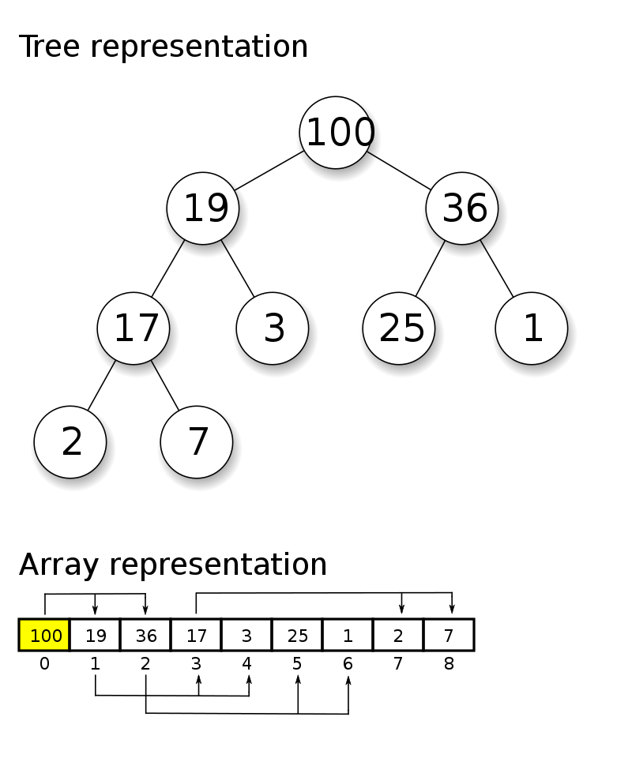
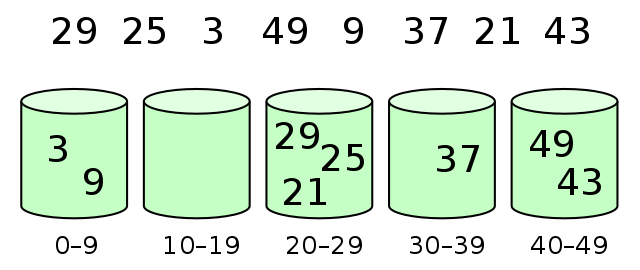

萌新接触排序算法--JS & Java实现

写在前面: 下面的排序都对整形类型的数组进行排序，并且为升序(ascending)排序

## 选择排序

先确定一个位置上的数，接着处理后续位置的元素。即在n个元素的数组中，找出n个元素的最大值或最小是，排到第1个元素位置上，然后屏蔽第1个元素，从第2个元素起，找出剩下n-1个元素的最大值，排在第2个元素的位置上面...以此类推


```javascript
function selectionSort(nums) {
    for (let i = 0; i < nums.length - 1; i++) {
        let currentMin = nums[i];
        let currentMinIndex = i;

        for (let j = i + 1; j < nums.length; j++) {
            if (nums[j] < currentMin) {
                currentMin = nums[j];
                currentMinIndex = j;
            }
        }

        if (currentMinIndex !== i) {
            // swap
            nums[currentMinIndex] = nums[i];
            nums[i] = currentMin;
        }
    }
}
```

## 插入排序

数组分为了排序好了的部分(前)和未排序的部分(后)，从未排序部分中取出一个元素，逐一与排序好了的部分的元素进行比较，以插入该部分中去。


```javascript
function insertionSort(nums) {
    for (let i = 1; i < nums.length; i++) {
        let k = i - 1;
        let current = nums[i];
        while (k >= 0 && nums[k] > current) {
            nums[k + 1] = nums[k];
            k--;
        }
        nums[k + 1] = current;
    }
}
```

## 希尔排序

(待更)

## 冒泡排序

可以把数组想象为横着的水池，数组的相邻元素进行两两比较，里面较大或较小的元素就会慢慢地“浮”到最右边或最左边


不过，我们可以考虑一下，不与排好了的部分进行比较

```javascript
function bubbleSort(nums) {
    for (let k = 1; k < nums.length; k++) {
        for (let i = 0; i < nums.length - k; i++) {
            if (nums[i] > nums[i +1]) {
                const tmp = nums[i];
                nums[i] = nums[i + 1];
                nums[i + 1] = tmp;
            }
        }
    }
}
```

并且还加入一个boolean进行判断整个数组是否已经排序完毕

```javascript
function bubbleSort(nums) {
    let needNextPass = true;
    for (let k = 1; k < nums.length && needNextPass; k++) {
        needNextPass = false;
        for (let i = 0; i < nums.length - k; i++) {
            if (nums[i] > nums[i +1]) {
                const tmp = nums[i];
                nums[i] = nums[i + 1];
                nums[i + 1] = tmp;
                needNextPass = true;
            }
        }
    }
}
```

## 归并排序

这个排序涉及到分治(Divide-and-Conquer即分而治之)的方法。将数组进行分割然后进行排序，之后将排序的结果一个一个地合并起来


代码实现如下，使用递归，将数组分开与合并

```javascript
function mergeSort(nums) {
    if (nums.length > 1) {
        const firstHalf = nums.slice(0, nums.length / 2);
        mergeSort(firstHalf);

        const secondHalf = nums.slice(nums.length / 2);
        mergeSort(secondHalf);

        merge(firstHalf, secondHalf, nums);
    }
}

// merge two sorted arrays
function merge(nums1, nums2, tmp) {
    let current1 = 0;
    let current2 = 0;
    let current3 = 0;

    while (current1 < nums1.length && current2 < nums2.length) {
        if (nums1[current1] < nums2[current2]) {
            tmp[current3++] = nums1[current1++];
        } else {
            tmp[current3++] = nums2[current2++];
        }
    }

    while (current1 < nums1.length) {
        tmp[current3++] = nums1[current1++];
    }

    while (current2 < nums2.length) {
        tmp[current3++] = nums2[current2++];
    }
}
```

## 快速排序

跟归并排序相似但不完全一样。大致思路如下

1. 选取数组的一个主元pivot
2. 对该数组进行排序---小于或等于该主元的元素成为子数组1(不包括主元)，大于主元元素的元素成为子数组2
3. 如果这些个数组的长度依旧大于1，继续对该两个数组进行该操作


伪代码如下

```markdown
suppose there is an array named list

function quickSort(list) {
    if (list.length > 1) {
        select a pivot;
        partition the list into list1 and list2 that satisfy
            1. all elements in list1 are <= pivot;
            2. all elements in list2 are > pivot;
        quickSort(list1);
        quickSort(list2);
    }
}
```

JS实现如下

```javascript
function quickSort(nums, first, last) {
    if (!first && !last) {
        quickSort(nums, 0, nums.length - 1);
    } else if (first < last) {
        const pivotIndex = partition(nums, first, last);
        quickSort(nums, first, pivotIndex - 1);
        quickSort(nums, pivotIndex + 1, last);
    }
}

function partition(nums, first, last) {
    const pivot = nums[first];
    let low = first + 1;
    let high = last;

    while (high > low) {
        // search
        while (low <= high && nums[low] <= pivot) {
            low++;
        }
        while (low <= high && nums[high] > pivot) {
            high--;
        }
        // swap
        if (high > low) {
            const tmp = nums[low];
            nums[low] = nums[high];
            nums[high] = tmp;
        }
    }

    // swap pivot with list[high]
    if (pivot > nums[high]) {
        nums[first] = nums[high];
        nums[high] = pivot;
        return high;
    } else {
        return first;
    }
}
```

## 堆排序

该排序算法使用完全二叉树来进行排序

完全二叉树指的就是，一棵深度为k的树，其他深度的节点的度都要为2(即其余层为满的)，除了深度为k(最后一层)的节点可以为满，也可以是右边缺少若干节点。

如果一棵完全二叉树树为堆的话，那么就会有这个性质---每个节点的大小比它的每一个child都要大

下图(By Kelott - Own work, CC BY-SA 4.0, [https://commons.wikimedia.org/w/index.php?curid=99968794](https://commons.wikimedia.org/w/index.php?curid=99968794))



上面的这个图片表示的就是一个Heap，还有有父子节点在数组上的关系

```javascript
leftChildIndex = 2 * fatherIndex + 1
rightChildIndex = 2 * fatherIndex + 2
```

往堆上添加元素的时候，元素会添加到数组最后一个位置上，然后与父节点作比较，大于或小于的话就交换位置，直到父节点小于或大于这个元素

去除元素的时候，是把根节点元素取出，然后把最后一个元素放置于根节点上，接着让这个元素与子节点进行比较与交换，使得最后结果还是一个堆。

`Heap`的实现如下

```javascript
class Heap {
    constructor(objects) {
        this.list = [];
        if (Array.isArray(objects)) {
            objects.forEach(o => this.add(o));
        }
    }

    add(newObj) {
        this.list.push(newObj);
        let currentIndex = this.list.length - 1;
        while (currentIndex > 0) {
           let parentIndex = (currentIndex - 1) / 2;
           if (this.list[currentIndex] > this.list[parentIndex]) {
               const tmp = this.list[currentIndex];
               this.list[currentIndex] = this.list[parentIndex];
               this.list[parentIndex] = tmp;
           } else {
               break;
           }

           currentIndex = parentIndex;
        }
    }

    remove() {
        if (this.list.length === 0) return null;

        const removedObject = this.list[0];
        this.list[0] = this.list[this.list.length - 1];
        this.list.pop();

        let currentIndex = 0;
        while (currentIndex < this.list.length) {
            const leftChildIndex = 2 * currentIndex + 1;
            const rightChildIndex = 2 * currentIndex + 2;

            if (leftChildIndex >= this.list.length) break;

            let maxIndex = leftChildIndex;
            if (this.list[leftChildIndex] < this.list[rightChildIndex]) {
                maxIndex = rightChildIndex;
            }

            if (this.list[currentIndex] < this.list[maxIndex]) {
                const tmp = this.list[maxIndex];
                this.list[maxIndex] = this.list[currentIndex];
                this.list[currentIndex] = tmp;
                currentIndex = maxIndex;
            } else {
                break;
            }
        }

        return removedObject;
    }
}
```

---

(待更)

## 桶排序

把数据都分开到几个桶里头



分别对这几个桶进行排序，接着把排序好的结果归到一起。完成排序。

当均匀分布时，最为高效。(时间复杂度慢慢加

```javascript
function bucketSort(nums, bucketSize) {
    // find max and min
    let max = Number.MIN_VALUE;
    let min = Number.MAX_VALUE;
    for (let i = 0; i < nums.length; i++) {
        if (nums[i] < min) { min = nums[i]; }
        if (nums[i] > max) { max = nums[i]; }
    }

    // generate buckets
    const DEFAULT_SIZE = 10;
    bucketSize = bucketSize || DEFAULT_SIZE;
    const bucketCount = Math.floor((max - min) / bucketSize + 1);
    const buckets = Array(bucketCount);
    for (let i = 0; i < bucketCount; i++) {
        buckets[i] = Array();
    }

    // push nums into bucket
    for (let i = 0; i < nums.length; i++) {
        const index = Math.floor((nums[i] - min) / bucketSize);
        buckets[index].push(nums[i]);
    }

    // sorted on each bucket
    console.log(buckets)
    buckets.forEach(bucket => insertionSort(bucket));

    // push result into an array
    let sorted = [];
    buckets.forEach(bucket => bucket.forEach(e => sorted.push(e)));

    return sorted;
}

function insertionSort(nums) {
    for (let k = 1; k < nums.length; k++) {
        let current = nums[k];
        let i = k - 1;
        while (i >= 0 && nums[i] > current) {
            nums[i + 1] = nums[i];
            i--;
        }
        nums[i + 1] = current;
    }
}
```

## 基数排序

但是桶排序不是稳定的，会受到桶的分配情况、元素个数、桶的个数的影响。

如果我们只需要进行数字的排序的话，我们就可以用基数排序。这个是稳定的算法，在时间上，复杂度为O(dn)，d为位数


自己写的伪代码...

```markdown
let n=1, nums=an array of numbers
while (n <= the digit of the maximum number in the list) {
    1. push the number to the n th bucket ,according to the number's n th digit from right to left.
    (For example, when n=2, 697->9 and 9(009)->0)
    2. gather the elements from bucket[0] to [9] one by one
    3. clear nums and let nums = these gathered elements
    n++
}
```

JS实现如下

```javascript
function radixSort(nums) {
    const buckets = Array(10);
    const max = Math.max(...nums);
    const digit = Math.ceil(Math.log10(max));
    for (let currentDiv = 1; currentDiv <= Math.pow(10, digit) ; currentDiv *= 10) {
        // clear the arrays
        for (let i = 0; i < buckets.length; i++) {
            buckets[i] = Array();
        }

        let newNums = [];
        for (let i = 0; i < nums.length; i++) {
            if (nums[i] / currentDiv >= 1) {
                buckets[Math.floor(nums[i] / currentDiv) % 10].push(nums[i]);
            } else {
                buckets[0].push(nums[i]);
            }
        }

        buckets.forEach(b => b.forEach(e => newNums.push(e)));
        nums = newNums;
    }

    return nums;
}
```

## 外部排序

其实思路跟归并排序，是差不多的。只不过这里的条件有点不同--即我们需要排序一个大文件里头的数字，由于规模非常大，我们不可能一次性把它们全部加载进内存里头。

因此，我们可以把这个文件其中分为定长(segmentSize)的许多片段(Segment)，每一个片段进行排序。（下面是依次把每一个排序好的子数组放入一个文件里头）

之后，再将这些个片段，两两归并到一起排序。排序之后，将片段数减半，片段长度加倍，(递归)反复这样排序，操作下去，直到最后，就会得到一个排序好了的文件。

代码实现(Java)如下，先随机创建一个含有很多数字的文件，然后对该文件进行外部排序。

```java
import java.io.*;
import java.util.Arrays;

public class ExternalSort {
    public static void main(String[] args) throws Exception {
        createFile();
        sort("largedata.dat", "sortedfile.dat");
        try (DataInputStream input = new DataInputStream(new FileInputStream("sortedfile.dat"))) {
            for (int i = 0; i < 100; i++) {
                System.out.print(input.readInt() + " ");
            }
        } catch (IOException e) {
            e.printStackTrace();
        }
    }

    private static void createFile() {
        try (
                DataOutputStream output = new DataOutputStream(
                new BufferedOutputStream(new FileOutputStream("largedata.dat")))
        ) {
            for (int i = 0; i < 5000000; i++) {
                output.writeInt((int)(Math.random() * 100000));
            }
        } catch (IOException e) {
            e.printStackTrace();
        }
    }

    private static int initializeSegments(int segmentSize, String originalFile, String f1) throws Exception {
        int[] list = new int[segmentSize];
        DataInputStream input = new DataInputStream(
                new BufferedInputStream(new FileInputStream(originalFile))
        );
        DataOutputStream output = new DataOutputStream(
                new BufferedOutputStream(new FileOutputStream(f1))
        );

        int numberOfSegment = 0;
        while (input.available() > 0) {
            int i = 0;
            for ( ; input.available() > 0 && i < segmentSize; i++) {
                list[i] = input.readInt();
            }

            Arrays.sort(list);

            for (int j = 0; j < i; j++) {
                output.writeInt(list[j]);
            }
        }

        input.close();
        output.close();

        return numberOfSegment;
    }

    private static void copyHalfToF2(int numberOfSegments,
                                     int segmentSize, DataInputStream f1, DataOutputStream f2) throws Exception {
        for (int i = 0; i < segmentSize / 2 * numberOfSegments; i++) {
            f2.writeInt(f1.readInt());
        }
    }

    private static void mergeSegments(int numberOfSegments,
                                      int segmentSize,
                                      DataInputStream f1, DataInputStream f2, DataOutputStream f3) throws Exception {
        for (int i = 0; i < numberOfSegments; i++) {
            mergeTwoSegments(segmentSize, f1, f2, f3);
        }

        while (f1.available() > 0) {
            f3.writeInt(f1.readInt());
        }
    }

    private static void mergeTwoSegments(int segmentSize, DataInputStream f1, DataInputStream f2,
                                         DataOutputStream f3) throws Exception {
        int intFromF1 = f1.readInt();
        int intFromF2 = f2.readInt();
        int f1Count = 1;
        int f2Count = 1;

        while (true) {
            if (intFromF1 < intFromF2) {
                f3.writeInt(intFromF1);
                if (f1.available() > 0 || f1Count++ >= segmentSize) {
                    f3.writeInt(intFromF2);
                    break;
                } else {
                    intFromF1 = f1.readInt();
                }
            } else { // intFromF1 >= intFromF2
                f3.writeInt(intFromF2);
                if (f2.available() > 0 || f2Count++ >= segmentSize) {
                    f3.writeInt(intFromF1);
                    break;
                } else {
                    intFromF2 = f2.readInt();
                }
            }
        }

        while (f1.available() > 0 && f1Count++ < segmentSize) {
            f3.writeInt(f1.readInt());
        }

        while (f2.available() > 0 && f2Count++ < segmentSize) {
            f3.writeInt(f2.readInt());
        }
    }

    private static final int MAX_ARRAY_SIZE = 100000;
    private static final int BUFFER_SIZE = 100000;

    private static void sort(String sourceFile, String targetFile) throws Exception {
        // phase 1
        int numberOfSegments = initializeSegments(MAX_ARRAY_SIZE, sourceFile, "f1.dat");

        // phase 2
        merge(numberOfSegments, MAX_ARRAY_SIZE, "f1.dat", "f2.dat", "f3.dat", targetFile);
    }

    private static void merge(int numberOfSegments, int segmentSize,
                              String f1, String f2, String f3, String targetFile) throws Exception {
        if (numberOfSegments > 1) {
            mergeOneStep(numberOfSegments, segmentSize, f1, f2, f3);
            merge((numberOfSegments + 1) / 2, segmentSize * 2,
                    f3, f1, f2, targetFile);
        } else {
            File sortedFile = new File(targetFile);
            if (sortedFile.exists()) sortedFile.delete();
            new File(f1).renameTo(sortedFile);
        }
    }

    private static void mergeOneStep(int numberOfSegments, int segmentSize,
                                     String f1, String f2, String f3) throws Exception {
        DataInputStream f1Input = new DataInputStream(
                new BufferedInputStream(new FileInputStream(f1), BUFFER_SIZE)
        );
        DataOutputStream f2Output = new DataOutputStream(
                new BufferedOutputStream(new FileOutputStream(f2), BUFFER_SIZE)
        );

        copyHalfToF2(numberOfSegments, segmentSize, f1Input, f2Output);
        f2Output.close();

        DataInputStream f2Input = new DataInputStream(
                new BufferedInputStream(new FileInputStream(f2), BUFFER_SIZE)
        );
        DataOutputStream f3Output = new DataOutputStream(
                new BufferedOutputStream(new FileOutputStream(f3), BUFFER_SIZE)
        );

        mergeSegments(segmentSize / 2, segmentSize, f1Input, f2Input, f3Output);

        f1Input.close();
        f2Input.close();
        f3Output.close();
    }
}

```
