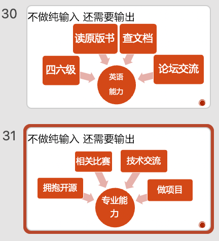

## 盛夏

> 人生的盛夏从大学开始，但同样地，大学时光也在一个盛夏走向结束

四年，能让地球的四季轮转四次，也能让一个本科生从大学入学到毕业，让一个人的四季向前一步，从春天进入夏天。四年的时间说快也快，说慢也慢，但始终会过去，如今我已经毕业，已经成为一个社畜。

是的，大学四年就这样结束了。当时我还觉得不可思议——四年居然就这样度过了，一个人的大学时代就这样落幕了。但我望着空荡荡的姚明柜（PS：学校宿舍经过四改六，柜子无处可放只能置顶了，由于一般人很难够着，于是叫做姚明柜）......哎，毕业已成事实。

## 动机

> 逝去的大学时光突然攻击我

怎么会突然想起写这样的一篇文章？一天，我在睡前整理 NAS 存放的几百 GB 的照片和视频，看到大学时期拍的几万张照片，不由得心生感慨。虽然在毕业后的几天没有任何波动，但近期，想念的劲头越来越大。这也许就是人们所说的后劲吧。

> 为了校准自己的历史记忆。

再者，为了回忆和总结大学四年到底做过什么。毕竟我偶尔会觉得自己在大学四年虚度光阴，没有花时间在任何事情上。于是就有了这篇文章。

## 我是？

首先，本人就读并毕业于广州大学城的一所普通本科院校。

怎么说呢，当时能来到这所学校，我家人也是没想到的（他们觉得我高中这么浪，专科预定了。对于高中时光，想专门开篇文章回忆，但又担心教坏高中生）。报考学校的时候，估分是是估得刚刚好（其实是考完之后就能猜到是这个分数和名次了......后来没有花额任何时间择校），并下直觉地没有选同级别的其他学校（不然就进志愿服从调剂区间了。比如 A 校，网工专业最低分跟我高考同分但最低名次比我的要高）。于是，我刚好被这所学校的网络工程专业录取。

## 大学

翻了翻笔记软件，发现有 2020-2024 的年度时间线总结。它们正躺在文件夹里，等待着我再次翻阅。

> 流水账不一定是水字数，它其实能让你知道，原来当时的你，还做过这种事。

### 大一

初入大学校园，我也跟每一个人一样，对这里的一切感到新鲜感到好奇。开学第一课是由前北邮方校长做主讲，内容挺不错，但可惜不能拍照录像。

后来 202 班也由班长牵头，聚集在一个教室里进行自我介绍，这应该也是班里同学的第一次见面。虽然后来班集体的存在感越来越弱，但我认为正常，毕竟除了上课就没有什么机会聚在一起了。

开学心比天高，一天夜晚，骑车出门打算环绕大学城一圈，结果就在不远处的科学中心撞到了台阶，连人带车飞了出去。还好只是小腿磕了一个比较深的伤口，去校医室处理了一下并喜提大学生第一次病假。

大一闲时会坐 B25 公交 or 地铁 4 号线出岛玩耍。有时候也会一整天宅在宿舍，中午晚上都点外卖，当年还处于疫情期间，点了外卖也要走一段路去生活区栏杆处取外卖。说起外卖，很幸运地，大学四年都没被偷过外卖（~~可能是点外卖的次数太少了~~）

上学期的一个周末，闲的无聊，看学校网安协会有个 CTF 新生赛就参加了。凭着高二高三折腾教室电脑的经验，水了个新生第一，同时也结实了在上大学以来的第一个好伙伴 favorhau。也去参加了网安协会的总结会，会上学长打在屏幕上的这句话令我印象深刻：

> 以坚持为土地，热爱为星空，成长为驱动，砥砺前行，勿忘初心。

同时期，我也开了自己的博客，用来记录自己的成长和学习（后期转用笔记 app 了，博客只用来分享文章）。

入冬，学院举行了大学生涯规划大赛。我也参加了，可能是 PPT 太幼稚且太理想化的原因，再受限于当时羸弱的语言表达能力，最后只拿了个优秀奖（~~安慰奖~~）。不过，对于 PPT 的内容，现在的我完成一大半，甚至已经全部完成了。

到了期末周，大伙都在紧张复习，我也不例外。但是，考前的元旦假吃得太上火了，我喜提发烧。按照当时的规则，我会被送到大学城医院看病和抽血检验，然后送到学校的隔离宿舍进行一个隔离。因此，我喜提总共 10 学分课程的人生第一次缓考（大概占保研绩点结算的 1/ 14 的权重），绩点直接爆炸，断了我保研的念头。我也第一次享受到了发热隔离。不过隔离房间的待遇挺不错的，三餐管饱，早上还有医生来喊你起床，给你量体温和捅喉咙。除了没有网络，其他都挺不错（前提是短期隔离）

> 命运有时候就是这么造化弄人

期末考后（对于我是发烧痊愈后），进行了学校史无前例的冬季军训，每天在 10 来度的室外呆一整天，真的很难受。并且中途还出现过寒潮冻雨，所有人暂停训练一天。

军训结束之后，学院给安排了一个图书馆经典百书 app 项目，想做的可以寒假留下。正好在那个时候，我当时在寻找学校的软件开发组织，因此，我也报了个名。不过，在学校呆了 4 天后，学院说前一段时间已经外包出去了...要我们马上撤离学校（PS 当时疫情）。

于是，我第一次成为宿舍最后一个走的人，但不是最后一次，心境也不一样。一人住六人间。午后也可以在空荡荡的宿舍楼和校园散步。

寒假宅在家里吃了睡睡了吃，当然，顺便学会了 Python。为了学习 Python，我写了个 "卷王的工具"，可以爬别人的绩点/排名，不过这个问题已经反馈上去并修复了。后面还因为懒得打卡而搞了个疫情打卡 Python 脚本。为了避免天天刷经典诵读而整了个自动化刷分脚本（我很很很讨厌古文背诵，高考语文背诵题也敢全空的那种。但这个项目占了 1 学分，会影响毕业...没办法，只能上脚本了）。

在家里通过了学院的创新班面试，成为了其中一员。大一下就参加这个班的一些活动和课题了，不过，由于个人兴趣不在深度学习上面，于是我在这个班里充当一个无形的调和者（~~客服~~）的角色：帮同学解决代码问题，帮配置电脑/软件/网络环境，偶尔还会谈谈心之类的。同样地，在这个班级里，我也结识了不少的小伙伴，虽然后面说话次数少了，但是他们也没有忘记我。

大一暑假将近结束，我顺便报名参加了字节第一次搞得前端训练营并进了进阶班，做了项目，最后拿了个团队第二名&结营证书（拿奖比例好像是 50/2000+），还收到了带有李松峰亲笔签名的 JS 犀牛书。不过，按字节那节奏，这玩意迟早会烂大街。果不其然，后面各种高频率举办这个活动 + 放水，于是乎这个经历和奖烂大街了。（PS：据说近年的前端校招简历全是这个经历🤣）

但是，重点不是你参加过什么，而是你获得了什么。参加这个活动学会了知识，甚至还结识了几个 nice 的小伙伴，后来经常在飞书水群聊天，真心觉得不错。任何一次机会，其实都可以是一次缘分的开始。

顺便，入坑了 web 前端开发。

### 大二

纵观整个中学和大学时光，大二可能是我人生中学习强度最高的时候了。当然也有一些感情相关的事情。

这一年，慢慢啃了几本经典的计算机图书，它们让我更了解软件/网络的运行原理：

- The C Programming Language
- Computer Systems: A Programmer's Perspective
- Operating Systems: Three Easy Pieces
- Computer Networking: a Top Down Approach

把英语六级也考了。可能是啃生肉图书啃的吧，没怎么准备过，最后 550 多分低空飘过考试。

第一学期的期末周/课设周，比较印象深刻的是一个 16 位 CPU 的指令集（微程序）设计，虽然设计用的软件也是 bug 多多，但还是整个过程挺享受的。我记得我在课设前还占用老师将近一小时时间来给大家讲解课设如何设计一个简单指令呢，事后同学反馈说通俗易懂。

期末周也跟着一个学长一起做了个静态页面外包，可能是我第一次给别人写正经的 web 前端页面，虽然这个页面实现起来很简单。

接着便开始了一个多月的寒假。没有人可以持续高能量地走完人生的长河吧？我在这段时间见到了很多大佬，我低迷过、自我怀疑过，觉得自己就是不如别人。但在一个春光明媚的午后，我对自己说：

> 努力成为自己想要的自己，而不是成为自己想要成为的那个别人

下学期，我加入了学校的网络中心团队，开始维护广大派（不知道还有没有人记得 TA。一个学长开发的校园类小程序，后来~~因为难管理生活墙的言论~~而被学校要求下架了...）。顺便也参加了网络中心的一些 app 项目，不过后来由于老师缺乏项目管理意识&经常提天马行空的需求，这些项目无疾而终。

参加了一些比赛活动，跟 favorhau 的组队参加微信小程序开发赛，最后拿了个全国一等奖😆（这个比赛后来停办了...）。

此外，还参加了阿里巴巴的开源之夏并完成了课题（这个活动后来也停办了...）。

~~难道我是行业冥灯~~

最后，拿着这两个活动的奖金，自己给自己买了人生的第一台 Macbook

### 大三

紧接着就开始了大三生活。这个大三生活就比较魔幻了：疫情防控史诗级加强，任何风吹草动都会惊蛇。于是，我在十一月的某个冬日迎来了第一次长达一周的封校。不过，学校提供的粮食还是很充足的。解封不久，就收到我高中同学的信息：

>快点逃回老家，据小道消息说，广州要来大的了！

结合最近封控区域越来越多，以及学校最近在不断地往外输送学生。慌乱之下，我召集了几个高中同学，在大学城高速附近聚合，打了个车，准备连夜回家。结果刚上高速，就收到了消息：

> 广州多区最新通告：解除疫情防控临时管控区

但学校让回家也让了，我回也回了，已经无所谓了。回到家就好好呆着吧，希望这是好的开始。

也就 10 天后吧，老家也永久解除了疫情防控和大规模核酸检测。不过，沉浸在保护罩两三年，突然说没就没，大家的恐惧才真正开始。后面相当的一段时间，街道都是空荡荡的，茶楼也是关门不营业。这段时间我在家享受居家学习生活：上网课，甚至期末考试也是在线上。当然这段日子也给用到的笔记工具 logseq 修 bug，顺带学会了 FP 语言 Clojure

过完春节，思考了一下，这个时间点是时候要找个实习了。于是就在 BOSS 找了几家开面，当时由于时间紧，我只花了一周从找实习到实习 offer 。找到了就结束了吗？nonono，我当时在家因为要只身去北京这件事难受了好久😣

但最后家人和亲戚还是支持我的。于是，我在二月底开启了人生的第一次进京。从祖国的南端到北端，约 2000km 路程，说实话真的好远好远。飞机要将近 3 小时，来回机票钱快 3000 了。但好在生活比较充实，工作时间 1065，晚上回到家有大把时间做自己地事情，周末也可以搭 13 号线进城游玩景点，这两个半月的实习，我把热门的景点逛了个遍。

这里放一张沙尘暴的照片，代表我对北京气候的印象。

后来找到了个深圳的工作，就在 5 月中旬结束北京实习，飞回南方了。在深圳实习的时候，也顺手也拿了好多个比较大的公司的 offer 保底。不过后来我评估了一下自己的体能，选择留在了实习的公司。

### 大四

我的大学实习生活从 3 月开始，到 9 月结束，刚好半年。结束实习后，回到了学校享受闲适的大学大四时光。

给自己买了很多当年想买却不舍得买的显示器、游戏主机、头戴耳机等电子设备。

开始喜欢上猫咪。也沉迷上了轨道交通，这大半年经常出门做运转，也常在自己的 MC 服务器里建地铁。

出岛游玩的频率又回到大一的频率。值得一提的是，12 月中，我在寒潮的日子去杭州上海玩了六天，同时会见了大一暑假认识的线上飞书群友。在盛夏线上相识，在寒潮线下相见，这下闭环了。

不知不觉时间来到了离毕业 100 天的节点，要做毕业设计了。趁此机会，我用 Rust 写了一个多协议多功能 DNS Proxy。结果很魔幻地，我在预答辩的时候差点被一个老师打不及格。

- Q：你介绍一下这是什么？
- A：你看这个图就行，虽然有点复杂，但是我们可以抛开其他层次，从最核心的部分和离用户最近的部分开始，首先，这本质是一个 Proxy，然后用户只需要在命令行输入对应的指令和参数就能使用这个软件。接着，我们把目光放到功能组合&拓展上....
- Q：（打断我发言）这么简单的东西也想拿来混毕设？意义是什么？
- Q：（开始钻牛角尖）你看看这个，为什么 DNS 报文放在了 HTTPS 协议上？
- A：这是 DoH 协议
- Q：这是你胡编乱造的协议吗？别当我没有教过计算机网络，我还教过好几年的计网...书上说了 DNS 协议是通过 UDP 协议传输的！
- A：（拿出了 RFC8484）你看看这个规范...
- Q：你这个又是什么东西？正规吗？（我内心：？）那你说说你这个 DoH 全称是啥？
- A：（指向标题）DNS over HTTPS...
- Q：（思考片刻，指向标题）不对不对，你说的少了个 Queries（标题是 DNS Queries over HTTPS）
- （这里省略一堆为了证明他就是对的我就是错的对话。老师全程没让我深入解说，全在钻我牛角尖...）
- Q：好了，今天就到这里吧（20 分钟过去了）。你需要回去改改图，Client 里的 UDP/TCP/TLS/HTTPS/QUIC 怎么能画在同一层呢？这么拉跨的网络知识，连 7 层协议都分不清，还敢做这种毕设？我没被你误导都算好的了（我内心：不看上下文就生搬硬套？直接扣我一顶帽子？）
- A：好的好的，我会改（后面我没有改，毕竟改了就真的错了🤣）

这还是学院被学生投票过的最受欢迎的老师的行为。全文下来，只要超出他的认知就会使劲打压你，真是让人大开眼界了。那么，为什么上课不会这样呢？我想一定是教的内容都在他的认知和控制范围内吧，哈哈。

> 这何尝不是进社会前的一课

反观我的指导老师很 nice，不懂的都会问我，会耐心地听我解释。并且，在创造的时候，自己至少是开心的，并且入门了 Rust，不亏不亏。

还好答辩的时候那老师没有为难我什么，只是说了我论文的英语词汇太多了无法一下子看懂...

还好最后顺利毕业了～

接下来就是毕业典礼，我的大学时光也随着这隆重仪式的结束，被画上了句号。

## 我是

历史回忆到此为止。

大学四年下来，我获得了什么成长？

- 找到自我：我自己就是我自己，我有我追求的东西，我有我喜爱的东西，我不会被各种标签和惯性路径给束缚
- 心理素质由差变好。不会因为失败而一直伤心和低落。也不会因为世界并非预期而停止前进的步伐
- 语言表达能力进步了。如果你们看过我博客的早期文章，你会发现它们非常口语化、啰嗦且不达要点...这可能就是为什么高考语文刚好及格吧...
- 终于开始不是只用感觉/直觉思考问题了。同时成为 Problem-Solver
- 开始成为无形的 influencer。举个例子，影响身边的人走上了软件开发的路，并在毕业的时候也找到了一些还不错的公司。该过程没有任何强组织行为、强求和 PUA（更多是靠所谓的人格魅力？）。同时也结识了不少朋友
- 学会了教学，并能把别人从不懂教到懂
- 懂得如何关心别人并顾及他人的感受

有什么遗憾呢？

- 四年都没加入过正儿八经的软件开发类院组织/校组织（因为压根就没有组织），也没有成功创立起这样的组织（有一个大佬学长专门发邮件问我有没有想法，结果最后只结识了学长本人...）
- 没有好好利用大学的时间，所有事都是感觉驱动的，好了就做，不好就摆烂（直到快毕业的时候给自己上了 GTD 才好点...）
- 没有好好地运营博客，运营 Twitter/小红书/微信公众号。可能也跟我比较内向有关。举个例子，每次发文章的时候无感，一段时间就恨不得想删了并找个洞钻进去，或者不敢回看
- 跟陌生人正经 1v1 交流（比如面试）的时候还是会紧张
- 面对只能多选一的抉择的时候必定会大脑宕机，然后使用当下的感觉做决策

哎，无所谓，谁没有那么几个遗憾啊。世界是变化的，后面慢慢让自己变得更好就行了。

## 我想成为

读完大学后，我想成为掌握这些技能的这样一个人。就在这里给自己人生立一个 flag 吧。

- 软件开发
- IT/网络运维
- 教育
- 心理学
- 多语言：普通话/英语/粤语/日语

## 永恒的盛夏

> 短暂的结束，不一定是永恒的终结。瞬间是永恒的开始，永恒是瞬间的结束。 —— 瞬间即永恒

虽然我的大学短暂，也不完美。

但我还是挺开心的，因为大学可以给一个人做他自己想做的事情，让他找到他想成为的人。

虽然大学在人的一生中很短暂，四年一瞬。

但对我说已是永恒了，我不会忘掉这段盛夏时光。

也在这里感谢我相识的每一个人，感谢你们让我成为我现在的自己。

