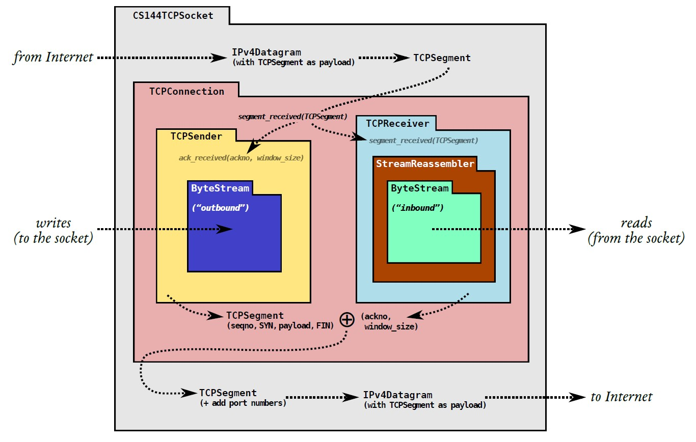

## 前言

在清明假后的某一个风和日丽的下午，某个不知天高地厚的同学，开始了 CS144 的 lab。迅速地做好 lab0 之后，他信心大涨，开始自信甚至差点自负起来(划去)

Lab0 是要我们写`webget`，一个使用了 OS 提供的 TCP 协议和 byte stream 抽象从 Internet 上 fetch 网页的程序。简的来说就是用 DNS 解析出目的主机的地址，与其建立起 socket，自行构建一个 HTTP 请求信息，通过请求获取网页信息。再根据 lab 给出的提示，自行实现一个 in-memory reliable 的 `ByteStream`

数据在计算机网络中，是通过分组传送的。如果反映在运输层，就是一个一个 segment，并且实际上，这些包还不一定是顺序到达的，绝大部分是乱序到达的，并且还有可能丢包重传，包被修改等的问题存在。这个时候，我们就得实现一个对这些 segment 进行重组的工具。

而这就是 Lab1 的实现产物`StreamReassembler`要做的事情。

## 大致要求

仔细阅读 lab1 的 assign 的 assignment，它的标题为 **stitching a substring into a byte stream**

要求我们实现一个容量有限的`StreamReassembler`，它的功能就是**组装**接收到的若干带有起始 index 的**子串**，将他们拼装回一个有序的连续的字节流。

这是我们的`StreamReassembler`的所在的位置，再结合它组装子串的功能，也就很容易想明白为什么它处于这个位置了。



## 实现

思考一下，该如何处理这些子串

如果我们接收到的到的子串在每一个位置上面，都是唯一的话，我们只需要好好将这些子串给放到到按 index 升序的列表里即可，长度达到了 string 的长度后，如果收到了 EOF 就代表组装结束了，把剩余的部分写入我们的 ByteStream（前一个 lab 实现的）即可。

> 注：下面的子串块指的是 Node 对象，而 buffer 指的是 ByteStream \_output

但是现实并没有理想那么丰满，它很骨感。有很多问题需要我们进行考虑的，经过一波踩坑，大概有这么些

1. 带有 EOF 的子串可能会先于其他子串带来
2. EOF 可能会被单独接收（不带子串的数据）
3. 收到的子串可能会与现有的子串完全或部分重复
4. 收到子串后可能使得`StreamReassembler`的大小超出容量限制

注意第 4 点所提到的容量限制，lab1 的 PDF 给出了一张很关键的图，图示了这个`StreamReassembler`的大致结构


从图中，不难看出，我们要负责的是 first unread 及其后面的部分，并且要搞清楚 capacity 的定义

不然就会像我干了一个晚上结果在 cap 测试上面过不了,然后又得努力 debug 一个下午

那我们可以增加几个 private field 来暂存接收到的 EOF，记录根据 EOF 与 index 以及子串长度推算出的字符串的总长度，记录已经接收了的字节数，记录仍未写入 buffer 的起始位置，如下

```cpp
class StreamReassembler {
  private:
    // Your code here -- add private members as necessary.

    ByteStream _output;            //!< The reassembled in-order byte stream
    size_t _capacity;              //!< The maximum number of bytes
    bool _is_eof;                  //!< Temporarily saved EOF while string is not fully assembled
    size_t _string_length;         //!< Computed from substring that carries EOF
    size_t _bytes_accept;          //!< Length of bytes you've received
    size_t _first_unassembled;     //!< Position of current unassembled string
                                   //!< Note that _output.buffer_size() + unassembled_bytes() <= capacity
    std::list<Node> _aux_storage;  //!< A linked list that contains unassembled substrings

    // ......
}
```

接着是最重要的部分：重组器对子串的组装以及对 buffer 的写入

我们可以子串打包成块，用这样的一个节点表示，记录了该节点的子串在原字符串中的起始 index 与结束 index，然后将这些 node 放入自行维护有序的列表中，想到链表的插入和删除的时间复杂度都是`O(1)`，于是我决定维护一个有序的`std::list`

```cpp
struct Node {
    std::string data;
    size_t index_start;
    size_t index_end;
    Node(std::string str, size_t index) : data(str), index_start(index), index_end(str.size() + index - 1) {}
};
```

要考虑新来的子串块与未组装区域的某个子串块这几种情况

1. 子串与某个子串不重叠
2. 子串与某个子串完全重叠且大于或等于某个子串
3. 子串与某个子串完全重叠但小于某个子串
4. 子串与某个子串部分重叠

对于 1，我们直接从头开始遍历链表，找到链表中的一个合适的位置，将该子串插入，要考虑是在某个子串块的前面还是后面

对于 2，我们选择遍历，把这些新来的数据与当前的子串块进行合并

对于 3，要考虑的是直接丢弃这个子串块，因为这个子串块的子串是某个子串块的子串

对于 4，要考虑的是把子串的重叠部分给丢弃后，将剩下的子串插入链表

然后，还要考虑如何将组装好的数据写入 buffer，还有一些细节处理，比如传来的子串的部分，已经被从 buffer 读出...再或者就是，我们的子串块的 capacity 大于 buffer 的剩余 capacity，就要截掉超出的部分等...

最后得出，一个子串，带着它的 index，以及(或没有)EOF，在`push_substring()`的执行旅途中，它们会经历这些事情。

`push_substring()`函数每一次执行都会做这几件事：对 EOF 进行检查，如果是便缓存下来，并通过 index 与此时传入的子串的长度计算得出字符串的总长度 => 测试该子串是否含有了已被输出到 buffer 的部分，如果有，删除这部分子串 => 测试该子串的加入会不会引起 capacity 的超出，如果是，截掉超出容量的子串 => 交给`assembly_string()`进行子串拼接工作，该函数对上面的子串块与子串块之间的六种关系进行了一定的处理，保证在`_aux_storage`中不会出现 index 一致的多个字符 => 检查`_aux_storage`，将满足条件的子串块中的子串给写进 buffer 里头 => 检查是否写完并且已经 EOF，如果是则结束掉 buffer 的写入

写出的代码如下

```cpp
#include "stream_reassembler.hh"

// Dummy implementation of a stream reassembler.

// For Lab 1, please replace with a real implementation that passes the
// automated checks run by `make check_lab1`.

// You will need to add private members to the class declaration in `stream_reassembler.hh`

template <typename... Targs>
void DUMMY_CODE(Targs &&.../* unused */) {}

using namespace std;

StreamReassembler::StreamReassembler(const size_t capacity)
    : _output(capacity)
    , _capacity(capacity)
    , _is_eof(false)
    , _string_length(0)
    , _bytes_accept(0)
    , _first_unassembled(0)
    , _aux_storage({}) {}

//! \details This function accepts a substring (aka a segment) of bytes,
//! possibly out-of-order, from the logical stream, and assembles any newly
//! contiguous substrings and writes them into the output stream in order.
void StreamReassembler::push_substring(const string &data, const size_t index, const bool eof) {
    string str = string(data);
    size_t i = index;

    // if eof
    if (eof) {
        if (!_is_eof) {
            _string_length = index + str.size();
            _is_eof = true;
        }
    }

    // slice str to make sure that index >= first_unassembled
    if (index < _first_unassembled) {
        size_t n = _first_unassembled - index;
        str.erase(0, n);
        if (str.size() == 0) {
            return;
        }
        i += n;
    }

    // capacity checking. bytes that exceed the capacity will be silently discard
    size_t used_size = _output.buffer_size() + unassembled_bytes();
    if (used_size > _capacity) {
        size_t remaining_size = _capacity - used_size;
        if (str.size() > remaining_size) {
            str.erase(0, remaining_size);
        }
    }

    Node node{str, i};
    assembly_string(node);

    // push substring into
    for (auto it = _aux_storage.begin(); it != _aux_storage.end();) {
        if (it->index_start <= _first_unassembled) {
            _first_unassembled += _output.write(it->data);

            it = _aux_storage.erase(it);
        } else {
            break;
        }
    }

    // check EOF
    if (_is_eof && _first_unassembled == _string_length) {
        _output.end_input();
    }
}

size_t StreamReassembler::unassembled_bytes() const { return _bytes_accept - _first_unassembled; }

bool StreamReassembler::empty() const { return _bytes_accept == _first_unassembled; }

void StreamReassembler::assembly_string(Node node) {
    if (_aux_storage.empty()) {
        _aux_storage.push_back(node);
        _bytes_accept += node.data.size();

        return;
    }

    // basic idea: iterate nodes in the linked list
    auto it = _aux_storage.begin();
    while (it != _aux_storage.end()) {
        size_t left = it->index_start;
        size_t right = it->index_end;

        // when data in node is empty
        if (node.data.size() == 0) {
            break;
        }

        // data does not overlap any exist node (before)
        if (node.index_end < left) {
            // directly insert before it
            _aux_storage.insert(it, node);
            _bytes_accept += node.data.size();

            break;
        }

        // (after)
        if (node.index_start > right) {
            // compare with next node
            it++;
            if (it != _aux_storage.end()) {
                continue;
            } else {  // if there is no node after current it
                _aux_storage.push_back(node);
                _bytes_accept += node.data.size();

                break;
            }
        }

        // smaller than it & overlap
        if (node.index_start >= left && node.index_end <= right) {
            // nothing to do
            break;
        }

        // (bigger than it OR equal to it) & overlap
        if (node.index_start <= left && node.index_end >= right) {
            size_t n = right - node.index_start + 1;
            // mutate it's data & index_start
            it->index_start = node.index_start;
            node.index_start = right + 1;
            it->data = node.data.substr(0, n);  // first n characters of node.data
            node.data.erase(0, n);              // then remove first n characters of node.data

            // update total bytes
            _bytes_accept += (n - 1);

            continue;
        }

        // partly overlap (before)
        if (node.index_end >= left && node.index_start < left && node.index_end < right) {
            // edit data field of node (remove part overlapped by current it)
            // remove tail
            size_t n = node.index_end - it->index_start + 1;
            // remove last n characters
            node.data.erase(node.data.size() - n);
            node.index_end -= n;

            continue;
        }

        // partly overlap (after)
        if (node.index_start <= right && node.index_end > right && node.index_start > left) {
            // just like before
            size_t n = right - node.index_start + 1;
            // remove first n characters
            node.data.erase(0, n);
            node.index_start += n;

            continue;
        }
    }

    return;
}
```

## 一些坑

### 懒得删除

我一开头为了方便遍历，就不删去所有的节点，谁不曾想，来到`fsm_stream_reassembler_cap`之后，我中招了...

```cpp
{
   ReassemblerTestHarness test{3};
   for (unsigned int i = 0; i < 99997; i += 3) {
       const string segment = {char(i), char(i + 1), char(i + 2), char(i + 13), char(i + 47), char(i + 9)};
       test.execute(SubmitSegment{segment, i});
       test.execute(BytesAssembled(i + 3));
       test.execute(BytesAvailable(segment.substr(0, 3)));
   }
}
```

可以很明显看出这个代码就是让你一直合成`char(0)`到`char(99996)`的范围的所有子串，但是你经过思考会发现，每一次循环都会往自己维护的`std::list`里头加入一个子串块节点而不会丢弃掉。

即使遍历的时间复杂度是`O(n)`，但是随着数据量的增大，时间的增加也是非常可观的。

于是很简单，一个子串块写到 buffer 里头就没有用了，将其删去即可。。。

```cpp
it = _aux_storage.erase(it); // Before fix: it++;
```

我记得当时这个用例跑了足足 15s

慢是慢了但也能成功跑完令人感慨

### 违反容量规定

比如在插进去的时候用 substr 来保证不超过大小，虽然 buffer 不会超出大小，但是 aux_storage 已经超出了！

```cpp
for (auto it = _aux_storage.begin(); it != _aux_storage.end();) {
  if (it->index_start <= _first_unassembled && it->index_end >= _first_unassembled) {
      auto _node = *it;

      _first_unassembled += _output.write(_node.data.substr(_first_unassembled - it->index_start));

      // TODO if data in a node are fully written
      if (it->index_end + 1 == _first_unassembled) {
          it = _aux_storage.erase(it);
      } else {
          it++;
      }
  } else if (it->index_start > _first_unassembled) {
      break;
  }
}
```

我就说为什么我不用在开头处检查容量也能通过所有测试

后来加上当前容量的检查

```cpp
// capacity checking. bytes that exceed the capacity will be silently discard
size_t used_size = _output.buffer_size() + unassembled_bytes();
if (used_size > _capacity) {
  size_t remaining_size = _capacity - used_size;
  if (str.size() > remaining_size) {
      str.erase(0, remaining_size);
  }
}
```

再把写 buffer 的循环更改为

```cpp
// push substring into
for (auto it = _aux_storage.begin(); it != _aux_storage.end();) {
  if (it->index_start <= _first_unassembled) {
      _first_unassembled += _output.write(it->data);

      it = _aux_storage.erase(it);
  } else {
      break;
  }
}
```

即可修复这一个测试不出错但实际会违反规则的问题

## 总结

呼呼呼地，花了一个晚上和一个下午，将近 8 小时的激情写代码与调试，终于把这个实验给肝出来了

然后再做完 lab 之后的几天看 OSTEP 的 scheduler 的时候，读到 Linux 的 CFS 的时候，突然发现了（火星了），论如何快速地维护一堆节点使其有序排序，还能进行快速查找，定位到某个节点，可以用到红黑树。而更令人感慨的是，C++中的`std::set`，内部实现就是红黑树。。。

当时的我，内心一万匹草泥马踏过，我哭了，还是自己太菜了，居然沦落到手动维护链表有序的地步...

主要是红黑树的查找的时间复杂度比我手动维护的链表的要好很多，时间复杂度是`O(logN)`

如果要对我自己的代码进行重构的话，主要是加入搜索部分，直接定位到与现有 node 的 index 差不多的 node 的附近，再开始进行比较操作

因此，我去网上找了一下，发现大伙们大多数都是用`std::set`的，这里放一个上网看到的大佬的[博客文章](https://www.cnblogs.com/kangyupl/p/stanford_cs144_labs.html)

但是从我实现的数据结构的测试结果来看（这是在腾讯云的轻量服务器跑的）并没有很严重的性能问题（实验在 FAQ 中要求是每一个测试都要小于 500ms）

```shell
➜  build git:(main) make check_lab1
[100%] Testing the stream reassembler...
Test project /home/ubuntu/lab-computer-network/build
      Start 18: t_strm_reassem_single
 1/16 Test #18: t_strm_reassem_single ............   Passed    0.00 sec
      Start 19: t_strm_reassem_seq
 2/16 Test #19: t_strm_reassem_seq ...............   Passed    0.00 sec
      Start 20: t_strm_reassem_dup
 3/16 Test #20: t_strm_reassem_dup ...............   Passed    0.01 sec
      Start 21: t_strm_reassem_holes
 4/16 Test #21: t_strm_reassem_holes .............   Passed    0.00 sec
      Start 22: t_strm_reassem_many
 5/16 Test #22: t_strm_reassem_many ..............   Passed    0.07 sec
      Start 23: t_strm_reassem_overlapping
 6/16 Test #23: t_strm_reassem_overlapping .......   Passed    0.00 sec
      Start 24: t_strm_reassem_win
 7/16 Test #24: t_strm_reassem_win ...............   Passed    0.07 sec
      Start 25: t_strm_reassem_cap
 8/16 Test #25: t_strm_reassem_cap ...............   Passed    0.09 sec
      Start 26: t_byte_stream_construction
 9/16 Test #26: t_byte_stream_construction .......   Passed    0.00 sec
      Start 27: t_byte_stream_one_write
10/16 Test #27: t_byte_stream_one_write ..........   Passed    0.00 sec
      Start 28: t_byte_stream_two_writes
11/16 Test #28: t_byte_stream_two_writes .........   Passed    0.00 sec
      Start 29: t_byte_stream_capacity
12/16 Test #29: t_byte_stream_capacity ...........   Passed    0.49 sec
      Start 30: t_byte_stream_many_writes
13/16 Test #30: t_byte_stream_many_writes ........   Passed    0.01 sec
      Start 53: t_address_dt
14/16 Test #53: t_address_dt .....................   Passed    0.00 sec
      Start 54: t_parser_dt
15/16 Test #54: t_parser_dt ......................   Passed    0.00 sec
      Start 55: t_socket_dt
16/16 Test #55: t_socket_dt ......................   Passed    0.00 sec

100% tests passed, 0 tests failed out of 16

Total Test time (real) =   0.77 sec
[100%] Built target check_lab1
```

额从这个结果看来 lab0 后期很可能会出现瓶颈

真出现了瓶颈再优化吧
