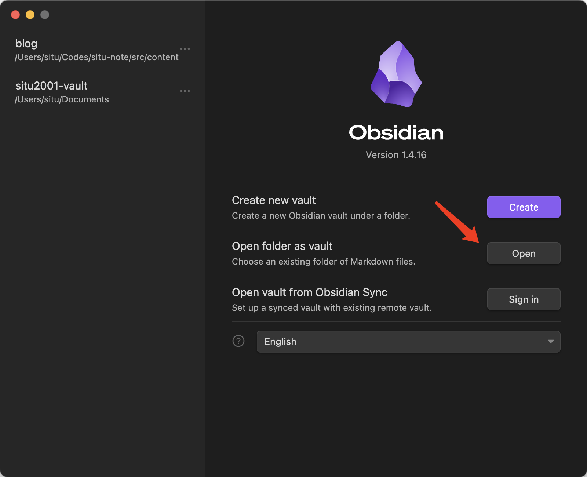
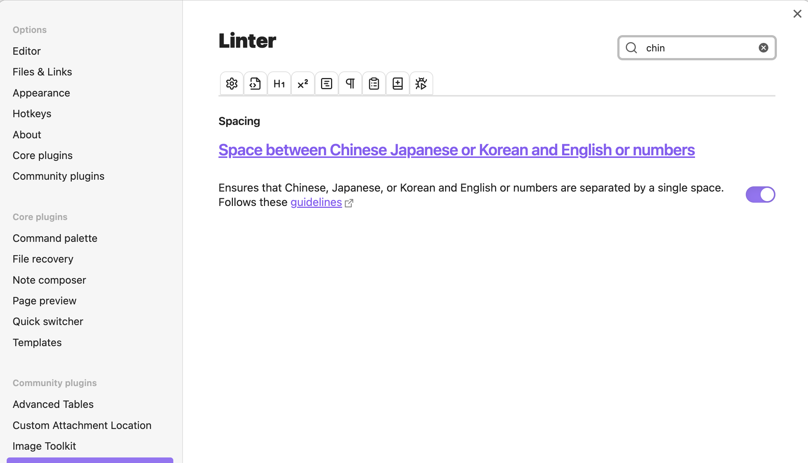
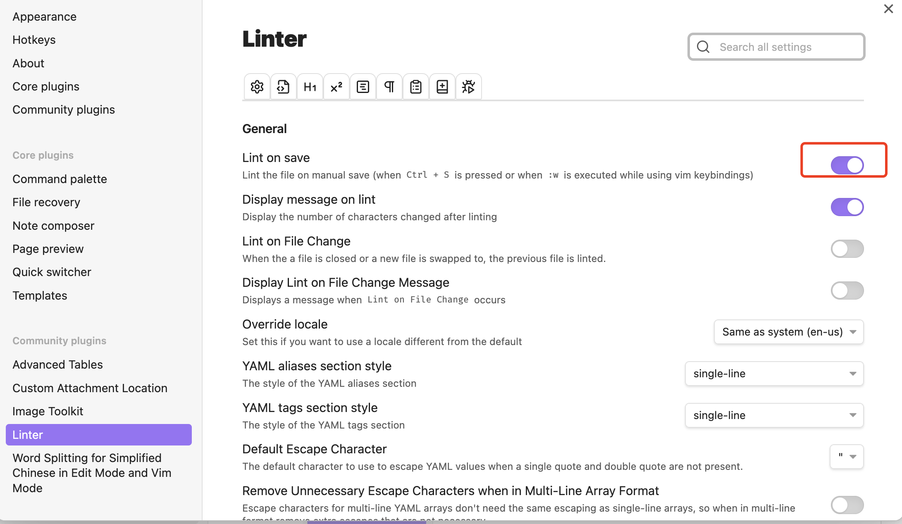
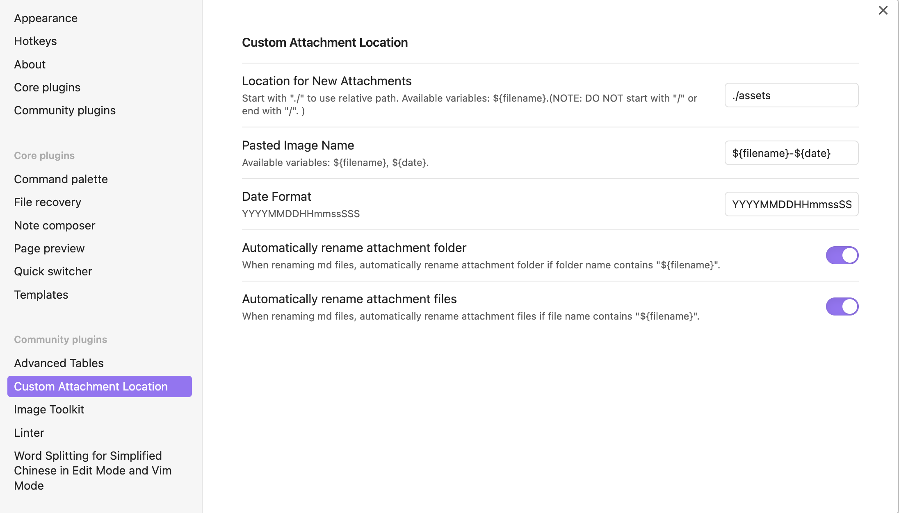
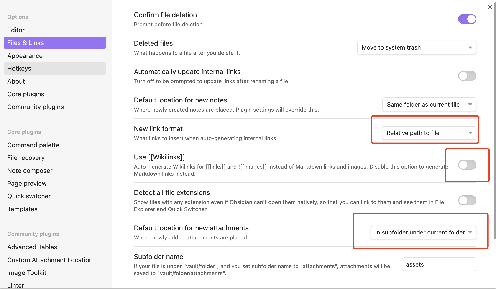
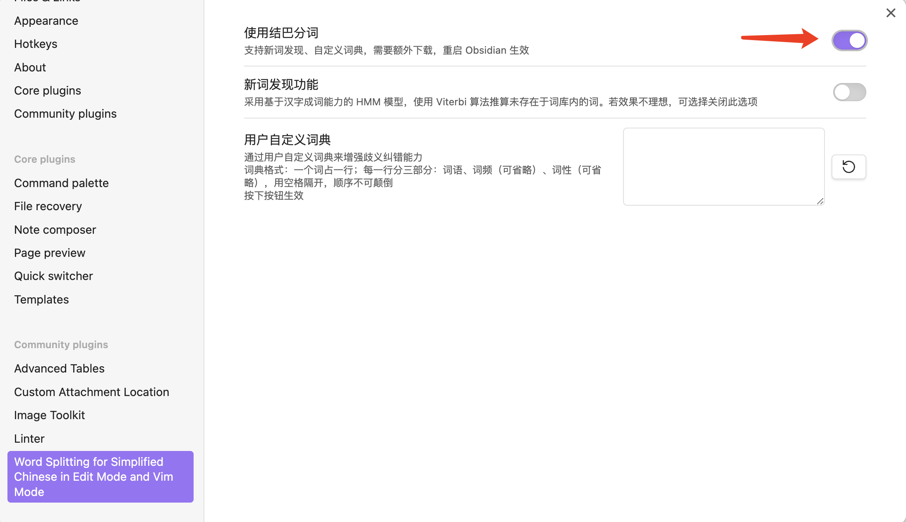

## 背景

需要一个平时常用的 WYSIWYG 编辑器进行博客文章（Markdown 文件）的编辑，而不是直接使用 vscode 。

博客 Markdown 文件内容如下

```
---
some-prop1:
some-prop2:
---

Main content begins.
...
...
Main content ends.
```

需求如下

1. 基本的 Markdown 编辑功能
2. 支持一键创建带有 file property 的 Markdown 文件
3. 支持 Markdown file property 的查看与更改
4. 支持复制粘贴图片，且图片路径为相对路径，支持自定义命名
5. 支持 Markdown 文件的格式化（Linter）
6. 支持 CJK 分词（用于：Option + 左右方向键跳词）

在这里，我选择了平时常用的适合长文编辑的 Obsidian 作为博客 Markdown 编辑器，并为博客 Markdown 编辑需求专门进行了一番配置。

## 基本配置

基本配置很简单，只需要把博客文章文件夹添加为 Obsidian Vault 即可。这个时候就能在 Obsidian 编辑器里编辑博客的 Markdown 文件了。



接着，可以按照个人喜好去设置如下内容。

字体：Settings -> Options -> Appearance -> Text Font & Monospace Font（这里我分别设置为 LXGW WenKai 与 Fira Code）

官方插件：既然只是用来编辑普通的 Markdown 文件，这里可以将 backlinks, canvas, daily note 等功能给关闭（在 Settings -> Options -> Core Plugins）

要满足 23 点要求，可以使用官方的 Templates 插件。创建如下的 Markdown 文件到模板文件夹（要求前缀为 `_` 因为 Astro 会 ignore 掉这些文件夹里的 md 文件）

```
---
title:
comments:
date:
categories:
description:
---
```

如何使用：新建一个 md 文件，Command+P 后 Templates: Insert Template 选择对应的模板，内容就会被自动插入到目标文件。

## 第三方插件配置

要满足上述 3456 点提到的需求，需要安装并配置若干第三方插件。这里我使用到了如下第三方插件：

- Linter（Markdown 格式化）
- Image Toolkit（更好地预览图片）
- Advanced Tables（更方便地创建表格）
- Custom Attachment Location（图片文件复制自动重命名）
- Word Splitting for Simplify Chinese in Edit Mode and Vim Mode（简体中文分词）

接下来是部分插件的具体配置步骤

对于 Linter，[查找](https://github.com/platers/obsidian-linter#rules) 并打开对应的规则。举个例子，打开中英文字符间插入空格的规则，可以在右上角搜索栏里进行搜索，找到后，启用规则。



并启动保存时候进行 Linting



对于 Custom Attachment Location，设置如下。此时会将资源文件自动重命名，并保存到同层目录的 `assets` 文件夹。



并保证 Obsidian 的编辑器文件设置如下



对于分词工具，在设置里启动结巴分词，以获得更准确的分词体验




## 完成

到这里，一个体验良好的个人博客文章写作环境就已经配置好了。不过仍有些许缺陷，集中在第四点：资源文件复制。插件目前只规避了 Astro 无法 import 名字带有空格即 `%20` 的图片的问题，而没有解决 Astro 无法解析前缀非 `./` 的相对路径图片的问题。

临时解决方案：在图片插入的时候，手动在相对路径前加上 `./`。但这个问题并不会影响文章发布，因为错误会在构建时被发现（Astro 会提示 Module not found）
