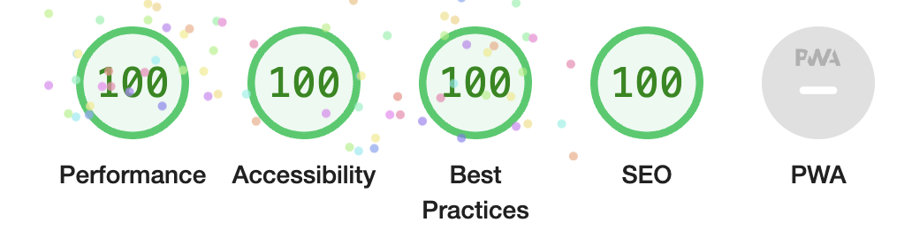

## 前言

就在上个月月底，我更换了本博客用的前端框架，从 Next.js 更换为 Astro

## 为什么要迁移

个人主观想法占大头：想让博客页面更集中、更关注内容，并尽可能降低博客本地 Dev, Build, Deploy 的复杂度。并且，个人博客也算是自己的一个 playground，可以在上面进行各种试验，包括不限于使用各种新技术。

回到前面的问题，为什么说前博客会有构建部署上的复杂度呢？

以下是原个人博客的构建链路，涉及三者：GitHub，运行数据库的机器，运行 Next.js 的机器。

1. git clone 下远程的 `blog-posts` 仓库（是的，前博客的仓库与文章仓库是分离的）
2. 解析 Markdown 文件的 frontmatter 与 content
3. 将解析出来的数据转换后，更新到远程的数据库
4. 开始 Next 真正的 SSG 构建，Next 会从指定的数据库中抓取数据，生成静态页面
5. 结束构建

重点在步骤 1 与 4，这两个步骤严重受到网络环境的影响。如果网络环境不好，那么 Build 的时候就是噩梦：比如在本地，如果没有任何特殊网络的环境，大多数后会卡在步骤 1（GitHub 在内地的可访问性不佳）。而如果是 Dev 的情况，会发现博客的文章源是远程服务器的数据库（步骤 4），如果要用本地的数据，就要本地新建 DB，并把 Next fetch 的 source 改为本地。

这么一番折腾下来，可行是可行，但，写作动机已经被磨灭了。

此外，还有 UI 样式等地方做得不是很好，CSS 堆了一层又一层，既然都要重写了，~~不如就把框架也换掉吧~~。

终上，是时候对博客进行一番重构或者重写了。而这次便采取了重写的做法（~~一次性将屎山铲掉~~），在一番调查后，将博客框架更换为 Astro，UI 库则使用 Solid.js，并将博客部署的流程缩短铲平。既能提升自己创作体验，也能提升博客的整体性能，还能让自己享受到折腾的过程。

## Astro 及其优点

> Astro is an **all-in-one** **web framework** for building **fast,** **content-focused** websites.

其实，从 [它的简介][1] 已经能看出它的优点：for build **fast, content-focused** websites

Astro 更加专注于 SSG。对于部署静态博客的我来说，它提供了开箱即用的 Markdown 与 MDX 支持，Content collections，更好的本地图片支持。这三点都极大地方便了使用 Markdown 文件源进行页面渲染的用户。

### Content Collections

举个例子感受一下：原先在 Next.js（版本 12），如果要解析 Markdown 文章，需要先手写若干 API，它们的作用是读取 Markdown 文件的内容，以及获取所有 Markdown 文件的路径。

这些 API 会在构建时运行，脚本的运行时为 Node.js。API 脚本涉及到了第三方的 Markdown 库如 unified 和 remark，以及 Node.js 的 fs 等库。

```js
export const getPostBySlug = (slug) => {
 let filePath; // path to target markdown file, computed from slug

 // 1. Build Markdown Processor
 const markdownProcessor = unified()
   .use(markdown)
   .use(remarkFrontmatter)
   .use(replaceImageUrl, { filePath }) // use custom function to replace image url
   .use(stringifyMarkdown);

 // 2. Read file content
 const fileContent = fs.readFileSync(filePath);

 // 3. Process markdown file by using the processor
 const result = await markdownProcessor.process(fileContent);

 // 4. extract content and frontmatter data
 const { content, data } = matter(result.toString("utf-8"));

 // Do something with content and frontmatter data...

 return { content, data };
}

export const getAllPostsStaticPath = () => { /** need impl */ }
```

接着在的对应 React 组件如 `[slug].tsx` 下使用这些 API，主要作用是：

- 指定 SSG 生成的页面的 static props
- 指定 SSG 生成的页面的 page path

```tsx
export const getStaticProps: GetStaticProps<Props> = async ({
  params,
}: any) => {
  const post = getPostBySlug(params.slug);

  return {
    props: {
      content: post.content,
      frontMatter: post.data,
      path: post.path,
    },
  };
};

export const getStaticPaths: GetStaticPaths = async () => {
  // generate all static paths, need impl yourself
  const slugs = getAllPostsStaticPath();

  return {
    paths: slugs.map((slug) => ({
      params: {
        slug: slug.split("/"),
      },
    })),
    fallback: false,
  };
};
```

最后 React 组件消费这个 Props

```tsx
export default function Post({ frontMatter, path, content }: Props) {
  // return some elements
  return <></>;
}
```

Astro SSG 的步骤跟 Next 相似，只有写法略微不同。它们的核心都是：

1. 获取要生成的页面的 page path
2. 获得要生产的页面的 props
3. 将 props 传给页面的 React 组件进行消费

但 Astro 写法与 Next 有些不同：Astro 使用 API [`getCollection`][4] 从 **Content Collection** 获取 Markdown 内容，并接受 [`getStaticPaths`][5] 函数的返回值（路径参数和页面 props），用于 SSG。

此外，props 还带有 `render` 方法，用于渲染 Markdown，做到了开箱即用的 Markdown 内容渲染。

```astro
---
import { type CollectionEntry, getCollection } from "astro:content";

import BlogPost from "../../layouts/BlogPost.astro";

export const getStaticPaths = async () => {
  const posts = await getCollection("blog");
  return posts
    .map((post) => ({
      params: { slug: post.slug },
      props: post,
    }));
};

type Props = CollectionEntry<"blog">;

const post = Astro.props;
const { Content } = await post.render();
---

<BlogPost {...post.data}>
  <Content />
</BlogPost>
```

### 更好的本地图片支持

此外，值得一提还有本地图片的原生支持。

在 Next，如果有本地图片，我需要遍历 Markdown AST 以处理图片节点：将引用的图片复制到 `public` 文件夹，并更改 Markdown 文本的 url。

如下是精简后的 transformer 代码，在 unified 创建 processor 的时候被引用。

```ts
const transformer = (tree) => {
  visit(tree, "image", (node) => {
    let srcPath, dstPath;

    // copy
    fs.copyFileSync(srcPath, dstPath);

    // modify url of node, starting with /
    node.url = `/foo/...`;
  });
};
```

而在 Astro，会根据 Markdown 的 url 自动去 import 本地图片。这一步骤已经被封装起来，绝大多数情况下，无需用户手动干预。

### RSS and Sitemap

Astro 还拥有许多常用的 integration，它可以帮我们做更多的事情，如生成 RSS 页面与 sitemap ，它们能有效地提升页面的 [SEO][3]

- [Add an RSS feed - Astro Doc](https://docs.astro.build/en/guides/rss/)
- [@astrojs/sitemap Documentation](https://docs.astro.build/en/guides/integrations-guide/sitemap/)

这些插件在 Next 也有，只不过不是那么易用。

### Astro Island

值得一提的是，Astro 有一个独特的特性：[Astro Island][2]，本质就是 partial/selective hydration。

总之，Astro 会生成一整个静态 HTML 页面，这会极大地缩短首屏时间。然后分别为需要的组件加载 JS 脚本（hydrate）。这也是 Astro 性能如此之好的原因。

这个特性使得 Astro 是 UI-agnostic 的框架，因为不同的组件的关系，宛如岛屿和岛屿的关系 —— 每个岛屿是独立的。因此，你可以在 `.astro` 文件里使用不同的 UI 框架的组件。

```astro
---
// From Astro official doc
// Example: Mixing multiple framework components on the same page.
import MyReactComponent from '../components/MyReactComponent.jsx';
import MySvelteComponent from '../components/MySvelteComponent.svelte';
import MyVueComponent from '../components/MyVueComponent.vue';
---
<div>
  <MySvelteComponent />
  <MyReactComponent />
  <MyVueComponent />
</div>
```

这部分后面单独写文章进行分析。

## 迁移过程

本次迁移整体步骤如下

1. 新建一个 Astro 项目
2. 合并博客文章仓库到博客代码仓库
3. 设置好文章的数据源与 schema
4. 接入对应的 Astro Integration（主要用途：页面生成与 UI 框架接入）
5. 修改或重写原有博客代码
6. 部署到 Vercel, Cloudflare Page 等云服务

如下是步骤 2 的设置，在 `config.ts` 内定义好 Markdown frontmatter schema

```ts
// ./src/content/config.ts
import { defineCollection, z } from "astro:content";

const blog = defineCollection({
  // Type-check frontmatter using a schema
  schema: z.object({
    title: z.string(),
    // Transform string to Date object
    date: z.coerce.date(),
    description: z.string(),
    categories: z.string(),
    // optional
    comments: z.boolean().optional(), // Enable comments on this post
    updatedDate: z.coerce.date().optional(),
  }),
});

export const collections = { blog };
```

如下是在步骤 3 配置的 integration，主要用到 rss, sitemap, solid.js 与 tailwind css

```js
// ./astro.config.mjs
export default defineConfig({
  site: "https://situ2001.com",
  integrations: [mdx(), sitemap(), tailwind(), prefectch(), solidJs()],
});
```

## 总结

一番折腾下来，对于静态博客类网页，Astro 带来的性能提升还是比较惊艳的。

举个例子，下面是同样的一篇文章页面的 lighthouse 结果。这里没有与原博客对比，是因为几乎所有页面我都进行了重写，在这里无法做变量控制。



此外还发现 Astro 在 SSG 方面做了许多的优化和最佳实践，值得后面单独写文章进行分析。

## 链接

1. [Astro Doc][1]
2. [Astro Island][2]
3. [Best practices for XML sitemaps and RSS/Atom feeds][3]
4. [Astro getCollection API][4]
5. [Astro getStaticPaths API][5]

[1]: https://docs.astro.build/en/getting-started/
[2]: https://docs.astro.build/en/concepts/islands/
[3]: https://developers.google.com/search/blog/2014/10/best-practices-for-xml-sitemaps-rssatom
[4]: https://docs.astro.build/en/reference/api-reference/#getcollection
[5]: https://docs.astro.build/en/reference/api-reference/#getstaticpaths
