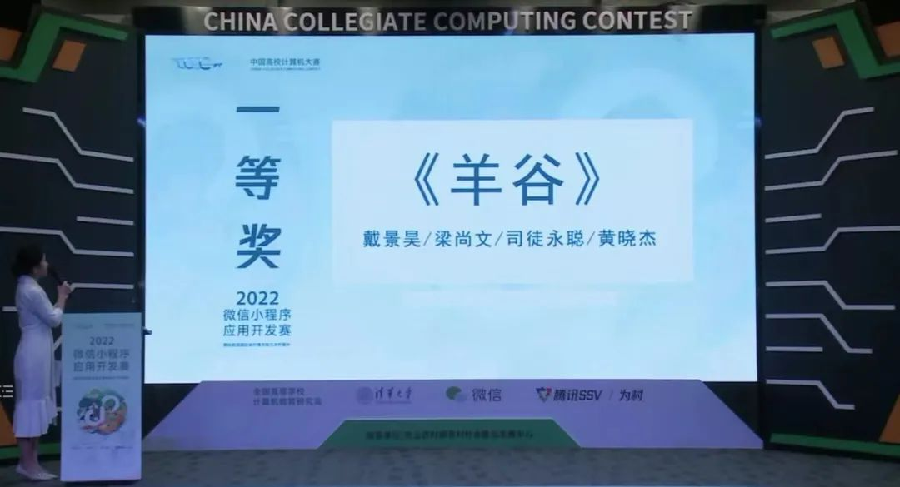
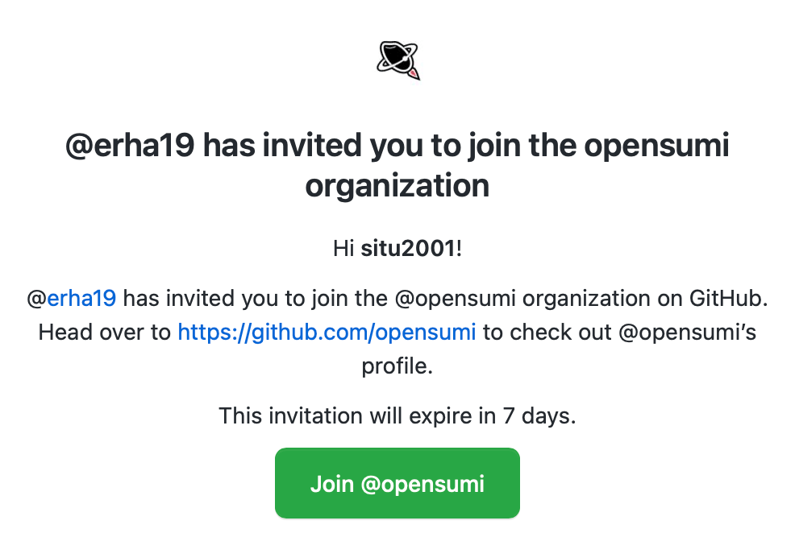
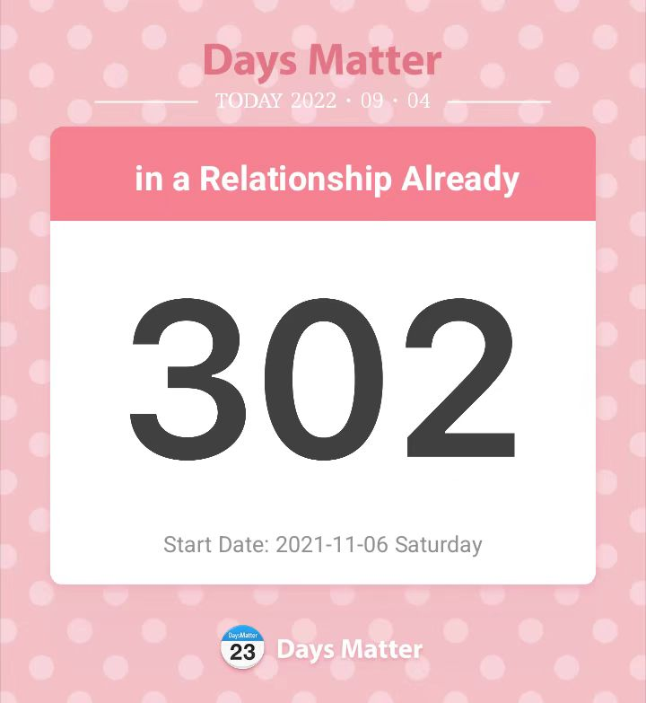
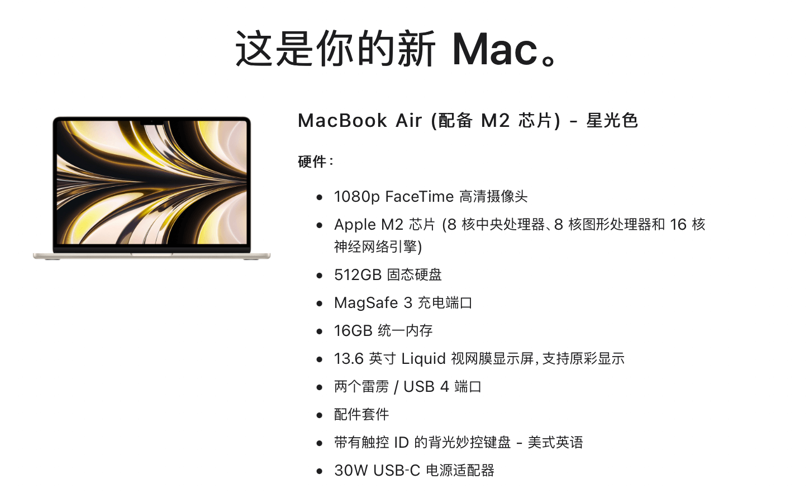

## 前言

写下这段文字的时候，笔者离学校正式上课还有一天不到，虽然在几天前就已经回到学校了，但是一直在忙于整理宿舍、以及 Notion 笔记内容、与同学见面等。并且，上学的时候，碰上广州的疫情，核酸力度也是特别大，一天一检，天天都要扔至少一小时进去，今天是第六天检验了，大概已经投入了半天时间到核酸检验里头了，这谁能顶得住啊。

时间转瞬从周三到了周日下午，而现在我也终于有了一点时间，那就写篇文章来对我的大二进行一波总结吧~

## 迷茫

人都会焦虑。我也不例外，抬头看到大佬们在天空闪闪发光，为人类大地送去耀眼的星光，目光再回到自己身上，感觉自己什么也不是。最后因为这个，焦虑了近乎一整个季节，11 月到次年 1 月，这段时间我几乎什么也没有学进去呀......几乎都在无聊滴刷爽文&上网冲浪，感觉一整个人就是废了的节奏。

我迷茫，迷茫自己走的道路是不是正确的。大家都去打算法竞赛，打数学建模比赛，做机器学习研究之类的事情。我没有折腾这些，反而是很佛系地每天上网冲浪，看看专业课书本打打基础，偶尔写写小应用小工具啥的，尝试用做出一些什么炫酷的事情，偶尔再去 GitHub 上面折腾折腾。不知能做出一番什么样的成就，因为走这种路线的前辈，在我们学校，几乎是没有的。

就这样白白内耗了一个季节，说长不长，但是，说短也不短了。大二下开学的时候，我想通了，与其迷茫下去，为什么不试试啥后果也不想，就直冲一波呢，看看能不能冲出来什么，于是，就是开始了另外一种“摆烂”，先不把结果看得很重，只管做自己喜欢的事情，并勇敢尝试一下看起来很难的事情。

这招下来，慢慢开始有动力了，也慢慢摆脱废人的这个状态了。

## 进步

除了那段极其艰难的迷茫期几乎啥也没有学到，其他时候还是有学习的动力的，一年下来，CS:APP 快学完了，实验也做得 7788，也看完了 OSTEP 的虚拟化和并发部分。

Rust 也入门了好几次，有点小收获。

可能是在平时经常看英语教材吧，除此之外，也会去油管看看老外的视频，偶尔也会去 GitHub 上帮社区翻译一下文档或者做文档纠错的活。在这样的背景下，没怎么复习过英语六级，最后考了个 550 多，其实还算可以的了，不高不低，满意。但满意的不仅仅是分数，还是我对个人英语能力的重视，英语确实让我看到更广的世界。

暑假还参加了两个挺有意义的活动。

### 小程序赛

暑假前，受同学邀请，我参与了到了高校小程序开发赛的开发活动中去（~~考试周的屎山堆砌活动~~），最后赶制出了一个成品来。以为提交作品后就是止步于初赛了。但是万万没想到，我们的作品一路突进，从赛区赛到了国赛，最后斩获了全国一等奖。

不得不感慨队长 favorhau 的 idea 牛逼！

出于对队长的 idea 和产品最基本的尊重和负责，打算九月将这个小程序重写，保证小程序代码是优良，且是可维护的。

### 编程之夏

同样是暑假前，我申请了阿里巴巴的编程之夏活动，抱着申请一下试试不过就算了的心态，但最后没想到通过了。

两个月时间，从对要开发的框架本身的懵懂无知，到对其略知一二，最后找到切入点将功能加进去，也是一件挺有成就感的事情。

非常神奇的事情就是，中途小程序赛居然过了赛区到了国赛阶段（这是大家都没有想到的事情），于是转头去完善小程序和答辩 PPT 了。。。最后，七月八月的时间在整个项目上，分摊严重不均衡，如果八月像七月那样时间富余就好了，这样的话，功能就能做得更好了。并且值得注意的是，踩坑填坑也是很耗时的一件事呢。

最后做出来的功能，有些许不足。为了开发团队后续好好接手我写的功能模块，我把已知的 bug 和限制，及其后面的展望和设想也写了出来。深究到底，毕竟，这是团队合作的事情，沟通能力也是很重要的。

虽然基本要求是完成了，但在我心目中，我没有很好地完成这个功能（有些小 bug），主要是时间没投入够，坑也没有踩够。这一块还是有点小遗憾的。

Mentor 也告诉我不要一开始就设想得很完美，几乎没有一写出来就是 bug-free 且 robust 的代码，先把基本的功能做出来，再去逐步完善和重构（我的理解就像是作者写书一样）

最后还受邀加入了他们的 GitHub org，开心。看看后面能不能为这个社区出一份力。

如果下一年秋招能进得去他们组就好了（划去）

## 其他

### 找到另一半

依稀还记得自己在大一结束后，立下了一些 flag，我回看了一下，似乎是完成了好几个呢。其中比较满意的是这个。

- [x] 找到女朋友 (?)

在大二上学期，我也遇到我的那个 TA 了，发现我俩许多观念都意外地很一致，许多生活方式都是差不多的，感觉就像是另一个自己。希望我们能好好走下去。不过只顾眼前的美好，未来规划也是要做好的呢。

### 购入新本本

受自己的第六感指示，它说：七月中开卖的 M2 MacBook Air，大可提前买，暑假结束之后必定可以回本。

便先付了全款，并默默发誓日后一定可以回本的...

暑假结束了，编程之夏和小程序赛的奖金真的可以抵消一本 Air 还有 Apple Care 的价格（这波是真回本了

## 收尾

暑假结束，隐隐约约，这个大环境越来越不好了，先把专业课考研相关的部分，以及数学给抓起来（两手抓，但是得有所偏重。要是早知道，还不如当时不要太浪，早早提高绩点保个研 p😭q），不能一头路扎进 JS 相关的工作上。

虽然 Coding JS 是我的一个爱好，但是没有做到很牛逼（自己终究还是常人）。再加上自己的学历是弱势，激进的同时也要求稳。

明天就要开启大三的新生活了，得好好努力下去，即使最后的结果不是很好，也无愧了，至少曾经为爱好努力过奋斗过。
