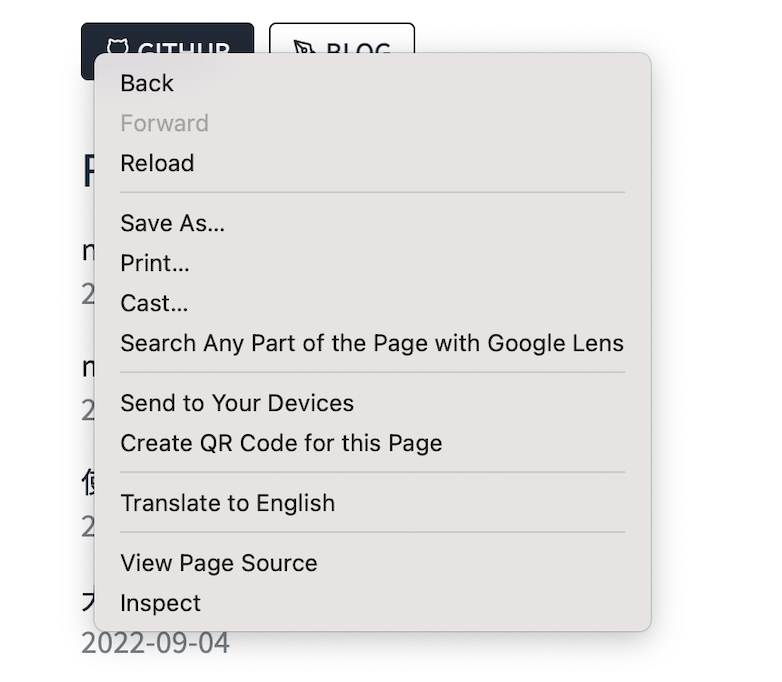
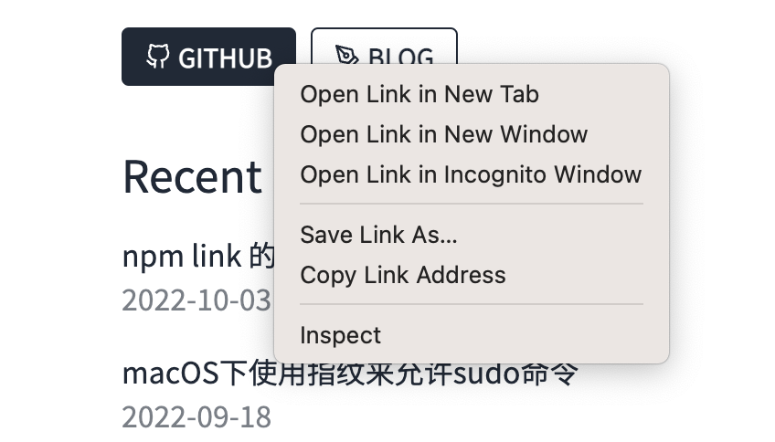

说来尴尬，我有一个朋友（）经常滥用 HTML 标签，并自认为乱用它们并不会产生什么大问题。

举个例子，这位朋友的的博客主页上面有一个 GitHub 按钮，按下之后，就会跳转到[他的同性交友个人主页](https://github.com/situ2001)去。这位朋友他当时的实现，如下所示：

```jsx
<Link href={"https://github.com/situ2001"}>
  <div className="btn btn-outline btn-sm gap-1 rounded mr-2 cursor-pointer">
    <FiGithub />
    GitHub
  </div>
</Link>
```

反正用一个 `<button>` 甚至 `<div>` 标签，手搓一个 event handler 再配上现成的库，都能实现跳转是吧？

直到今晚，我看到了文章——[浏览器默认行为](https://zh.javascript.info/default-browser-action)之后。感觉非常不妥。

直接去到他的主页下，进行右键，诶我去，我的右键菜单怎么是这个样子的？！我的在新标签页中打开的选项，去到哪里了啊。。。？



必须得把我的所见所得，告诉给我的朋友听。

显然，这位朋友显然也不是什么蠢驴，马上根据上面的描述得出下面这几点

- 许多事件会自动触发浏览器执行某些行为。比如，点击一个链接，就会触发导航（navigation）到该 URL。在文本上按下鼠标按钮并移动，就会选中文本。
- 浏览器默认行为可以使用 `e.preventDefault()` 来禁用
- 保持语义，不要滥用

什么是“保持语义，不要滥用”呢？拿标签 `<a>` 举个例子——浏览器允许我们在该标签元素上，在右键菜单里，便可以在新窗口中打开此类链接。虽然我们可以使用 `cursor-pointer` 这些 CSS 规则使得一个 `<div>` 表现得很像一个 `<a>`，但是浏览器内置的特定于标签 `<a>` 的行为，却是无法被干涉的。

我的朋友速速理解完，接下来就是动手了——他马上打开他的博客仓库，找出使用了 `<button>` 甚至 `<div>` 来做 URL 跳转的地方，并速速开始了整改。

很明显地，只需要把 `<div>` 或 `<button>` 标签给换成 `<a>` 标签就行了。如下所示

```jsx
<Link href={"https://github.com/situ2001"}>
  <a className="btn btn-outline btn-sm gap-1 rounded mr-2">
    <FiGithub />
    GitHub
  </a>
</Link>
```

最后，右键菜单的行为重归重要，终于可以右键，然后新标签页打开了~



一切正常了，为这位朋友的主动点赞（
