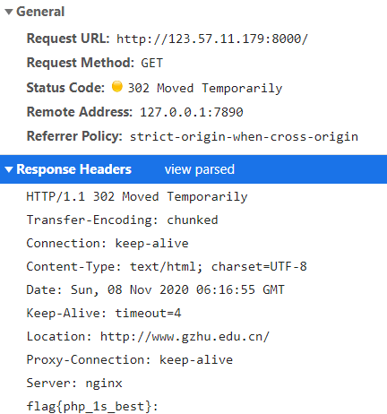
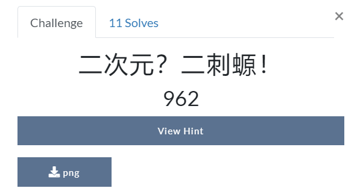
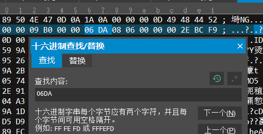
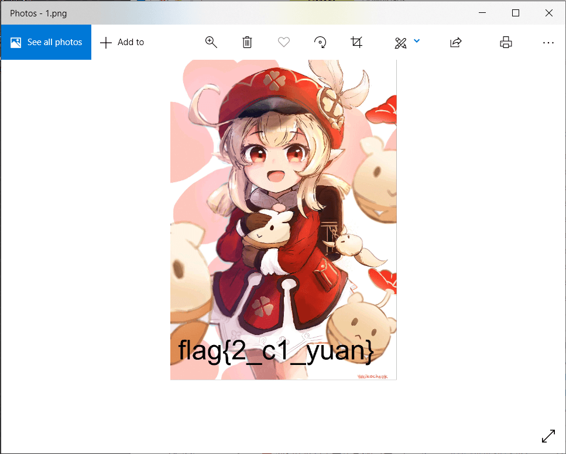
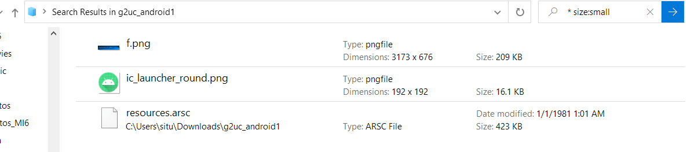
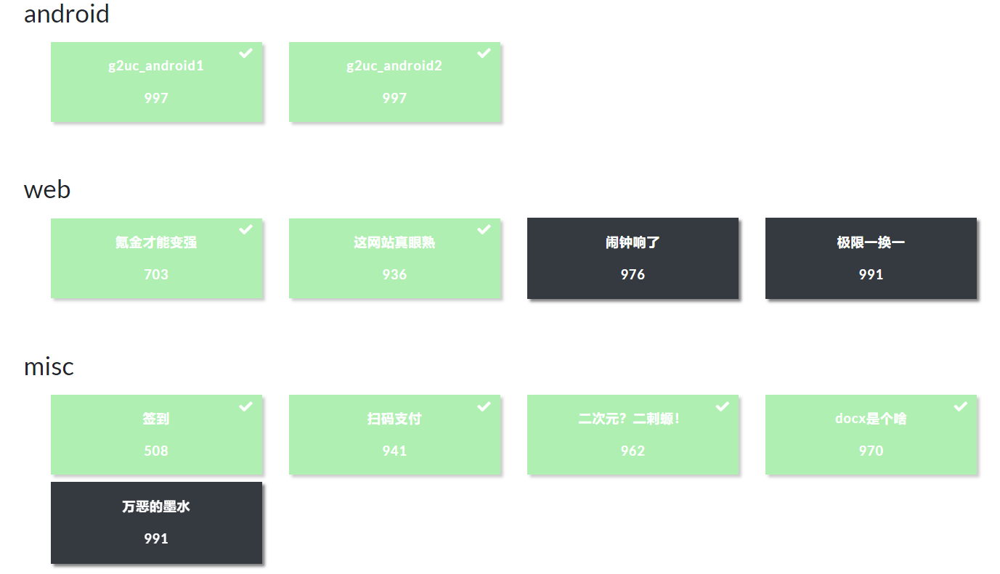
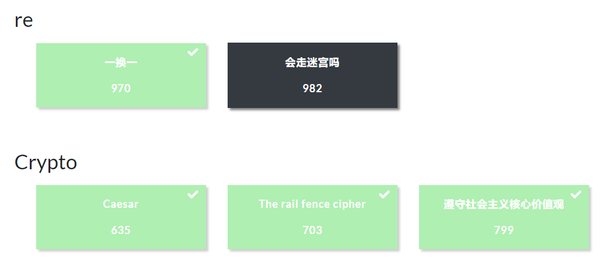
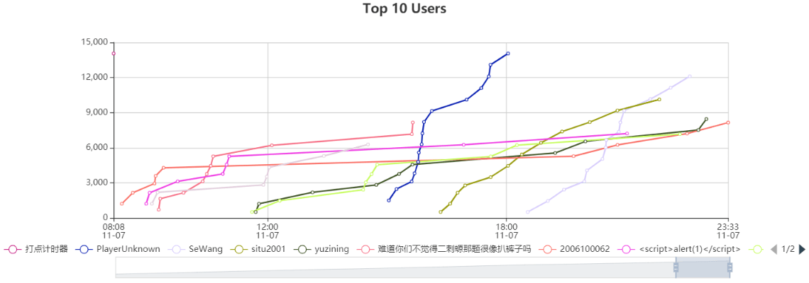

新手上路，大佬们轻喷

## 前言

昨天举办了一场 CTF 新生赛，比赛时间是早八到凌晨结束 ~~我一觉睡到下午三点半才发现~~

既然是咸鱼的周六，最近也累得很没啥事情想做，那就~~先看一集 yuru yuri~~再参加耍耍呗

## 一瞥

题目还挺综合的，Android web reverse misc 和 crypto 都有涉及，难度大多数都还算是 EZ 级别的，就挑三四道~~我会的~~题记录一下吧

1. 这网站真眼熟
2. 二次元？二刺猿！
3. g2uc_android1
4. g2uc_android2

## 题目部分

### 这网站真眼熟

题目给出了一个 URL，在浏览器打开之后会跳到学校官网

下意识想到是不是有可能是 302 跳转，如果是这样的话，直接 F12 看看跳转部分有啥就行
果不其然，在 header 的部分找到了 flag



### 二次元? 二刺猿

题目如图所示




hint 如下，我表示这是 GHS 的行为 ~~赤裸裸的扒裤子~~

> 这图只有上半身，这合理吗，**下半身**表示很淦，快把**下半身**放出来

那综合现有条件进行分析，应该是通过某种手段将下半部分隐藏起来了，而下半部分的实际信息还是存在的

之前参加过一个学院的讲座，好像是介绍啥方班的，里面的大佬也一展身手，我印象中好像有个十六进制编辑器是常用到的，便匆忙下载了 UltraEdit，然后把图扔进去打开，出现一坨码

先冷静一下，进行第一次尝试，会不会是这 se 图的高度被改掉了？查看一下分辨率，其高度是 1754，十六进制转换过去就是 06DA，于是把 06DA 扔入搜索框内进行搜索，果不其然在开头部分找到了



那么图片高度属性应该就可以通过修改这个 hex 值进行更改了

过于疲惫，做人要暴力一点，直接把 06 更成 0F 再保存（



一瞬爆出 flag

### g2uc_android1

这个题差点把我整吐了，前期没有 hint 也不能安装，打开 jadx 也就是一个创建 mainactivity 的方法，并没有什么特殊之处，死磕了好久，太菜了
不过最后 admin 加了 hint。。。

题目没啥的，就提供了一个 apk，两个 hint 如下

> Hint1: 我被盖住了嘤嘤嘤
> Hint2: 为什么同样都是图片，他就是能在我上面

思考了一下，难不成这个 apk 打开其实有张图片被盖住了？那既然是图片，直接把 apk 解开不就行了吗。

解开之后，根据高中用 app inventor(?)写 apk 现在用 AS 的我的一点经验，~~直接搜索筛选较大文件啊这 apk 这么小~~



最后找出了 flag 所在图，图片名为 f，~~我表示我的此刻的心情也是 F~~


### g2uc_android2

这个还行，直接 jadx 打开就看到获取 flag 的方法了，应用如果能安装运行的话，那应该是一个输入框+按钮进行 flag 输入与比对

有用的部分在下面，很直接写在 MainActivity 里了

```java
    public final void click(View view) {
        Intrinsics.checkParameterIsNotNull(view, "view");
        if (view.getId() == R.id.button) {
            boolean correct = true;
            View findViewById = findViewById(R.id.editTextTextPersonName);
            Intrinsics.checkExpressionValueIsNotNull(findViewById, "findViewById<EditText>(R…d.editTextTextPersonName)");
            Editable Flag = ((EditText) findViewById).getText();
            int[] arr = {153, 147, 158, 152, 132, 167, 144, 141, 160, 206, 140, 160, 154, 158, 140, 134, 134, 134, 130};
            int i = 0;
            for (int i2 = 0; i2 < Flag.length(); i2++) {
                if ((Flag.charAt(i2) ^ 255) != arr[i]) {
                    correct = false;
                }
                i++;
            }
            TextView text = (TextView) findViewById(R.id.textView2);
            if (correct) {
                Intrinsics.checkExpressionValueIsNotNull(text, "text");
                text.setText("Correct");
                return;
            }
            Intrinsics.checkExpressionValueIsNotNull(text, "text");
            text.setText("False");
        }
    }
```

一眼看出是个简单的异或拿 flag，根据异或可以反向日回去，我们可以直接反向用 arr 数组里面数字跟 255 进行异或处理，就可以得到 flag

~~下面是简陋 jvav coding 时间~~

```java
public class Test {
    public static void main(String[] args) {
        int[] arr = {153, 147, 158, 152, 132, 167, 144, 141, 160, 206, 140, 160, 154, 158, 140, 134, 134, 134, 130};
        for (int i = 0; i < arr.length; i++)
            System.out.print((char)(arr[i] ^ 255));
    }
}
```

最后获得 flag `flag{Xor_1s_easyyy}`
嗯，以后可能没那么 EZ 了
~~不会有 easy 的题目，但可能有难到要写 essay 总结的题目~~

## 写在后面

这新生赛竟然开了 16 小时，听说真正比赛是肝一天多的
我才断断续续肝四小时多就累趴下了，~~体能有待提升~~

然后，笔记本比赛下来，没有 linux 虚拟机，所有操作全靠奇怪操作，一圈下来，~~奇怪的工具增多了~~
最好还是要备一个 kali-linux VM，这样一来，什么工具都能有

做题的时候脑洞要放开多多思考，还有知识的储备量要足够大（不然就像我那样解不出 PHP 相关的 web 题了

新手上路也只能做这么多了




也就这样了，希望前排的大佬能带带萌新



~~先溜去把一团糟的笔记本环境整理一下了~~
