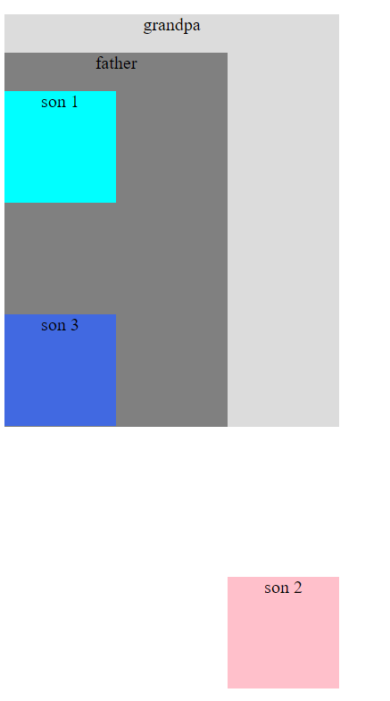

~~Web 安全方向试探路~~(2020/05/23 追更，已经决定，以后想成为一个 Front-end Engineer 了)

## 写在前面

由于最近想探一下 CTF 的 web 方向，并且这些知识就算放在以后也挺有用，于是便开始了 HTML/CSS 和 JavaScript 的基础性学习。

我学习的资源来自 github，是巨硬的一个 repo：[https://github.com/microsoft/Web-Dev-For-Beginners](https://github.com/microsoft/Web-Dev-For-Beginners)，里面先是给我灌输了一些必备的知识储备，然后开始实例驱动手把手教，我觉得这挺不错的，做着做着就学到了东西。

再来一个万能的文档镇楼：[https://developer.mozilla.org/en-US/docs/Web](https://developer.mozilla.org/en-US/docs/Web)

这文章呢，就先把三件套的一些知识做成笔记记下来了，DOM 和 event-driven 这些呢，以后再写（咕咕咕

## JavaScript 部分

先有几个 chapter 介绍了 JS Basics，分别讲了一下 JS 的数据类型(?)，函数和方法，选择与循环，数组。

由于我有一定的 Jvav 基础，所以我就挑一些有差异的、特别的地方记录一下吧。

### 基本数据类型

- 初始化一个变量

可以用`let`或`var`来初始化，但是`let`在 ES6 开始，代表的变量或者常量是有 scope 的，所以教程推荐我们使用`let`而不建议使用`var`，如下所示

> Note, They keyword `let` was introduced in ES6 and gives your variable a so called _block scope_. It's recommended that you use `let` over `var`. We will cover block scopes more in depth in future parts.

变量`let myVar = 123;`，长这个样子就行了。

- 关于常量的初始化和可改变性

**初始化**：常量用`const`来初始化，如`const MY_VARIABLE = 123`

**可改变性**：应该是跟 Java 差不多的，基本数值类型的变量不能被改变，OOP 里面的引用变量不能改变其引用的对象，但是可以改变对象里面的 value

```javascript
const PI = 3;
PI = 4; // not allowed

const obj = { a: 3 };
obj = { b: 5 }; // not allowed
obj.a = 5; // allowed
```

- 6 种基本数据类型

> There are 6 primitive data types: string, number, bigint, boolean, undefined, and symbol.

~~（这怕不是要它自己来进行推测判断~~

- String 字符串

1. 在 JS 里面，字符串可以用单引号或者双引号，都用的场景就是如`'Are you "OK"'`之类的
2. 连接字符串可以像 Java 一样使用 **+** 号，还可以使用一种叫做`Template literals`的操作，如下

```javascript
let myString1 = "Hello";
let myString2 = "World";

myString1 + " " + myString2 + "!"; //Hello World!
myString1 + ", " + myString2 + "!"; //Hello, World!

`${myString1} ${myString2}!` //Hello World!
`${myString1}, ${myString2}!`; //Hello, World!
```

不过要注意，这不是单引号`''`，而是反引号`` `

- Boolean 类型

在 JS 里面，布尔类型**默认**是 true，除非它被定义为 false

### 运算符与操作符

与 Java 差不多，唯一不同的话就是，比较操作符有`==`和`===`，不同之处就是前者比较的是值的相同，而后面的既比较值是否相同还比较数据类型是否相同。同理，也就会有`!=`和`!==`

| Symbol | Description                                                                                                                                             | Example            |
| :----: | :------------------------------------------------------------------------------------------------------------------------------------------------------ | ------------------ |
| `===`  | **Strict equality**: Compares two values and returns the `true` Boolean data type if values on the right and left are equal AND are the same data type. | `5 === 6 // false` |
| `!==`  | **Inequality**: Compares two values and returns the opposite Boolean value of what a strict equality operator would return                              | `5 !== 6 // true`  |

- 函数与方法

不过这两者可以互换地讲，严格说的话，方法是限定在对象范围内的吧。也只是把差异记下来而已。

1. 初始化一个 function: `function nameOfFunction() {}`
2. 参数与传递：`function name(param, param1, param2) {}`
3. 默认值：`function name(name, salutation='Hello')`
4. 然后函数里面可以套函数。函数参数里面也可以套函数（这叫做匿名函数）（？为了解决 scope 问题）~~套娃警告~~
5. ~~肥箭头~~Fat Arrow 函数：~~这像极了 Lambda 表达式不是吗~~在匿名函数，可以直接用 `() => {}`

## HTML 部分

我认为使用 HTML 的话，有两个核心要素

1. **Semantic**即语义
   - 这个靠你自然语言能力就行了
2. 理解结构与合理使用 tag 和 class 和 id
   - 这个用树状图应该可破
3. ~~不会就去看文档[https://developer.mozilla.org/en-US/docs/Web/HTML/Element](https://developer.mozilla.org/en-US/docs/Web/HTML/Element)~~

### 组成

一个 HTML Doc 的话，由下面的一些部分来组成

```html
<!DOCTYPE html>
<html>
  <head>
    <!-- 存放页面的关键信息 -->
  </head>
  <body>
    <!-- 放的是显示区域能看到的东西 -->
  </body>
</html>
```

### 元素与属性

HTML 有两个重要的东西：元素（Element）与属性（Attribution），哪些是元素，哪些又是属性呢？不如，直接上一个包含 src 属性和 class 属性还有一个和 style 属性和 id 属性的 img 元素，一目了然

```html

```

### 什么时候用

什么时候用`<>`呢

这个问题曾经有过，不过我认为大多数情况下，这个 tag 中间不引文字的话就不用了，比如

```html
<p>This is a<br />line break.</p>
```

### 使用语义

在读 HTML 或者写 HTML 的时候最好用语义即 Semantic，为什么呢？我认为 HTML 好多 tag 都是某个英语单词的缩写，比如`<br />`是**break**`<i>`是**Italic**`<a>`是**Anchor**`<li>`是**list**

又比如`<span>`就是**span**中文意思是**跨度、范围**，就是一块 inline 的东西，而`<div>`表示**division**，就是一块一块的，你可以去查下这些东西的英文全称。

所以，表示按钮的时候是`<button>`而表示列表时候使用`<list>`

## CSS 部分

这部分我没啥可说的了，感觉下来就是 CSS 牵一发而动全身......感觉不能用编程语言的思维来理解它~~，我目前的做法也就是不会的查文档，然后 F12 在 Element 选项卡里面，边调数字边预览~~

~~先把文档放这里：[https://developer.mozilla.org/en-US/docs/Web/CSS](https://developer.mozilla.org/en-US/docs/Web/CSS)~~

当然还是有点基础的基础要知道的。

### 优先级 继承 与 选择器

- CSS 优先级

CSS 是啥呢？英文全称是**Cascade Style Sheets**，Cascade 有级联、串联的意思，对于 priority 优先级的话，也是这个样子，优先级就是

`inline style > style tag > external css file`

这三种表示方法是怎么样的呢？我们不妨看下下面的示例

```html
<!--inline style-->
<p style="text-align: center">Test</p>
<!--style tag-->
<style>
  p {
    text-align: center;
  }
</style>
<!--external css file-->
<link rel="stylesheet" src="style.css" />
```

- CSS 继承

这个要想象一下 HTML 文件里面的不同 tag、class 和 id 之间的结构关系了，比如有如下

```css
body {
  font-family: helvetica, arial, sans-serif;
  text-align: center;
}
```

所有的文字都会变为这种字体，因为所有文字都是 body 的下级啊。

然后有个子元素把`text-align`更改为了`left`，如下

```css
input {
  text-align: left;
}
```

那么 input 元素里面的文字对其形式，就会是左对齐，这点跟 Java 中的**Method Override**有点类似~~（奇怪的联想增加了~~

- CSS 选择器

可以根据 tag、class 或 id 来进行 styling，如下：

```css
/* by tag */
h1 {
}
/* by class */
.left-container {
}
/* by id */
#left-container {
}
```

当然了，也能一层一层地深入选择，如下

```css
/*class inside a tag */
input .test {
}
/*tag inside a tag */
div img {
}
```

加逗号就是同时对多个进行应用

```css
.div1,
.div2,
.div3 {
}
```

### 布局与定位

- CSS 的 layout

~~这部分我无能为力了，我目前也就只会拿实例进行比对，再开始写新的 css~~啊，原因是巨硬提到了

> Mixing position properties (there are static, relative, fixed, absolute, and sticky positions) can be a little **tricky**, but when done properly it gives you good control over the elements on your pages.

喂，别这么怂啊，还没开始你就退下了？

首先布局和定位这些我一般在某些居中的元素里头见到，怎么说呢，HTML 的 document 像河道，里面的元素都是像水一样，顺着河流流下来的，所以一般的 HTML 里面的内容，都是靠左显示，并且一个接一个地往下列。

要想改变它们的布局，就要使用 CSS 的`position`了，先来看下`position: relative`和`position: absolute`的区别

首先`position`有许多 value，包括`static fixed relative absolute`等，其中`static`和`fixed`分别是无定位（默认）和固定（字面义）

然后把注意力放在`absolute`和`relative`上，这两个东西都可以用`left`,`right`,`top`和`bottom`来进行**相对定位**，但是又有那么一点小差别，具体可以用个小例子来解释。

既然是**相对**定位，大家也都学过初中物理，知道这么一个道理

> 运动是绝对的而静止是相对的

那么这里肯定也会出现参照物的说法！

因为要实际操作体验，所以我自己造了一个很简单的小 demo

HTML 部分

```html
<!DOCTYPE html>
<head>
  <title>Test</title>
  <link rel="stylesheet" href="style.css" />
</head>
<body>
  <div class="grandpa">
    <p>grandpa</p>
    <div class="father">
      <p>father</p>
      <div class="div1">son 1</div>
      <div class="div2">son 2</div>
      <div class="div3">son 3</div>
    </div>
  </div>
</body>
```

CSS 部分

```css
div {
  text-align: center;
}

div div div {
  width: 100px;
  height: 100px;
}

.div1 {
  background-color: cyan;
}

.div2 {
  background-color: pink;
}

.div3 {
  background-color: royalblue;
}

.father {
  background-color: gray;
  width: 200px;
}

.grandpa {
  background-color: gainsboro;
  width: 300px;
}
```

页面长这个样子，如图所示。


然后我们给 son2 加上这么一段 css

```css
position: absolute;
left: 40px;
top: 120px;
```


如图所示，son3 直接顶上来了，son2 仿佛就像是“跳”出了文档本身一样，并且以页面（此时没有其他的 father 设置了 non-static 的 position）左上角，相对左边向右偏移了 40px，相对上面向下偏移了 120px

如果我们把`position`改为`relative`，那么便会出现下图的情况


可以看出，son2 在文档原本的位置依旧存在，只不过 son2 以原位置，右偏移了 40px 且向下偏移了 120px

然而，上面这些是根据像素点（pixel 缩写为 px）来偏移的，既然是相对的位置表示，用百分比又会如何呢？

这就涉及到参照物的情况了，我**目前**碰到有这些

1. 父级没有`position: xxx`的，son 本身有`position: absolute`的就会以 body(`position: fixed`)来作为参照物
2. 父级有`position: xxx`的，son 本身有`position: absolute`的就会以离他最近的那个 father 来作为参照物
3. son 本身有`position: relative`的话，就是以自己作为参照物，然后宽度高度继承上一级的

那么，`left`,`right`,`top`和`bottom`带百分比的话，就是相对于参照物的左上角，进行相对定位。

就那 1 和 2 举个简单的例子，如果我们再 grandpa 上加这么一段`position: relative`

再把 son2 加上这么一段，

```css
position: absolute;
left: 100%;
top: 100%;
```

就会出现下图的这种情况


此时百分比是**占得 father 的宽度和高度**

但是我们把 son2 改成`position: relative`的话，发现 son2 只向右移动了一个 father 宽度的像素而没有额外的下移


思考了一下，既然这个属性百分比是继承父类的属性，那 father 肯定没有加 height，一查，果然如此，给 father 加个`height: 335px`之后，果然好了。


