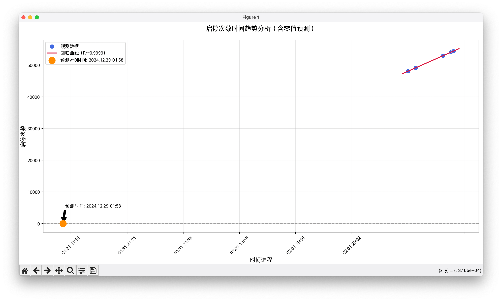
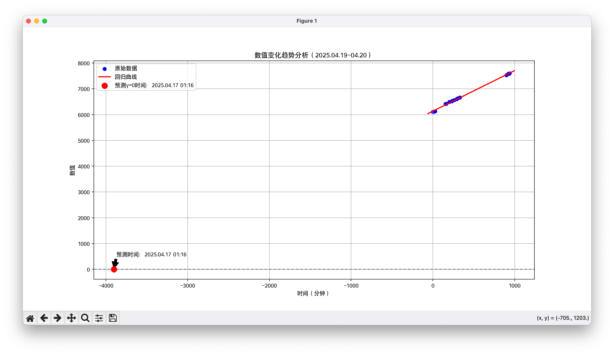

## tl;dr

如果你的硬盘是这样的型号和版本，并于 QNAP（威联通） NAS 上使用

```text
Western Digital Ultrastar DC HA340
Model:            WUS721208BLE6L4
Firmware version: V1GNW9EQ
```

也遇到下面所述的频繁启停的问题，可以通过 SSH 登录到你的 QNAP NAS，执行以下命令

```bash
# 需要注意：每次重启后都需要执行一次，如果需要长期生效，可以将此命令添加到开机启动脚本中
# 将 /dev/sdb 替换为你的硬盘设备名
sudo hdparm -B 254 /dev/sdb
```

## 问题描述

有一段时间，我总是能在客厅听到转盘的高速启转声，我以为是隔壁的邻居在家里装修，但后来发现事情并没有那么简单。我不论是白天还是黑夜，只要一坐到客厅沙发，就能时不时地听到这个声音，并且频率还挺高的，大概几分钟就能听到一次

起初我不以为然，以为是我的幻觉或者是周围的噪音。但后来有一次我在清洁我放置 NAS 的桌子的时候，发现这个声音又出现了并且还不小。我仔细一听，发现声音是从 QNAP NAS 里的硬盘发出来的

然后打开 QNAP NAS 的硬盘管理页面，切换到 S.M.A.R.T 数据，发现其中 HA340 硬盘的启停次数已经超过了 37000 次！并且这个值还在不断地增加

## 初步排查

嘶，这肯定是哪里出现问题了，先观察一段时间，并把每次的记录都通过表格记录了下来（`0x04`或`0x0c`，因为这两个值是一样的且都在飞快地增加）

这个问题是年前发现的，但由于工作比较忙，所以一直没有时间去排查，只能每天记录一下启停次数，一直到年后放假回到家，发现这个次数已经来到了 66000 次！真的把我吓到了...

| 记录时间           | 0x04 & 0x0c |
|--------------------|-------------|
| 2025.01.19 11:40   | 37883       |
| 2025.01.19 12:20   | 37899       |
| 2025.01.20 10:55   | 37929       |
| 2025.01.21 19:30   | 38543       |
| 2025.01.21 19:44   | 38565       |
| 2025.01.21 19:46   | 38572       |
| 2025.01.22 09:24   | 38742       |
| 2025.01.23 09:17   | 39618       |
| 2025.01.28 18:58   | 48077       |
| 2025.01.29 11:15   | 49124       |
| 2025.01.31 21:21   | 52957       |
| 2025.01.31 21:38   | 52970       |
| 2025.02.01 14:58   | 54071       |
| 2025.02.01 19:56   | 54386       |
| 2025.02.01 20:02   | 54394       |
| 2025.02.04 13:17   | 58721       |
| 2025.02.07 22:52   | 63993       |
| 2025.02.09 11:56   | 66383       |

## 进一步排查

这些数据看着像是线性增长的，说明这个问题在之前的某个时间点就开始了。使用 GPT 写了一段 py + matplotlib 的代码，画出了启停次数的变化曲线，给出了这样子的图片



翻了一下 QNAP 的日志，发现在这个时间点附近，我进行了一次重启，但这也无法解释硬盘刚到货的重启为什么没有影响到硬盘...

没办法，可能是硬盘本身有问题？我于是联系京东更换了同型号的硬盘，新盘到货之后，一切看起来回归正常，启停次数也没有再增加。

但是过了大概 45 天左右，我又听到了这个声音，打开 S.M.A.R.T 数据一看，发现启停次数又开始增加了。。。这次的启停次数已经超过了 6000 次

观察了大概三天，记录下来的第二块硬盘的启停次数

| 记录时间           | 0x04 & 0x0c |
|--------------------|-------------|
| 2025.04.19 18:20   | 6109        |
| 2025.04.19 18:37   | 6119        |
| 2025.04.19 18:41   | 6126        |
| 2025.04.19 18:47   | 6135        |
| 2025.04.19 20:53   | 6413        |
| 2025.04.19 21:05   | 6421        |
| 2025.04.19 21:40   | 6493        |
| 2025.04.19 22:10   | 6516        |
| 2025.04.19 22:17   | 6529        |
| 2025.04.19 22:40   | 6567        |
| 2025.04.19 23:10   | 6603        |
| 2025.04.19 23:26   | 6635        |
| 2025.04.19 23:50   | 6664        |
| 2025.04.20 09:18   | 7530        |
| 2025.04.20 09:42   | 7583        |
| 2025.04.20 09:46   | 7585        |
| 2025.04.20 09:48   | 7588        |
| 2025.04.20 09:58   | 7599        |

再次让 GPT 给我用 py 画了个图



...这，怎么又是线性增长的趋势？并且增长的速度也是跟之前的硬盘大差不差的，并且也是在最近一次 NAS 重启之后开始的

## 初步观察

- 两块硬盘都在 45-60 天左右出现问题，并且开始出问题的时间点附近，我对 NAS 进行了一次重启
- 两块硬盘都是 HA340 同一个型号和固件
- 通过 SMART 数据发现 0x04 和 0x0c 的数值几乎一致
- 只要有持续的数据读写就不会有停转，只要一停下数据读写，就会马上停转
- 我的 NAS 的另一块 HC320 8TB 表现正常

## 最终排查

不可思议，得排除掉是 QNAP 的问题，于是我继续搜索，将硬盘放入我的移动硬盘盒，连接到我的电脑上，发现这块硬盘在电脑上的表现也是一样的，硬盘会不停地启停。

难道是硬盘本身跟启停频率有关的设置出了问题？于是我开始搜索相关的资料。发现 `hdparm` 命令可以设置硬盘的电源管理配置，主要有

- APM（Advanced Power Management）：高级电源管理，通过 `hdparm -B` 命令设置
- AAM（Automatic Acoustic Management）：自动声学管理，通过 `hdparm -M` 命令设置
- Standby (Spindown) timeout：待机（停转）超时，通过 `hdparm -S` 命令设置

通过一番搜索，我认为硬盘的启停会跟硬盘的电源管理有关。于是我通过 SSH 登录到 QNAP NAS，执行了以下命令

```bash
sudo hdparm -I /dev/sdb
```

发现了一行特别的输出

```bash
Advanced power management level: unknown setting (0x0000)
```

这说明硬盘的 APM（Advanced Power Management）值为 `0x00`！这个值实际上是无法被 `hdparm -B` 直接设置的，参考 `hdparm -B` 的说明，这个命令不支持将 APM 的值设置为 `0x00`。

> Set the Advanced Power Management feature. Possible values are between 1 and 255, *low values mean more aggressive power management and higher values mean better performance*. Values from 1 to 127 permit spin-down, whereas values from 128 to 254 do not. A value of 255 completely disables the feature.

但是重读上述的话，似乎是这个 APM 值越小，硬盘的停转越频繁，会不会是这个值导致了硬盘的频繁启停？于是我尝试将 APM 值设置为 `254`，即不允许硬盘停转

```bash
sudo hdparm -B 254 /dev/sdb
```

发现执行成功了，并且 APM 值也被设置为 `0xfe`，这意味着硬盘的 APM 值被设置为 `254`，即不允许硬盘停转

```bash
Advanced power management level: unknown setting (0x00fe)
```

此后，直到我写这篇文章时，启停次数也没有再异常增加。但要注意，在 NAS 重启后，这个设置会失效，即 APM 值的再次变回 `0x00`，需要每次重启后都重新执行一次 `hdparm -B 254 /dev/sdb` 命令来设置 APM 值

真的是太玄学了，虽然我不知道这个问题的根源是什么，但至少目前这个问题是解决了

## 根本原因是？

好了，这个问题看起来是解决了，我也尝试反馈给 QNAP 的技术人员和西部数据的客服，但是他们并没有给出明确的答复，QNAP 客服叫我再换一块同款的硬盘观察一下，而西部数据客服让我尝试跟京东协商换成 HC320...

我也懒得做他们的免费测试员了，只好用了上面的 `hdparm` 手动设置的操作来个规避这个问题

目前唯一能确定的是：HA340 硬盘在被 unmount 或者 detach 的时候（？），其 APM 值会被重置为 `0x00`，而这个值会导致硬盘在没有数据读写的情况下迅速停转，一有读写的时候就会启转，这就导致了启停次数的疯狂增加

希望有缘人能看到这篇文章，并能指出问题的根因所在

## 常见问题 FAQ

### Q: QNAP NAS 上西数 HA340 硬盘为什么会频繁启停？

A: 主要原因是硬盘的 APM（高级电源管理）参数被重置为 0x00，导致硬盘在无读写时迅速停转。

### Q: 如何用 hdparm 解决 QNAP 硬盘频繁启停问题？

A: 通过 `sudo hdparm -B 254 /dev/sdb` 命令设置 APM 参数，可有效防止硬盘频繁启停。

## 参考资料

- 我在 v2ex 上的帖子 [HA340 在持续通电两个月后出现频繁启停的问题，一个月不到可达 30000 次启停](https://v2ex.com/t/1126732)
- [hdparm - Archwiki](https://wiki.archlinux.org/title/Hdparm#Power_management_configuration)
