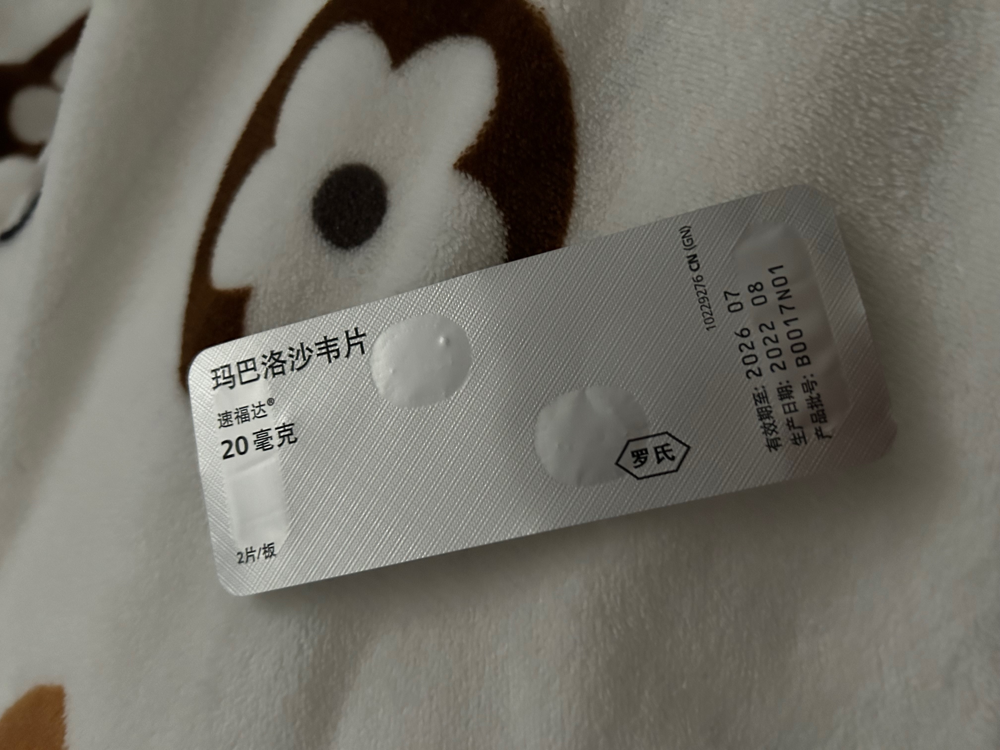
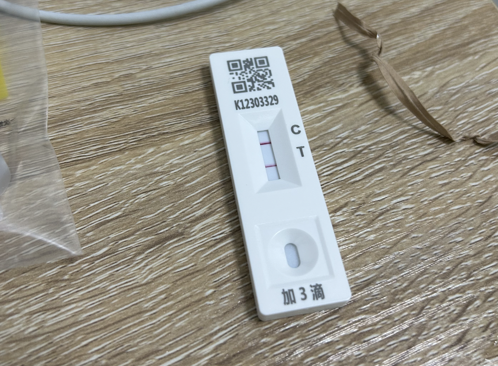

import BodyTemp from "./_BodyTemp.astro";
import { tempMarch, tempJune, tempNovember } from "./_data.js";

> 最近又发烧了...去急诊的时候看到很多人都在排队，据说近日又出现了流感。
>
> 唉，长这么大，头一次见这么频繁地发烧，感觉在新冠大流行后，人体免疫力都下降了。

今年 2023 年，距离 2020 年年初新冠疫情爆发已经 1400+ 天，距离广州解除疫情封控也已经 360+ 多天了。也就是说，差不多在一年前的今天，大家已经在准备逃离学校回家“避难”了。

全国解封后，开始出现大规模的新冠感染，很多人都中招了。但我在这波感染中，没有中招，不过在 2022 年 12 月上旬因为过度清洁耳道和长时间佩戴入耳式耳机，引发了外耳道炎，发烧了几天。

我以为我稳了，但是，我错了...在 2023 年 3 月到 11 月这短短半年多时间里，我分别经历了三次发烧，并且每次引起发烧的症状都不一样。

## 甲流

3 月初，我在北京实习还没几天，就感染了上了甲流。当时我以为是新冠，因为我在北京实习的公司有人确诊了新冠。但我去医院检查了一番之后，发现是甲流而不是新冠。

甲流的感受是这样的：是头痛为主的发热，即使体温很高了，也没有非常难受。体温长期在 39 度左右徘徊，甚至会冲到 40 度以上。吃了退烧药（布洛芬）能降下来，药效失效后，体温立马飙升。

正因为这个问题，11 号中午我再次去到了医院，医生给开了甲流特效药，如下图所示，小小的两粒（~~却要大大的两百块~~）。吃了之后，不到半天，体温就降下来了且不再升高。

<BodyTemp data={tempMarch} />

## 新冠

6 月中旬，跟几位朋友在广州玩了两天，就当我回到深圳准备上班的时候，身体感到不是很舒服。出门前测 37 度多，感觉还好，就头铁去了公司，结果到了公司，体温已经飙升到 38 度多了额...领取了几份新冠检测试剂盒就回家了。前两天测了两次都没有问题，结果到第三天退烧后，测出阳性。

发烧的时候有剧烈头痛感和疲惫感，虽然没有甲流那次这么高温，但是发烧的身体感受是比甲流强烈的。

不过，这次没有吃什么特效药，仅仅只是吃了几天布洛芬（但吃布洛芬是无法退烧的，只能止痛）还有止咳水，**熬**到退烧就好了。

<BodyTemp data={tempJune} />

等烧退了之后，真正的折磨才到来：

- 喉咙痛，如刀割一般的疼痛感（持续一周）
- 不停地咳嗽（持续好几周）
- 丧失了味觉与嗅觉**足足两周**，那段日子，吃啥都不香了（~~饮食成本大降低~~），上厕所也闻不到臭味了...

## 外耳道炎

道理很简单，就是耳道发炎导致的发烧。这跟喉咙发炎发烧是一个道理。究其原因...估计还是掏耳屎过度外加佩戴入耳式耳机时间过长。

其实已经肿了一周多了，但前些天凌晨才开始痛并把我痛醒。在痛了一天之后，去了一趟急诊，医生开了瓶滴耳水和喉炎茶合剂，用了几次就好了大半。

炎症退去之后，体温就自然下降了。

<BodyTemp data={tempNovember} />

已经是第二次外耳道炎了，后面估计得更换为头戴式耳机 & 控制入耳式耳机的佩戴时间了。目前心水索尼大法的 XM5，等双 12 优惠下个单。
