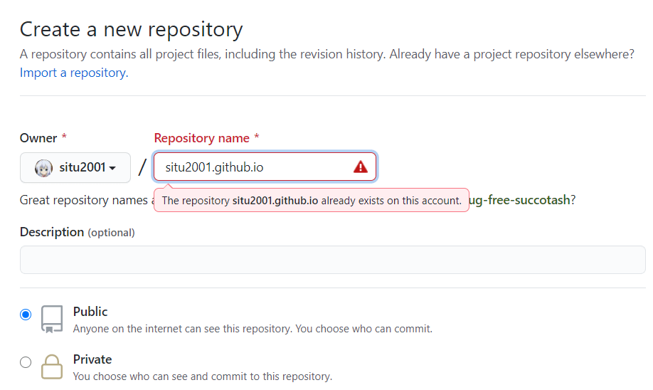
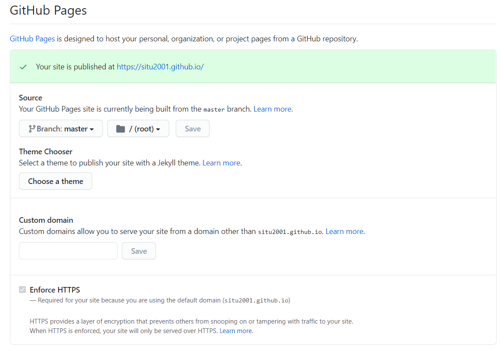
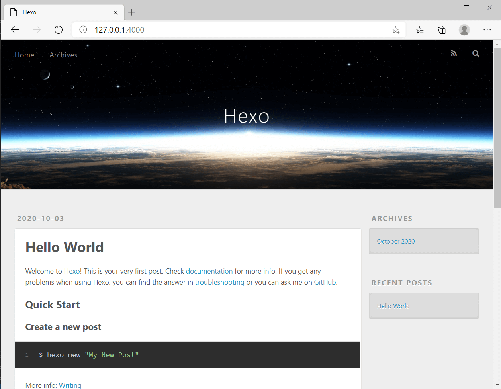

国庆回家了，先随便水一篇文章 ~~才放 4 天假差评~~

那么，如何搭建一个属于自己的静态博客？

**时效性**：本文在 2020/12/12 时，经舍友测试可用

## 前言

这个世界上有许多东西，如果我们不去刻意记录，它们也许会永远消失于自己脑海，消失于他人视野中，消失于这个世上

拥有一个自己的博客，可用于随手记下自己的成长历程中的点滴与思考

## 准备工作

1. 一个自己的 GitHub 账户
2. 相关本地环境
3. SSH 密钥
4. 阅读相关文档的**耐心**

## 选择博客框架

能搭建起博客的有很多，比如

- WordPress (适合新手，不过有点臃肿，毕竟是动态博客)
- django (一个 python-based 的框架)
- hexo (轻量的静态博客，也是我选用的)
- github page 一把梭 (简单粗暴适合新手~~可以直接把 github 当 editor~~)
- Jhipster (~~能玩得起来的人都 tql~~)

最后我选择了 hexo 作为我的博客框架，基于以下一些个人的思考

1. 博客是否足够轻?
2. 文章文件是否**易于备份**(重要，毕竟文章才是自己输出的心血)
3. 支不支持 Markdown
4. 是否可拓展且有比较多的插件
5. 是否可以一键部署至云端

## 本地环境

github 账户应该是人均一个了吧，这里不再说 github 账户注册相关的了

在本地环境下，安装如下软件

1. [Git](https://git-scm.com/)
2. [node.js](https://nodejs.org/en/)

Git 用于后续的博客部署和版本控制，而 hexo 是 powered by nodejs 的

## 安装 hexo

作为用户，我们啥也不知道啊，但开发者已经把他想说的都写出来了，所以**阅读文档**是个好方法

[Hexo Deocumentation](https://hexo.io/docs/)

里面写了 requirement 和 hexo installation 方法

**耐心**阅读与寻找，便能找到如下内容

    Install Hexo
    Once all the requirements are installed, you can install Hexo with npm:

    $ npm install -g hexo-cli

读出来，就是在命令行输入

```shell
npm install -g hexo-cli
```

便能安装 hexo

hexo-cli 安装了，所以该如何 setup 呢？

无需多虑，开发者写了相应的文档[hexo setup](https://hexo.io/docs/setup)

开局就写到

    Once Hexo is installed, run the following commands to initialize Hexo in the target <folder>.

    $ hexo init <folder>
    $ cd <folder>
    $ npm install

也就是说，在目标文件夹下依次输入上面三个 commands 就行了

初始化之后的目录结构，一些对于 config 文件的说明，文档里已经讲得清清楚楚了，跟着它一起配置即可

关于命令行操作，[文档](https://hexo.io/docs/commands)里面也写的很清楚了

我一般也就新建新文章，本地测试，上传到 github，所以大部分时候会用到如下几个

```shell
hexo new [layout] <title>
hexo generate
hexo publish
hexo clean
hexo server
hexo deploy
```

## 撰写你的第一篇文章

在 hexo 目录下输入 `hexo new my-first-content`

接着，该文章的文件就会生成于子目录 `source/_post` 下

该文件是 **Markdown** 格式，最好用支持 md 的 editor 打开（~~vscode + markdownlint 天下第一~~

typora 对于 Markdown 的支持也是很好的（~~不过 vscode 能做的事为什么还要用其他编辑器啊~~

此处附上 Markdown syntax 相关的网页: [Markdown Guide](https://www.markdownguide.org/basic-syntax/)

## 配置 SSH 密钥

这里使用 SSH 密钥来进行本地与 github 之间的通讯

官方文档如下

[connecting to github with ssh Github Docs](https://docs.github.com/en/free-pro-team@latest/github/authenticating-to-github/connecting-to-github-with-ssh)

经阅读上方的文档可以得知

先生成 SSH key，下列 command 生成了公/私对
`$ ssh-keygen -t rsa -b 4096 -C "your_email@example.com"`

再将其 public key 复制进剪贴板
`$ clip < ~/.ssh/id_rsa.pub`

之后到[https://github.com/settings/keys](https://github.com/settings/keys)里，点击 New SSH key，然后把它粘贴到文本框里

接下来就是测试连接

在命令行下输入 `ssh -T git@github.com` 以测试 SSH 是否配置好

预期结果应如下

```powershell
PS C:\Users\situ> ssh -T git@github.com
Hi situ2001! You've successfully authenticated, but GitHub does not provide shell access.
```

此时，到 github 的 connection 已经没有问题

## 关于部署

本地写好了，当然是要部署，而部署之前，得要有地方给你放。

首先先在 github 上建立一个这样的仓库



repo 的 name 是 yourusername.github.io ，并且这个 repo 要是 Public 的，填完之后点击 Create Repository 按钮就行了

至于为什么要这样做，细看官方讲解: [Github Pages](https://pages.github.com/)

新建出来的 repo，github pages 默认是启用着的（~~也关不了~~

再调一下 repo 里面的 setting ，进入 setting 之后一直往下跑就看到了



主要是设置一下 source folder 和 branch 之类的，可以直接加一个 HTTPS，也支持自定义域名

至于 hexo 这边如何配置呢

先执行如下命令，为什么，因为文档有的说啊：[Github Pages | Hexo](https://hexo.io/docs/github-pages#One-command-deployment)
`$ npm install hexo-deployer-git --save`

再去到 hexo 文件夹下，找到 `_config.yml` 文件

添加如下几行

```yml
deploy:
  type: "git"
  repo: https://github.com/yourusername/yourusername.github.io
  #branch: master
  branch: main
```

> 2020-11-01 更新: GitHub repo 的 default branch name 变成 main 而不是 master 了, 因此上方做了一些修改

输入 command `hexo deploy` 等待一段时间之后，若无错误提示，便是部署成功

## 访问博客

在部署之前可以输入 command `hexo server` 进行本地访问

若已经部署到 github 上了，直接在浏览器输入 `username.github.io` 就行

如果没有问题，你的博客页面将会被加载

**注**: 绝大部分地区可能无法打开`*.github.io`，建议修改 DNS 为 `223.5.5.5`，能解决大部分问题，如果有域名和 CDN 的，推荐 CNAME 解析再套上 CDN

update: CNAME 文件会在 deploy 之后被覆盖，翻了一下，发现`hexo deploy`用的是 `git push --force` ，因此远程仓库的内容会被现有的本地仓库覆盖掉，解决方法是在 source 目录下直接新建一个 CNAME 文件，这样在生成的时候就会出现在 public 目录里

如下图所示



## 图床配置 (Optional)

Git 这种东西，不是拿来给我们存放二进制文件（如图片）的

俗话说得好， ~~Git 存换删图一时爽，.git folder 火葬场~~

而图片在 Markdown 中，可以以 URL 形式附上，所以只要有链接，就能出图了

经过一把 Google 之后，我认为有两种不错的方法来进行图片的

### 公共图床

使用公共图床，可以直接 0 开支（免费图床的话），但有利也有弊，图床毕竟只是别人的一项服务，图片放在别人那里，万一用着的这家公共图床凉了呢？能换，但是文章中 URL 修改的工程量可不小呢，如果没有备份的好习惯，你的图片都还在本地吗？

列一些用的比较多的图床

1. [imgur](https://imgur.com/) (国外知名图床，国内访问不友好)
2. [imgchr](https://imgchr.com/) (~~跟 1 域名高度重合，一看就知道解决了什么问题~~)

### 私人图床

私人图床可以考虑使用对象存储，如七牛、腾讯、阿里的对象存储
对于一般的个人博客，用对象存储，金钱开支一般都会很小（存储便宜，流量价格适中但是几乎不怎么跑流量）

### 图片管理神器 PicGo

地址：[PicGo](https://github.com/Molunerfinn/PicGo)
这是 github 上的大佬开发的一个用于管理自己存放于图床的图片的工具

下载下来并根据里面的 Wiki 一步一步来就行了

上传图片之后，按照 md 的 syntax `` 插入到文章即可

不详细说怎么操作了，毕竟人家已经有文档了，我在这里说，无非就是照搬文档，甚至还可能加上自己的主观认知，从而导致方法步骤等被个人地二次加工。

所以
**不会读文档的人可不是一个新时代青年哦**

~~为了叫你们去读文档而不花费大量篇幅写作，我可真是好人呢~~

## 安装主题 (Optional)

可以安装其他主题以美化自己的博客
我用的是 Next 主题：[https://github.com/next-theme/hexo-theme-next](https://github.com/next-theme/hexo-theme-next)

安装很简单，直接在 hexo 目录下输入下面 command 即可
`$ npm install hexo-theme-next`

之后再在 `_config.yml` 下将 theme 改成
`theme: next`

剩下的设置都在官方文档了，自己去看吧: [https://theme-next.js.org/docs/](https://theme-next.js.org/docs/)

~~我还在用着默认设置~~

## 备份博客 (Optional)

虽然博客的源文件是在本地的，但是在本地也有风险啊，（猜测）并且有时候为了去其他电脑码文，你用了 U 盘拷过去，一次两次还好，多次之后你将会分不清那边是最新的源文件了~（论版本控制的重要性）~

### 大致流程

所以我们可以在 github 新开一个 private repo(没想到已经放开使用了)

**首次**先`git clone`下来，把源文件扔进去，一波 `git add .` 一波 `git commit` 最后 `git push` 送他上路  
**以后**再其他设备上，只需要 `git clone` `git add` `git commit` 和 `git push / git pull` 就行了（常用的几个）

Alternative: 也可以在 github pages 的 repo 下，把 deployment 的 branch 设置为 master 之外的（如 gh-pages），然后直接 push 到 master 分支即可，不过.deploy_git 文件夹没拉下来的话，可能会出事，下面有提到。

### 把.gitignore 文件设置好

**一定要有**.gitignore 文件
一定要**有.gitignore 文件**
**一定要有.gitignore 文件**

如果你想 git clone 下来一堆或者 push 一堆 node_moudle，请忽略此步


该文件的作用如文件名本身，可以忽略上传的文件/文件夹

对于 hexo 源文件，我一般选择忽略如下，剩下的便是文章和 config 文件

```
.DS_Store
Thumbs.db
db.json
*.log
node_modules/
public/
.deploy*/
```

2020-11-21 更新：**不过**在更换本地环境之后，.deploy\*/是保存有静态页面仓库的.git 文件夹的，并且 hexo-deployer-git 的[README](https://github.com/hexojs/hexo-deployer-git#how-it-works)如是说

> hexo-deployer-git works by generating the site in .deploy_git and force pushing to the repo(es) in config. If .deploy_git does not exist, a repo will initialized (git init). Otherwise the curent repo (with its commit history) will be used.

由于是 force push，也就是说没有这个文件夹时候，重新生成的新的，会把你原有的仓库直接覆盖掉（也就是说 commit 啥的全没了）
所以在换环境的时候，记得 clone 一下，即是把你的 username.github.io 这个 repo clone 下来并重命名为.deploy_git，如下

```shell
git clone <gh-pages repo> .deploy_git
```

## 最后

到这里，现在你~~应该~~有一个属于自己的个人博客了

听说在线聊天，异性"哦"你的时候，回个"嗯"是一个很好的选择（跑

那么

嗯

Enjoy writing
