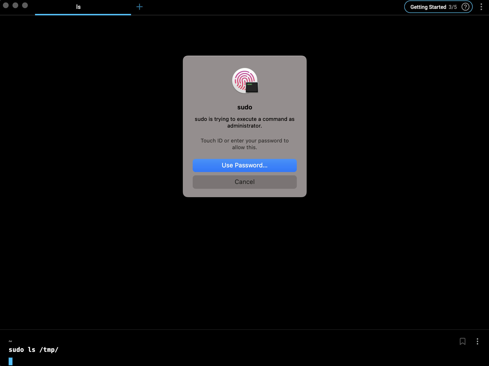

每一次在 macOS 的终端输入`sudo`的时候都要输一遍管理员密码，实属麻烦。

今天，题主已经忍无可忍了——必须要把指纹允许 sudo 的操作提上日程！

在做的过程中，题主参考了这个Q&A: [Can Touch ID for the Mac Touch Bar authenticate sudo users and admin privileges?](https://apple.stackexchange.com/questions/259093/can-touch-id-for-the-mac-touch-bar-authenticate-sudo-users-and-admin-privileges)

其实，操作很简单，只需要以 su 的权限，用 nano 或者其他编辑器编辑`/etc/pam.d/sudo`

在最前面加上这一行，保存就行

```text
auth       sufficient     pam_tid.so
```

关闭当前 terminal session，打开一个新的 session

最后效果如下所示



根据提示，放下手指到 touchID 处输入指纹就行了，非常舒服~
