上个月购入了一款规格参数比较“小众”的显示器，一个月用下来感觉很不错。正好，朋友今天参加国考，而我在等她考完。趁着有充足的时间，这里给大家分享个从购买到个人使用的历程。

## 购买动机

实习半年后发现，一台外接显示器对生产力的提高是很有帮助的。~~并且现在购入也可以方便大学毕业前的我在宿舍的娱乐摆烂时光~~

购买前先确定目标和需求，这是我理想中的显示器

1. 24 英寸（27 英寸太大了，暂且不说宿舍能不能放下，在滴滴和腾讯实习的时候，用的是 27 寸显示器，经常需要转动脖子来浏览内容）
2. 4K（在 24 英寸下像素点密度达到了 183PPI。其实 2K 在这个尺寸下也有 122PPI，但细腻程度还是不如 4K 显示器的）
3. 100% DCI-P3 + 出厂校色（Mac 用户懂得都懂）
4. 全功能 Type-C 口（一根线解决数据 + 充电 + 屏幕输出三个问题）

经过这么一番操作下来，得到了搜索关键字（尺寸 + 分辨率组合）：显示器 24 英寸 4K。

往京东一搜，结果令人感慨。一眼下去只有 ViewSonic、Acer 还有 LG 的那台显示器（没错就是传说中的 Ultrafine）。往下翻其实还有一些不知名的品牌如 FLYOBU,、Kuycon 等，但由于厂子太小，售后可能会是个大问题，所以就没有考虑。

废话不多说，上个表格分析一下

| 型号                | 兼容 | 接口           | 色域        | 材质   | 亮度   | PD 功率 |
| ------------------- | ---- | -------------- | ----------- | ------ | ------ | ------- |
| ViewSonic VG2481-4K | 良好 | C+HDMI+DP+USB3 | 100% DCI-P3 | 雾面屏 | 400nit | 96W     |
| Acer EK241QK        | 良好 | HDMI+DP        | 72% NTSC    | 雾面屏 | 250nit | --      |
| LG 24MD4KL-B        | Mac  | Thunderbolt3+C | 100% DCI-P3 | 镜面屏 | 500nit | 85W     |

对比了一下，直接给出结论：~~ViewSonic 这显示器 TM 不就是 LG Ultrafine 青春版吗~~？

结合油管上一位老哥的 [推荐安利](https://www.youtube.com/watch?v=K2zN6EShBzg) 与我~~空瘪瘪的钱包~~，我决定下单 ViewSonic VG2481-4K

京东的物流效率还是挺高的，早上 10 点前下单，晚上 7 点就已经收到货并拿回宿舍了。

插播个吐槽

> 买的时候：10 月 23 日 20 点有双 11 活动，价格会降低到 1999 元，7 天内购买可以去申请价保。（机智如我，早买早享受）
>
> 10 月 23 日晚上：价保不支持百亿补贴的价保...（被京东套路了）

## 开箱

盒子很朴素，印有三只七彩文鸟，里头装着显示器本体，兼容 VESA 的支架，自带一个底座。

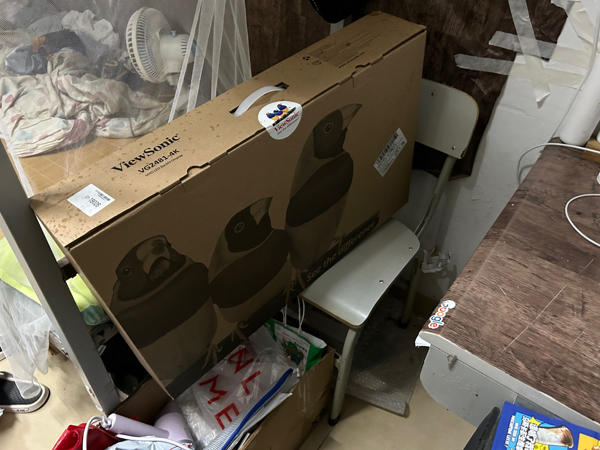

开箱后，迎面而来的是一个用泡沫和塑料膜包着的显示器面板。此外，配有不少线材（如下图床上所示）：C to C 线、USB3.0 A to B 上行线、HDMI 线、DP 线。电源适配器是外置的，一块大板砖，有 150W 的功率，盲猜其中有三分之二的功率是分配给 96W PD 的。

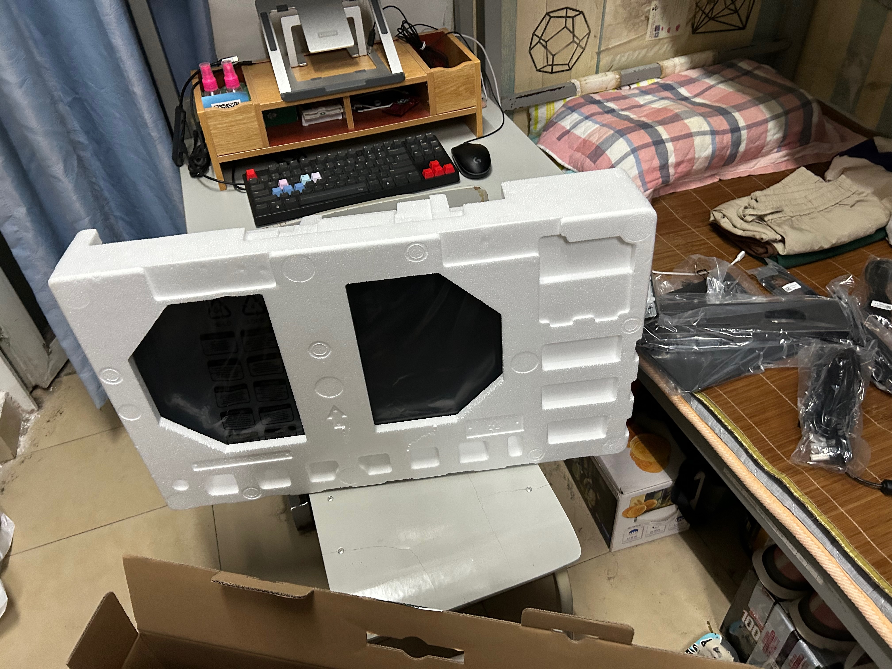

除此之外还带有一份打印的校色报告，从报告可以看出，可以在不同的色域下做到不大于 1 的 deltaE 平均值。

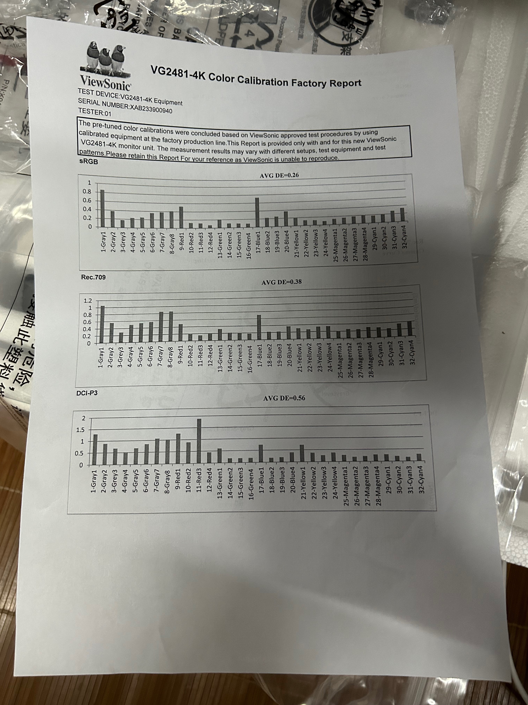

安装体验很好，将支架套一下，拧一下螺丝就好了。组装好后，放于桌面，亮屏，启动，出现经典的七彩文鸟开机 logo

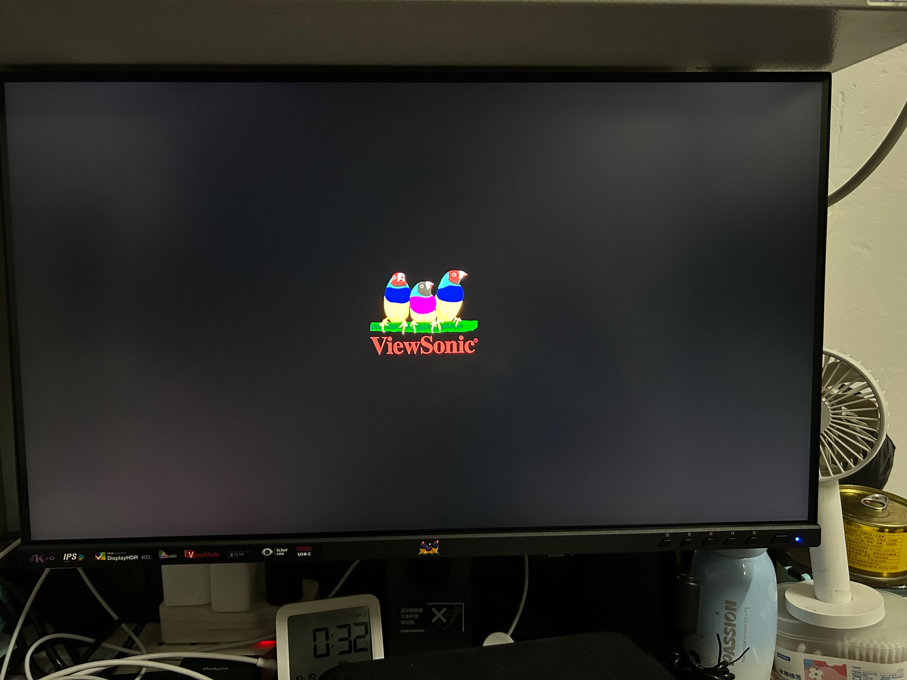

屏幕面板应该是京东方的。由于手里没有专业的屏幕测试设备。只能验一下能主观感受到的部分了——本次收到的显示器没有亮点和坏点。屏幕材质为雾面屏，如果觉得雾面屏显示不通透的话需三思。就个人而言，显示器的实际观感与 MacBook 大差不差。

该显示器自带两个 3W 功率的扬声器，不要期待太高，是听个响的水平。用于应急或者播个系统提示音啥的还不错。

本显示器的 IO 口有如下：

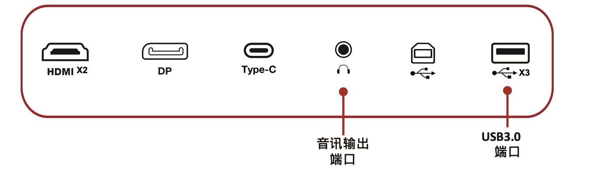

其中，C 口是多功能的：提供 96W PD 供电，USB2.0/3.0 的数据传输速率，以及 4K 60Hz 10bit/8bit 输出。

对于这个接口配置，我其实不是很满意

- HDMI 口是 HDMI 2.0 标准的，只能输出到最高 3840x2160@60Hz, 8bit，如果给到 2.1 就好了
- RJ45 口缺失，不过问题不大，现在无线传输速率也是够用了
- USB 口全是 **A 口**（这个年代给带 C 口才是好文明）... 并且，受限于 C 口的带宽，10bit 位深与 5Gb/s 的 USB3.0 速率是互斥的...对此，我选择了 10bit，于是这三个口只有可伶的 2.0 速率了...最终归宿估计是接鼠标的和键盘（~~或者挂一个移动硬盘在那里做缓慢的 Time Machine~~）。回想了一下，之前在滴滴实习用的 Dell U27200M 也是这个样子，~~心理突然平衡了~~

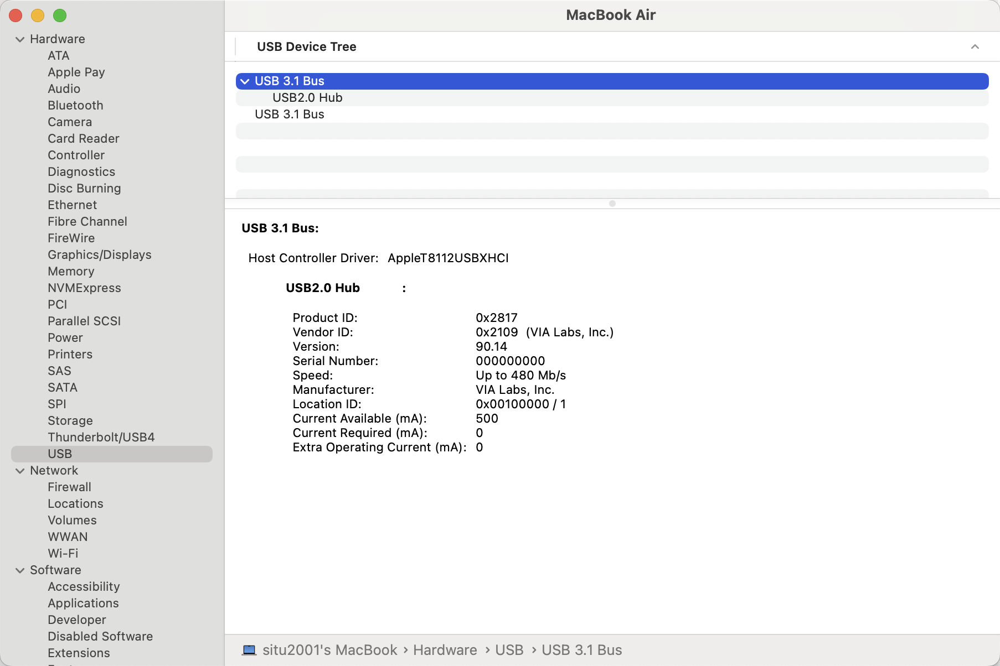

## 设备兼容性

结论先行：对于绝大部分设备，只要 C 口支持 DP 输出，即可点亮该显示器。

我手上可以通过直连 Type-C 输出的设备有：MacBook Air M2、Switch OLED 和 Galaxy S21

### MacBook Air M2

不多说了，受益于 M2 强大的能耗比，接着 4K 显示器的时候并没有想象中的发烫。并且，这个显示器也给 Mac 做了不少的适配，能同步 MacBook 传感器收集的环境色温，做到类似 TrueTone 的效果。

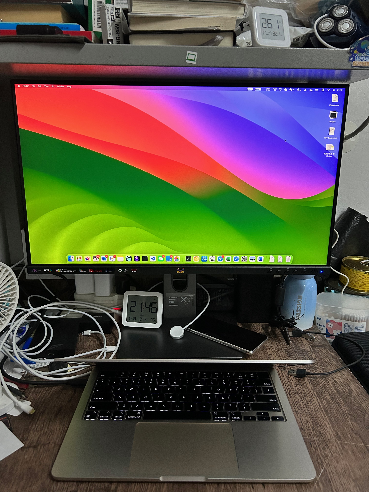

实际观感很不错的，用来玩点 VN 也挺养眼，如下

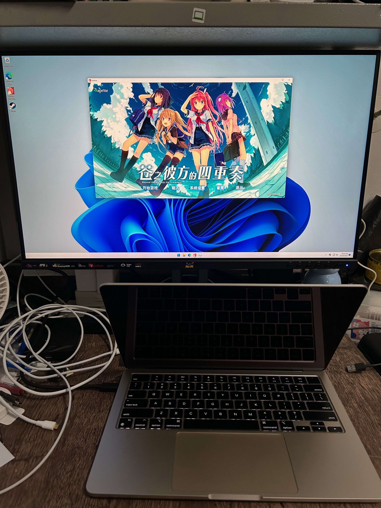

> 好奇探索了 M2 只能外接一块显示器的原因：有专门处理屏幕输出的 [协处理器](https://www.zhihu.com/question/579272647/answer/2850123509)

> 该显示器甚至还专门加了个 Mac 预设模式，不过切换后大体观感并没有什么不同。

### Switch OLED

我是真的没有想到这个显示器居然支持 C 线直连 Switch，当时抱着试试看的心态插上，结果真亮屏了...

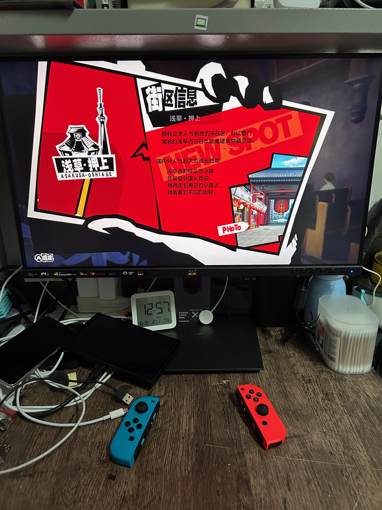

虽然输出的分辨率只有 1080P（这就是 Switch 最高支持的分辨率），如下图所示。

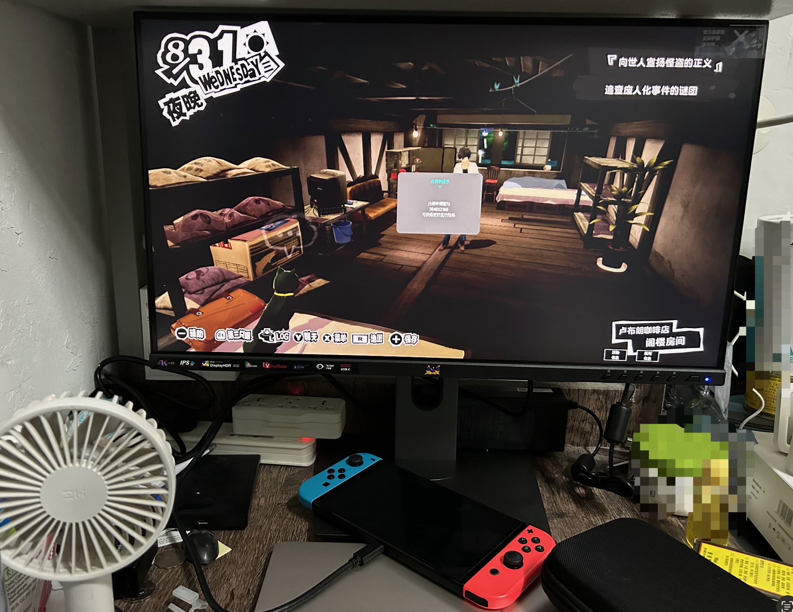

此外，显示器自带的扬声器派上了用场——充当 Switch 的音频输出源，这下就避免了 TV 或显示器没有扬声器从而要往 Switch 3.5mm 接口插耳机的尴尬了。

> 个人猜测：显示器的 PD 输出有**15V 这一档电压**，而这个电压则是 Switch 底座模式的时候用到的（Switch 底座模式的电压要求比较苛刻，Switch 自带的电源适配器的输出参数是 15V/2.6A）

### Galaxy S21

成功点亮显示器并进入 Samsung Dex Mode，从 Dex Mode 的设置来看，支持原生 4K 输出。

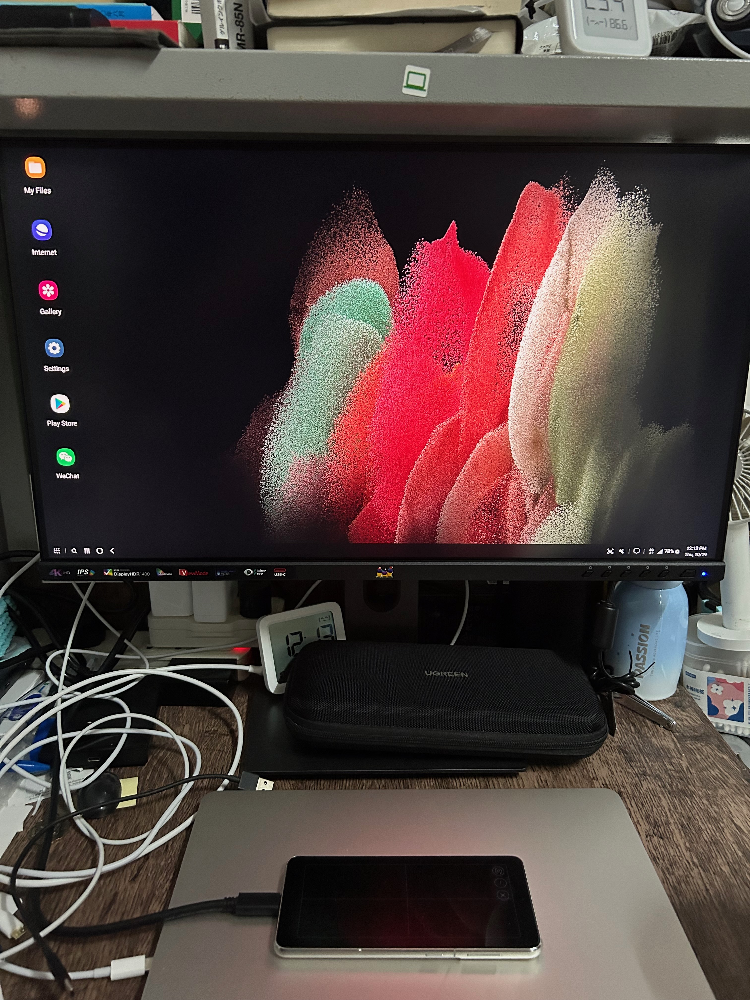

但是 Android APP 和 OneUI 对桌面模式的适配还是一言难尽，各种常用 app 在 4K 下 UI 显示异常，比如 Minecraft 打开不全屏。

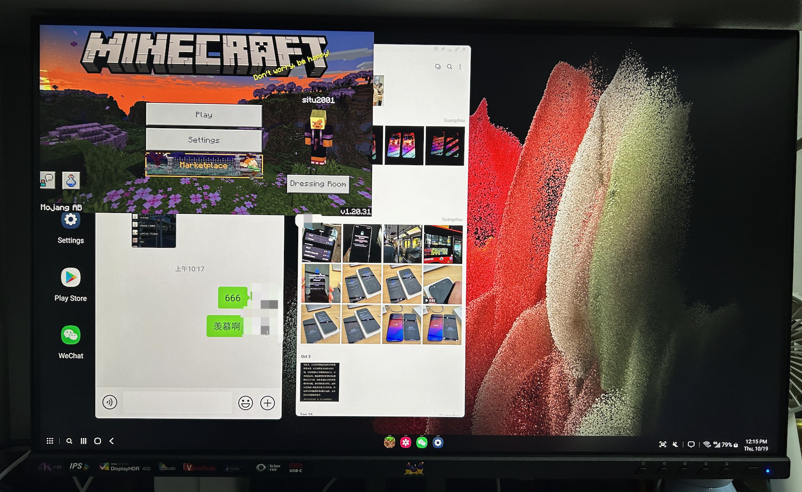

> 我记得三星从 S8 开始就加入了 Dex Mode，Type-C 口也支持了 PD+DP+USB3（反观某果某米的 USB2.0-only 的 C 口）

## 个人喜好调教

### 控制亮度与音量

> [DDC 协议(Display Data Channel)](https://en.wikipedia.org/wiki/Display_Data_Channel) 是 VESA 为了让显示适配器与显示器交流信息而创建的通信协议。

理论上只要显示器和 OS 支持 DDC 协议，就可以在电脑侧去调节显示器的设置（分辨率/亮度/音量/对比度等）

但不知道水果在想什么，macOS 原生只支持设置自家在售/曾售的显示器调节亮度和音量，比如 Studio Display 与 LG Ultrafine。如果是非官方支持的显示器，接上后，是无法通过 macOS 调节亮度的。

这对于非官方在售的显示器特别不友好。不过，有不少第三方工具能突破这个限制。它们能跟支持 DDC 协议的显示器打交道，以达到亮度/对比度/音量的调节。选一个安装并使用即可。

- BetterDisplay
- Monitor Control

我选择了 BetterDisplay，免费版的功能足够我用了。如果没有记错，该软件安装后默认支持通过 DDC 协议调节屏幕亮度和声音的。具体到设备则是键盘 F1 F2 调节亮度，键盘 F10 F11 F12 调节音量。

### 选择屏幕缩放

对于 4K 显示器，macOS 默认使用 1920x1080 的逻辑分辨率，在物理像素点上，则是将 4 个物理像素点当 1 个逻辑像素点用。如果想要获得更高的屏幕空间利用率，可以将逻辑分辨率调到 2304x1296

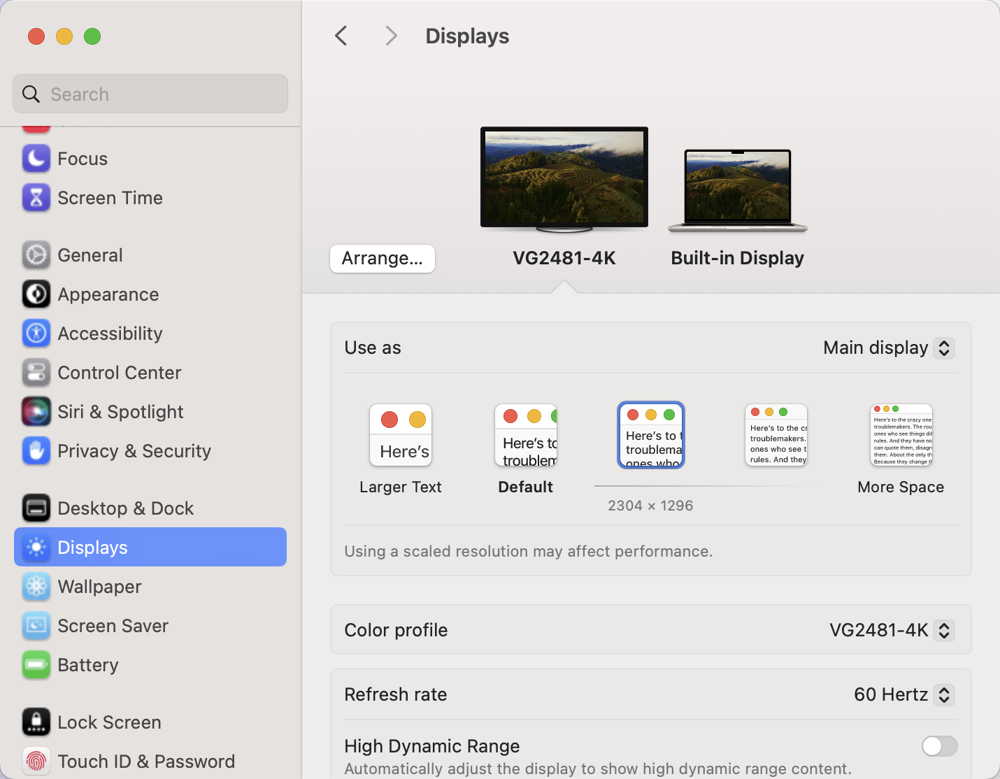

此时 GPU 输出的物理分辨率就是 4.5K，在此模式无法做到准确的物理像素点和逻辑像素点的对齐。但会获得更大的工作区，大小跟 iMac 24 无异。看取舍，我目前在用这档。

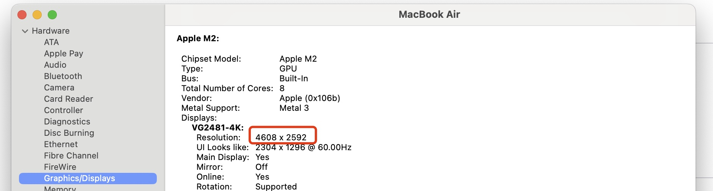

## 总结

不管怎么黑，这都是一款非常不错的适合 Mac 用户的 Ultrafine 平替产品。毕竟，2000 出头的价格摆在那里，还想要啥自行车？
