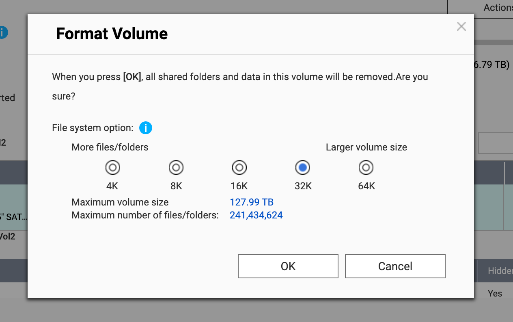
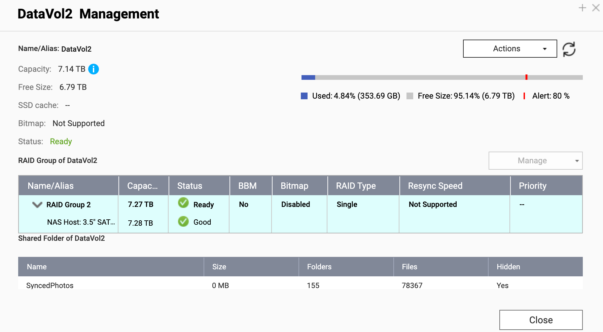
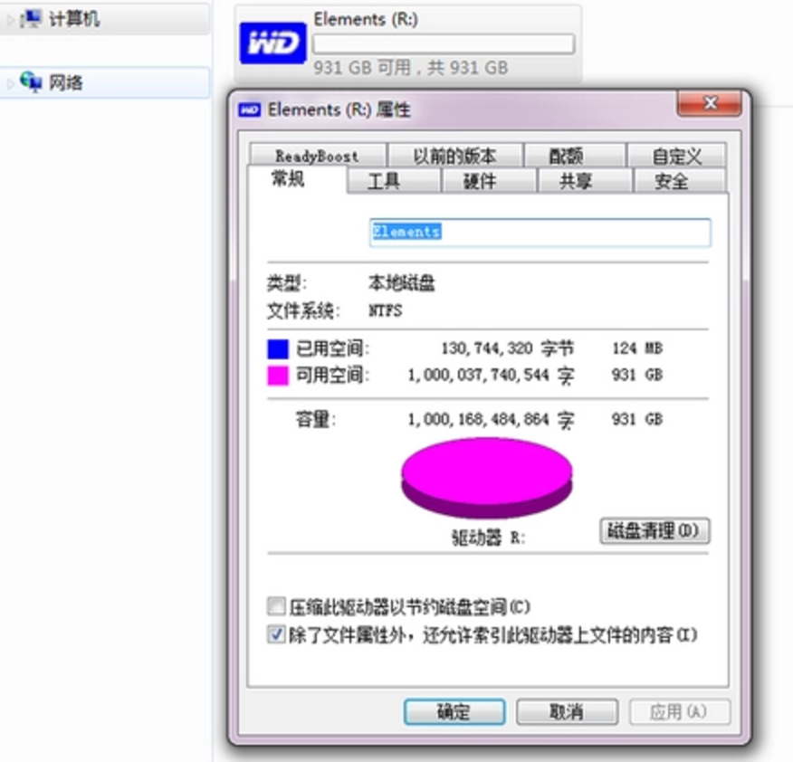

> Disclaimer: 这是一篇科普向文章

## 前言

近日，笔者入手了一块西数企业盘 HA340 作为 QNAP NAS 的第二块数据盘（HA340 是 HC320 的升级型号，拥有更低的噪音和温度）。配置这块硬盘的时候，QNAP 推荐用户使用 32K 进行格式化



格式化之后，笔者猛地想起：很早之前玩机的时候，看到过一个叫做”4K 对齐的“术语，如果我把这个硬盘给 “4K 对齐“ 的话，是不是会拥有更好的性能呢？(其实是搞错了,这个 4K 跟 4K 对齐的 4K 不是同一样东西，4K 对齐是扇区对齐，而这里的 4K 是 `size-per-inode` 的值)

说干就干，选择 4K 再次进行格式化。然后发现：如果在格式化引导窗口里选择不同的 size-per-inode 对硬盘进行格式化，QNAP NAS 页面显示的可用总容量是不一样的！（下图是 `size-per-inode` 为 32K 的 Capacity）



嘶...怎么按不同的 `size-per-inode` 格式化硬盘会出现不一样的可用 Capcity 呢？接着，继续以 8K/16K/64K 进行格式化，最后得到了下面的结果

| size-per-inode | 实际可用容量 |
| -------------- | ------ |
| 4K             | 6.74TB |
| 8K             | 6.97TB |
| 16K            | 7.08TB |
| 32K            | 7.14TB |
| 64K            | 7.17TB |

嘶，看起来实际可用容量与 size-per-inode 的大小成反比。回想了之前学习的文件系统知识，这里显示的可用容量不就是硬盘实际容量减去 inode 等文件系统开销后的剩余容量吗？

其实问题已经破案了，如果想了解更多，可以接着往下阅读

## 少掉的第一重容量：容量单位转换

首先，大家如果用过电脑，也许听说过这么一个常识：对于容量，硬盘厂商使用 1000 进制，而电脑对于容量的计算，使用 1024 进制，单位是 TiB, GiB, MiB, KiB(`binary Bytes`)。其中，$1KiB = 1024Bytes$，$1MiB = 1024KiB$，$1GiB = 1024MiB$

那么，对于一个 8TB 硬盘，在硬盘厂商看来，字节数是

$$
8TB=8 \times 1000^4 Bytes
$$

而在电脑看来，8TiB 有这么多字节

$$
8TiB=8\times1024^4Bytes
$$

因此，到了电脑上，厂商标称的 8TB 硬盘，经过转换后

$$
\frac{8TB \times1000^4 \frac{Bytes}{TB}}{1024^4{\frac{Bytes}{TiB}}} \approx 7.275TiB
$$

同样地，如果我们要为 GiB 为单位显示 1TB 的硬盘的大小，那么

$$
1000GB*\frac{1000^3{\frac{Bytes}{GB}}}{1024^3{\frac{Bytes}{GiB}}}\approx931GiB
$$

这就是很多人拿到 1TB 硬盘后插到电脑，在"我的电脑"看到的可用容量为 931GB 的原因



## 少掉的第二重容量：文件系统数据

实际上，还有另一层隐形的开销——文件系统。下面以 ext4 文件系统为例解释这层开销

我们要知道一点：在文件系统中，数据的存储不仅需要存储数据本身，还需要存储用于描述和索引这些数据的信息。

首先，文件系统以块（block）作为单位分配存储空间。其中，一个块是一个介于 1KiB 到 64KiB 的一组 sectors，块的大小（block size）默认是 4KiB

其次，文件系统会使用 inode（一种数据结构）对文件进行描述，inode 里包含了如时间戳、文件链接、文件的大小、块的位置等文件信息。一般来说，一个文件会有一个对应的 inode 用于存放元数据，inode 的数量决定了最多存放的文件数量。同理，为了存储 inode 数据，inode 在文件系统也会占用一定空间，大小默认为 256Bytes 一个 inode

这就像在使用储物柜时：

- 储物柜由很多小格子组成，每个格子都有固定大小，这些格子就像文件系统中的 block 
- 我们需要一个签名表来记录"哪些物品放在哪些格子里"，以及"物品的大小、存放时间"等信息，这个签名表就像文件系统中的 inode，也会占用储物柜的空间

在 Linux 下，我们可以使用 `mkfs.ext4` 格式化硬盘为 ext4 文件系统

```shell
mkfs.ext4 /dev/sdb1
```

当然，用户可以手动指定 `mkfs` 的 `block-size`, `inode-size` 和 `bytes-per-inode` 

```text
man mkfs.ext4

OPTIONS
		-b block-size
			  Specify  the size of blocks in bytes.  Valid block-size values are powers of two from 1024 up to 65536 (however note that the kernel is able to mount only
			  file systems with block-size smaller or equal to the system page size - 4k on x86 systems, up to 64k on ppc64 or aarch64 depending  on  kernel  configura‐
			  tion).  If omitted, block-size is heuristically determined by the file system size and the expected usage of the file system (see the -T option).  In most
			  common cases, the default block size is 4k. If block-size is preceded by a negative sign ('-'), then mke2fs will use heuristics to determine the appropri‐
			  ate block size, with the constraint that the block size will be at least block-size bytes.  This is useful for certain hardware devices which require that
			  the blocksize be a multiple of 2k.
		
		-i bytes-per-inode
			  Specify  the  bytes/inode ratio.  mke2fs creates an inode for every bytes-per-inode bytes of space on the disk.  The larger the bytes-per-inode ratio, the
			  fewer inodes will be created.  This value generally shouldn't be smaller than the blocksize of the file system, since in that case more  inodes  would  be
			  made  than can ever be used.  Be warned that it is not possible to change this ratio on a file system after it is created, so be careful deciding the cor‐
			  rect value for this parameter.  Note that resizing a file system changes the number of inodes to maintain this ratio.
		
		-I inode-size
			  Specify the size of each inode in bytes.  The inode-size value must be a power of 2 larger or equal to 128.  The larger the inode-size the more space  the
			  inode  table  will consume, and this reduces the usable space in the file system and can also negatively impact performance.  It is not possible to change
			  this value after the file system is created.
		
			  File systems with an inode size of 128 bytes do not support timestamps beyond January 19, 2038.  Inodes which are 256 bytes or  larger  will  support  ex‐
			  tended timestamps, project id's, and the ability to store some extended attributes in the inode table for improved performance.
		
			  The  default inode size is controlled by the mke2fs.conf(5) file.  In the mke2fs.conf file shipped with e2fsprogs, the default inode size is 256 bytes for
			  most file systems, except for small file systems where the inode size will be 128 bytes.
```

大部分的 Linux 系统的默认配置如下：

```text
root@pve:~# cat /etc/mke2fs.conf 
[defaults]
        base_features = sparse_super,large_file,filetype,resize_inode,dir_index,ext_attr
        default_mntopts = acl,user_xattr
        enable_periodic_fsck = 0
        blocksize = 4096
        inode_size = 256
        inode_ratio = 16384
```

QNAP NAS 所使用的系统 QTS 的 inode 和 block 的大小是固定的（前者是 256Bytes，后者是 4096Bytes），我们只能对 `bytes-per-inode` 进行选择（QNAP 提供了 4/8/16/32/64KiB 的 `bytes-per-inode` 选项）。指定 `bytes-per-inode` 的值，就是在指定 `inode_ratio`，即 `mkfs.ext4` 会为每 `inode_ratio` 个字节创建一个 inode

$$
Number(inode)=\frac{TotalBytes}{InodeRatio}
$$

不同的 `bytes-per-inode` 会带来不同的文件系统最大支持的容量/最多可存储的文件数，以及影响 data block 区域的大小，这里以文章开头那张图进行计算


我们登录 QNAP 的 SSH，使用 `parted` 查看的分区的实际大小

```shell
[situ@situ-nas ~]$ sudo parted /dev/mapper/cachedev2 unit B print
Model: Linux device-mapper (linear) (dm)
Disk /dev/mapper/cachedev2: 7911329759232B
Sector size (logical/physical): 512B/4096B
Partition Table: loop
Disk Flags: 

Number  Start  End             Size            File system  Flags
 1      0B     7911329759231B  7911329759232B  ext4
```

那么按照 32K 这个 `inode-ratio`，则有 inode 的数量如下

$$
\frac{7911329759232Bytes}{32768Bytes}=241434624
$$

然后使用 `dumpe2fs` 查看分区的情况。可以看到，分区分配的 inode 与我们计算一致

```shell
[situ@situ-nas ~]$ dumpe2fs -h /dev/mapper/cachedev2
Inode count:              241434624
Block count:              1931476992
Reserved block count:     131072
Free blocks:              1915964476
Free inodes:              241434612
First block:              0
Block size:               4096
Fragment size:            4096
Group descriptor size:    64
Reserved GDT blocks:      1024
Blocks per group:         32768
Fragments per group:      32768
Inodes per group:         4096
Inode blocks per group:   256
RAID stride:              128
RAID stripe width:        128
Flex block group size:    16
Reserved blocks uid:      0 (user admin)
Reserved blocks gid:      0 (group administrators)
First inode:              11
Inode size:               256
Required extra isize:     32
Desired extra isize:      32
Journal inode:            8
Default directory hash:   half_md4
Journal backup:           inode blocks
Journal features:         journal_incompat_revoke journal_64bit
Journal size:             1024M
Journal length:           262144
Journal sequence:         0x00000005
Journal start:            15
```

实际上， QNAP 的前端页面就是这么计算格式化后的预期的 inode 数量的。我们在浏览器 F12 里打一个 subtree modification breakpoint，然后切换 GUI 的 `inode-ratio` 选中项，可以看到如下代码实现

```js
function e() {
	var a = QNAP.lib.GetNormalizedSize(c.app.getStore("volumeInfo").data.items[0].data.realsize_kb) // 这里，a=7911329759232
	  , b = Ext.getCmp("P3FileSystemOptionPanel_Desc02_Value")
	  , e = 65536;
	Ext.getCmp("P3InodeRatio").items.items.each(function(a) {
		// 设置 e 为 inode-ratio
		!0 === a.getValue() && (e = QNAP.lib.iNodeTable[a.inputValue][1]) 
	});
	a = g.addCommaToNumber(parseInt(1024 * a / e));
	b.setText(a);
	return a
}
```

也就是说，光是 inode 的数据，就吃了这么多

$$
241434624\times256Bytes=57.5625GB
$$

`parted` 给出是整个分区的字节数。如果我们用 `df` 命令查看该分区的大小，便是如下

```shell
Filesystem           1K-blocks      Used Available Use% Mounted on
/dev/mapper/cachedev2
                     7663948048 370873880 7292533496   5% /share/CACHEDEV2_DATA
```

经过计算，得出提供给 data block 的容量大约如下所示，与开头图片的 UI 所示的 Capacity 差不多

$$
7663948048KiB \approx7.14TB
$$

这时候我们再比较一下 `df` 和 `parted` 的值是不是近似相差了 inode 的体积，可以发现差值是差不多的（因为还有超级块、位视图等数据开销）

$$
\frac{241434624inode\times256B/inode}{7911329759231B-(7663948048 \times 1024)B} \approx97.4\%
$$

## 设备的大小与感知的强弱

为什么笔者现在才感知到这个问题呢？嘛，其实是因为之前用的存储的体积相对太小了...

那我们不妨**简单计算**一下不同设备的格式化后的体积大小。因此，在这里，我们简单计算并列出常见大小的硬盘设备在经过上述双重容量“减少”后，留给数据存储用的大致容量

我们控制 `inode-size` 为 256Bytes 不变，只改变 `inode-ratio` 的大小（4K/8K/16K/32K/64K）。并使用脚本进行计算 32G/64G/128G/256G/512G/1T/2T/3T/4T/8T/10T/14T/16T 的结果，并输出 markdown 表格

```js
const INODE_RATIOS = [4,8,16,32,64]
const INODE_SIZE = 256

const diskSizeDecimal = [
  [32,'GB'],
  [64,'GB'],
  [128,'GB'],
  [256,'GB'],
  [512,'GB'],
  [1,'TB'],
  [2,'TB'],
  [4,'TB'],
  [8,'TB'],
  [10,'TB'],
  [14,'TB'],
  [16,'TB'],
]

const unitNameMap = {
  'B': 'B',
  'KB': 'KiB',
  'MB': 'MiB',
  'GB': 'GiB',
  'TB': 'TiB',
}

const convertDecimalUnitToBytes = (sizeNum,unit) => {
  const unitMap = {
    'B': 1n,
    'KB': 1000n,
    'MB': 1000n ** 2n,
    'GB': 1000n ** 3n,
    'TB': 1000n ** 4n,
  }
  return BigInt(sizeNum) * unitMap[unit]
}

const convertBinaryUnitToBytes = (sizeNum,unit) => {
  const unitMap = {
    'B': 1n,
   "KiB": 1024n,
   "MiB": 1024n ** 2n,
   "GiB": 1024n ** 3n,
   "TiB": 1024n ** 4n,
  }
  return BigInt(sizeNum) * unitMap[unit]
}

const covertBytesToBinaryUnit = (bytes,unit) => {
  const unitMap = {
    'B': 1n,
   "KiB": 1024n,
   "MiB": 1024n ** 2n,
   "GiB": 1024n ** 3n,
   "TiB": 1024n ** 4n,
  }
  const binaryUnit = unitMap[unit]
  return Number(bytes) / Number(binaryUnit)
}


const calculateInodeNumber = (bytesTotal,inodeRatio) =>
  Math.ceil(Number(bytesTotal) / Number(convertBinaryUnitToBytes(inodeRatio,'KiB')))


const mdTableHeader = '| 硬盘容量 | Inode Ratio| 实际大小  | Inode 占用 | 数据实际可用 |'
const mdTableSplit = '| --- | --- | --- | --- | --- |'

const rows = []
rows.push(mdTableHeader)
rows.push(mdTableSplit)

for (const disk of diskSizeDecimal) {
  const [sizeNum,sizeUnit] = disk
  const binaryUnitName = unitNameMap[sizeUnit]

  const bytesTotal = convertDecimalUnitToBytes(sizeNum,sizeUnit)
  const totalSizeInBinaryUnit = covertBytesToBinaryUnit(bytesTotal,binaryUnitName)

  for (const inodeRatio of INODE_RATIOS) {
    const inodeNumber = calculateInodeNumber(bytesTotal,inodeRatio)
    const inodeSize = BigInt(inodeNumber) * BigInt(INODE_SIZE)
    const inodeSizeInBinaryUnit = covertBytesToBinaryUnit(inodeSize,binaryUnitName)
    const dataSize = bytesTotal - inodeSize
    const dataSizeInBinaryUnit = covertBytesToBinaryUnit(dataSize,binaryUnitName)

    rows.push(`| ${sizeNum} ${sizeUnit} | ${inodeRatio}| ${totalSizeInBinaryUnit.toFixed(2)} ${binaryUnitName} | ${inodeSizeInBinaryUnit.toFixed(3)} ${binaryUnitName} | ${dataSizeInBinaryUnit.toFixed(2)} ${binaryUnitName} |`)
  }
}

console.log(rows.join('\n'))
```

可以得到如下表格，可以看出，当 `inode-ratio` 为默认的 16K 且硬盘本身容量不大的时候，inode 占用的体积对用户而言实际感知不强

| 硬盘容量   | Inode Ratio | 实际大小       | Inode 占用   | 数据实际可用     |
| ------ | ----------- | ---------- | ---------- | ---------- |
| 32 GB  | 4           | 29.80 GiB  | 1.863 GiB  | 27.94 GiB  |
| 32 GB  | 8           | 29.80 GiB  | 0.931 GiB  | 28.87 GiB  |
| 32 GB  | 16          | 29.80 GiB  | 0.466 GiB  | 29.34 GiB  |
| 32 GB  | 32          | 29.80 GiB  | 0.233 GiB  | 29.57 GiB  |
| 32 GB  | 64          | 29.80 GiB  | 0.116 GiB  | 29.69 GiB  |
| 64 GB  | 4           | 59.60 GiB  | 3.725 GiB  | 55.88 GiB  |
| 64 GB  | 8           | 59.60 GiB  | 1.863 GiB  | 57.74 GiB  |
| 64 GB  | 16          | 59.60 GiB  | 0.931 GiB  | 58.67 GiB  |
| 64 GB  | 32          | 59.60 GiB  | 0.466 GiB  | 59.14 GiB  |
| 64 GB  | 64          | 59.60 GiB  | 0.233 GiB  | 59.37 GiB  |
| 128 GB | 4           | 119.21 GiB | 7.451 GiB  | 111.76 GiB |
| 128 GB | 8           | 119.21 GiB | 3.725 GiB  | 115.48 GiB |
| 128 GB | 16          | 119.21 GiB | 1.863 GiB  | 117.35 GiB |
| 128 GB | 32          | 119.21 GiB | 0.931 GiB  | 118.28 GiB |
| 128 GB | 64          | 119.21 GiB | 0.466 GiB  | 118.74 GiB |
| 256 GB | 4           | 238.42 GiB | 14.901 GiB | 223.52 GiB |
| 256 GB | 8           | 238.42 GiB | 7.451 GiB  | 230.97 GiB |
| 256 GB | 16          | 238.42 GiB | 3.725 GiB  | 234.69 GiB |
| 256 GB | 32          | 238.42 GiB | 1.863 GiB  | 236.56 GiB |
| 256 GB | 64          | 238.42 GiB | 0.931 GiB  | 237.49 GiB |
| 512 GB | 4           | 476.84 GiB | 29.802 GiB | 447.03 GiB |
| 512 GB | 8           | 476.84 GiB | 14.901 GiB | 461.94 GiB |
| 512 GB | 16          | 476.84 GiB | 7.451 GiB  | 469.39 GiB |
| 512 GB | 32          | 476.84 GiB | 3.725 GiB  | 473.11 GiB |
| 512 GB | 64          | 476.84 GiB | 1.863 GiB  | 474.97 GiB |
| 1 TB   | 4           | 0.91 TiB   | 0.057 TiB  | 0.85 TiB   |
| 1 TB   | 8           | 0.91 TiB   | 0.028 TiB  | 0.88 TiB   |
| 1 TB   | 16          | 0.91 TiB   | 0.014 TiB  | 0.90 TiB   |
| 1 TB   | 32          | 0.91 TiB   | 0.007 TiB  | 0.90 TiB   |
| 1 TB   | 64          | 0.91 TiB   | 0.004 TiB  | 0.91 TiB   |
| 2 TB   | 4           | 1.82 TiB   | 0.114 TiB  | 1.71 TiB   |
| 2 TB   | 8           | 1.82 TiB   | 0.057 TiB  | 1.76 TiB   |
| 2 TB   | 16          | 1.82 TiB   | 0.028 TiB  | 1.79 TiB   |
| 2 TB   | 32          | 1.82 TiB   | 0.014 TiB  | 1.80 TiB   |
| 2 TB   | 64          | 1.82 TiB   | 0.007 TiB  | 1.81 TiB   |
| 4 TB   | 4           | 3.64 TiB   | 0.227 TiB  | 3.41 TiB   |
| 4 TB   | 8           | 3.64 TiB   | 0.114 TiB  | 3.52 TiB   |
| 4 TB   | 16          | 3.64 TiB   | 0.057 TiB  | 3.58 TiB   |
| 4 TB   | 32          | 3.64 TiB   | 0.028 TiB  | 3.61 TiB   |
| 4 TB   | 64          | 3.64 TiB   | 0.014 TiB  | 3.62 TiB   |
| 8 TB   | 4           | 7.28 TiB   | 0.455 TiB  | 6.82 TiB   |
| 8 TB   | 8           | 7.28 TiB   | 0.227 TiB  | 7.05 TiB   |
| 8 TB   | 16          | 7.28 TiB   | 0.114 TiB  | 7.16 TiB   |
| 8 TB   | 32          | 7.28 TiB   | 0.057 TiB  | 7.22 TiB   |
| 8 TB   | 64          | 7.28 TiB   | 0.028 TiB  | 7.25 TiB   |
| 10 TB  | 4           | 9.09 TiB   | 0.568 TiB  | 8.53 TiB   |
| 10 TB  | 8           | 9.09 TiB   | 0.284 TiB  | 8.81 TiB   |
| 10 TB  | 16          | 9.09 TiB   | 0.142 TiB  | 8.95 TiB   |
| 10 TB  | 32          | 9.09 TiB   | 0.071 TiB  | 9.02 TiB   |
| 10 TB  | 64          | 9.09 TiB   | 0.036 TiB  | 9.06 TiB   |
| 14 TB  | 4           | 12.73 TiB  | 0.796 TiB  | 11.94 TiB  |
| 14 TB  | 8           | 12.73 TiB  | 0.398 TiB  | 12.34 TiB  |
| 14 TB  | 16          | 12.73 TiB  | 0.199 TiB  | 12.53 TiB  |
| 14 TB  | 32          | 12.73 TiB  | 0.099 TiB  | 12.63 TiB  |
| 14 TB  | 64          | 12.73 TiB  | 0.050 TiB  | 12.68 TiB  |
| 16 TB  | 4           | 14.55 TiB  | 0.909 TiB  | 13.64 TiB  |
| 16 TB  | 8           | 14.55 TiB  | 0.455 TiB  | 14.10 TiB  |
| 16 TB  | 16          | 14.55 TiB  | 0.227 TiB  | 14.32 TiB  |
| 16 TB  | 32          | 14.55 TiB  | 0.114 TiB  | 14.44 TiB  |
| 16 TB  | 64          | 14.55 TiB  | 0.057 TiB  | 14.50 TiB  |

## 结论

那么，我们该如何挑选我们的 `inode-ratio` 值呢？

回到储物柜，如果按照每存一件物品就要在签名表上登记的规则进行物品存取，有可能出现两种情况：

- 储物柜格子空间用完了，但是签名表还有大片空白
- 签名表用完了，但是还有大量的空闲格子间

因此根据自己的需求来指定这个值，提高空间的利用率，是相当有必要的。并且，除非格式化，这个值设置后就不能更改了。总的来说：

- 主要存储图片/视频等大文件，可以使用较大的 `inode-ratio` 值，比如 32K/64K
- 主要存储小文件 (如~~node_modules~~)，可以使用较小的 `inode-ratio` 值，比如 4/8K
- 通用存储，可以用 16K

## 参考文章

https://docs.kernel.org/filesystems/ext4/overview.html#layout

https://blogs.oracle.com/linux/post/understanding-ext4-disk-layout-part-1

https://blog.zuwei.top/2024/02/10/ext4-file-system/#%E5%8F%82%E8%80%83%E6%96%87%E7%AB%A0

https://lensual.space/archives/896.html

https://bean-li.github.io/EXT4-packet-meta-blocks/

https://www.ruanyifeng.com/blog/2011/12/inode.html
