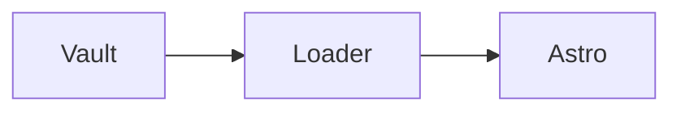

# Markdown 与 LaTeX 综合测试

PUBLIC_PROVIDER_SENTINEL

这篇文章来自外部 Obsidian 测试库，用于检查内容经过 loader 后是否保留 Markdown 语义。图片原始尺寸为 **1600 × 900**；下方分别使用 Wiki 图片和标准 Markdown 图片引用同一文件。

## 01 · 大图与图片链接

![[pixel.png|1600 × 900 排版测试图]]


[](Second)

## 02 · 文字、换行与分隔线

普通中文 English 123，**粗体**、*斜体*、***粗斜体***、~~删除线~~、`inline code`、emoji 🧪。

这一行以两个空格结尾。  
这里应当是同一段中的硬换行。

这一行仅在源文件中换行，
这里是软换行，仍属于同一段落。

转义符号：\*不是斜体\*、\#不是标题、\[不是链接\]、反斜杠 \\。实体：&amp; &lt; &gt; &copy;。

---

### 三级标题

#### 四级标题

##### 五级标题

###### 六级标题

Setext 风格标题
--------------

## 03 · 列表与任务

- 一级项目，含 **强调**。
  - 二级项目，含 `code`。
    - 三级项目。
- 另一个一级项目。

1. 第一步。
2. 第二步。
   1. 嵌套步骤。
   2. 继续处理。
3. 第三步。

- [x] 已完成的任务
- [ ] 待完成的任务
  - [x] 嵌套任务

## 04 · 引用与混合内容

> 普通引用，包含 **粗体** 和 $E=mc^2$。
>
> 第二段引用。
>
> > 嵌套引用。
>
> - 引用里的列表。
> - [[Second|引用中的公开链接]]。

## 05 · 表格

| 左对齐 | 居中 | 右对齐 |
| :--- | :---: | ---: |
| **粗体** | `code` | 123.45 |
| 中文与 English | $x^2$ | 67 |
| 转义竖线 \| | [[Second\|公开目标]] | 0 |

## 06 · 链接、脚注与本页锚点

[[Second|公开目标]]、[[Secret|私人链接]]、[[Missing Note|不存在的笔记]]。

[普通笔记链接](Second) · [引用链接][second] · [跳转到公式](#latex) · [外部链接](https://example.com "链接标题")。

自动链接：<https://example.com>，裸链接 https://example.com/path?q=test （URL 后留空格，避免中文句号进入地址）。

第一条脚注在这里[^one]，同一脚注再次引用[^one]；还有一条多段脚注[^long]。

[second]: Second "引用链接标题"

[^one]: 简单脚注，包含 **强调** 和 $\alpha + \beta$。

[^long]: 多段脚注的第一段。

    第二段包含 `inline code` 和 [公开笔记](Second)。

## LaTeX

行内公式：$a^2+b^2=c^2$，$e^{i\pi}+1=0$，$\frac{\partial f}{\partial x}$，$\mathbf{v}\in\mathbb{R}^n$。

### 分式、根号与无穷级数

$$
\int_0^\infty e^{-x^2}\,dx = \frac{\sqrt{\pi}}{2},
\qquad \sum_{n=1}^{\infty}\frac{1}{n^2}=\frac{\pi^2}{6}
$$

### 对齐公式

$$
\begin{aligned}
(a+b)^2 &= a^2+2ab+b^2 \\
\nabla \cdot \mathbf{E} &= \frac{\rho}{\varepsilon_0}
\end{aligned}
$$

### 矩阵与分段函数

$$
A=\begin{bmatrix}1&2&3\\4&5&6\\7&8&9\end{bmatrix},
\qquad
f(x)=\begin{cases}x^2,&x\ge 0\\-x,&x<0\end{cases}
$$

### 中文说明与长公式

$$
\underbrace{\sum_{i=1}^{n}(x_i-\bar{x})^2}_{\text{离差平方和}}
=\sum_{i=1}^{n}x_i^2-\frac{1}{n}\left(\sum_{i=1}^{n}x_i\right)^2
$$

$$
\mathcal{L}(\theta)=\sum_{i=1}^{N}\left[-y_i\log p_{\theta}(x_i)-(1-y_i)\log(1-p_{\theta}(x_i))\right]+\lambda\sum_{j=1}^{d}\theta_j^2+\gamma\left(\sum_{j=1}^{d}|\theta_j|\right)+\eta\|\theta-\theta_0\|_2^2
$$

货币转义：\$5.00 与 \$10.00。代码中的公式必须保留：`$x^2$`。

## 08 · 代码

`[[Secret]]` 与 ``含 ` 反引号的代码`` 不应被解析为链接。

```typescript
interface Note { title: string; shared: boolean }
const note: Note = { title: '中文笔记', shared: true };
console.log(note); // [[Secret]] 和 $x^2$ 应保留
```

```json
{ "title": "Markdown fixture", "enabled": true, "items": [1, 2, 3] }
```

```text
![[private.png]]
[[Second]]
**不是粗体**
$$ E = mc^2 $$
```

    缩进代码块
    [[Secret]] 和 ![[private.png]] 不转换

## 09 · Obsidian 扩展边界探针

以下几项用于观察当前降级行为，不宣称已经支持：

> [!NOTE] Callout 探针
> 当前按普通 blockquote 展示，尚未生成专门的提示框。

==高亮探针==，%%Obsidian 注释探针：当前不会隐藏%%。

![[Second]]

上方笔记嵌入当前降级为文件名，不展开正文。Mermaid 当前只展示代码：



HTML、跨笔记标题和块链接会主动拒绝构建；这些在隔离测试中验证，避免中断本页。
